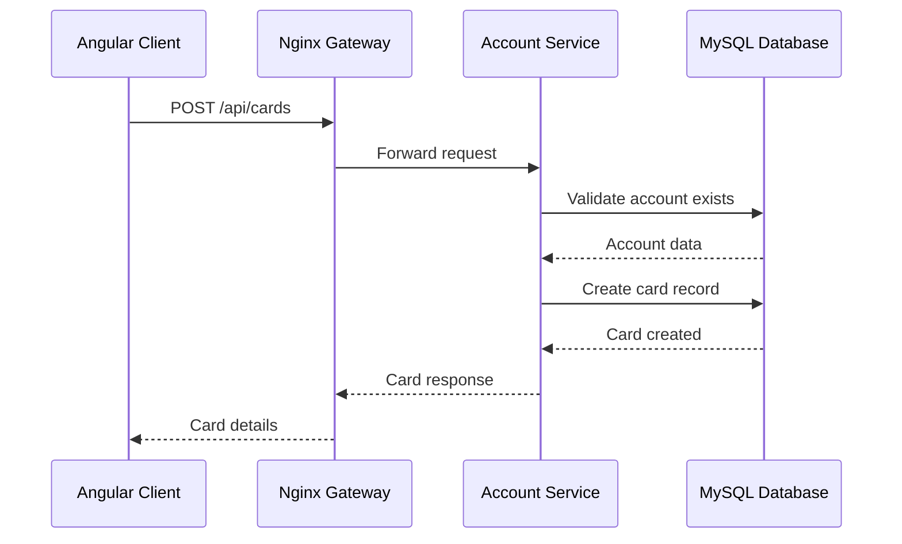
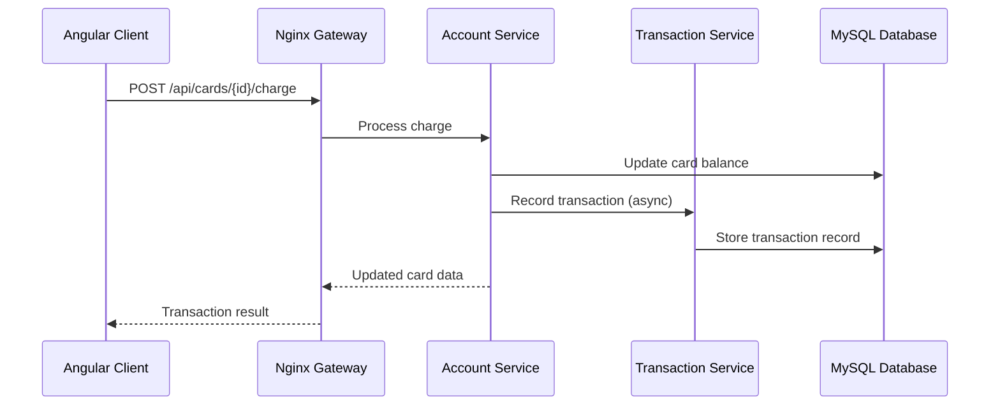
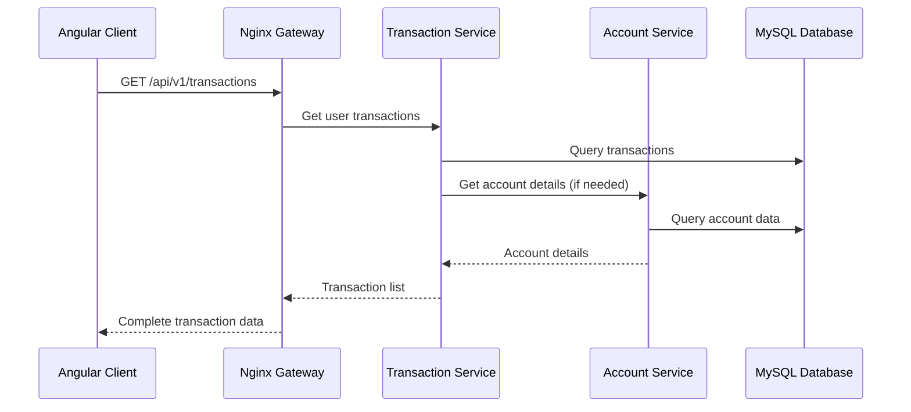

# Arquitectura Completa de FinTrack

## Índice
1. [Visión General](#visión-general)
2. [Arquitectura de Microservicios](#arquitectura-de-microservicios)
3. [Frontend Angular](#frontend-angular)
4. [Proxy y Comunicación](#proxy-y-comunicación)
5. [API Gateway con Nginx](#api-gateway-con-nginx)
6. [Base de Datos](#base-de-datos)
7. [Comunicación Entre Servicios](#comunicación-entre-servicios)
8. [Infraestructura Docker](#infraestructura-docker)
9. [Flujos de Datos](#flujos-de-datos)
10. [Patrones Arquitectónicos](#patrones-arquitectónicos)
11. [Seguridad](#seguridad)
12. [Monitoreo y Observabilidad](#monitoreo-y-observabilidad)

---

## Visión General

FinTrack es una aplicación de gestión financiera personal basada en una **arquitectura de microservicios** que permite a los usuarios gestionar cuentas, tarjetas, transacciones e instalments. La aplicación está construida con tecnologías modernas y sigue principios de **Domain-Driven Design (DDD)** y **Clean Architecture**.

### Stack Tecnológico
- **Frontend**: Angular 20 + Angular Material
- **Backend**: Go (Gin Framework)
- **Base de Datos**: MySQL 8.0
- **Proxy Reverso**: Nginx
- **Orquestación**: Docker Compose
- **Monitoreo**: Adminer (dev)

---

## Arquitectura de Microservicios

La aplicación está dividida en **8 microservicios** independientes, cada uno con responsabilidades específicas:

### 🏗️ Diagrama de Arquitectura

```
┌─────────────────────────────────────────────────────────────────┐
│                        FRONTEND LAYER                          │
│  ┌───────────────────────────────────────────────────────────┐  │
│  │              Angular 20 Application                       │  │
│  │                  (Port 4200)                             │  │
│  └───────────────────────────────────────────────────────────┘  │
└─────────────────────────────────────────────────────────────────┘
                                │
                                ▼ (HTTP/REST)
┌─────────────────────────────────────────────────────────────────┐
│                     API GATEWAY LAYER                          │
│  ┌───────────────────────────────────────────────────────────┐  │
│  │                    Nginx Proxy                           │  │
│  │            (Load Balancer + Rate Limiting)               │  │
│  └───────────────────────────────────────────────────────────┘  │
└─────────────────────────────────────────────────────────────────┘
                                │
                                ▼ (HTTP/REST)
┌─────────────────────────────────────────────────────────────────┐
│                    MICROSERVICES LAYER                         │
│                                                                 │
│  ┌─────────────┐  ┌─────────────┐  ┌─────────────┐              │
│  │User Service │  │Account      │  │Transaction  │              │
│  │(Port 8081)  │  │Service      │  │Service      │              │
│  │             │  │(Port 8082)  │  │(Port 8083)  │              │
│  └─────────────┘  └─────────────┘  └─────────────┘              │
│                                                                 │
│  ┌─────────────┐  ┌─────────────┐  ┌─────────────┐              │
│  │Wallet       │  │Notification │  │Chatbot      │              │
│  │Service      │  │Service      │  │Service      │              │
│  │(Port 8080)  │  │(Port 8080)  │  │(Port 8080)  │              │
│  └─────────────┘  └─────────────┘  └─────────────┘              │
│                                                                 │
│  ┌─────────────┐  ┌─────────────┐                               │
│  │Report       │  │Exchange     │                               │
│  │Service      │  │Service      │                               │
│  │(Port 8080)  │  │(Port 8080)  │                               │
│  └─────────────┘  └─────────────┘                               │
└─────────────────────────────────────────────────────────────────┘
                                │
                                ▼ (MySQL Protocol)
┌─────────────────────────────────────────────────────────────────┐
│                       DATA LAYER                               │
│  ┌───────────────────────────────────────────────────────────┐  │
│  │                   MySQL Database                         │  │
│  │                   (Port 3306)                           │  │
│  └───────────────────────────────────────────────────────────┘  │
└─────────────────────────────────────────────────────────────────┘
```

### 📋 Descripción de Microservicios

| Servicio | Puerto | Responsabilidades | Tecnologías |
|----------|--------|-------------------|-------------|
| **User Service** | 8081 | Autenticación, autorización, gestión de usuarios | Go + Gin + JWT |
| **Account Service** | 8082 | Gestión de cuentas y tarjetas, operaciones financieras | Go + Gin + MySQL |
| **Transaction Service** | 8083 | Procesamiento de transacciones, historial, reglas de negocio | Go + Gin + MySQL |
| **Wallet Service** | 8080 | Gestión de billeteras digitales, saldos | Go + Gin + MySQL |
| **Notification Service** | 8080 | Notificaciones push, email, WebSocket | Go + Gin + WebSocket |
| **Chatbot Service** | 8080 | IA conversacional, soporte al cliente | Go + Gin + AI/ML |
| **Report Service** | 8080 | Generación de reportes, analytics | Go + Gin + MySQL |
| **Exchange Service** | 8080 | Conversión de divisas, tasas de cambio | Go + Gin + External APIs |

---

## Frontend Angular

### 🎨 Estructura del Frontend

El frontend está construido con **Angular 20** y utiliza **Angular Material** para los componentes UI.

```
frontend/
├── src/
│   ├── app/
│   │   ├── components/          # Componentes reutilizables
│   │   ├── pages/              # Páginas de la aplicación
│   │   ├── services/           # Servicios HTTP para comunicación con APIs
│   │   ├── models/             # Interfaces TypeScript
│   │   ├── guards/             # Guards de autenticación y autorización
│   │   └── interceptors/       # Interceptores HTTP
│   ├── environments/           # Configuraciones de entorno
│   └── assets/                # Recursos estáticos
├── proxy.conf.json            # Configuración del proxy de desarrollo
├── angular.json               # Configuración de Angular CLI
└── Dockerfile                # Imagen Docker para producción
```

### 🔧 Servicios Angular Principales

| Servicio | Responsabilidad | Endpoint Base |
|----------|----------------|---------------|
| `AuthService` | Autenticación y manejo de tokens JWT | `/api/auth/**` |
| `AccountService` | Gestión de cuentas bancarias | `/api/accounts/**` |
| `CardService` | Gestión de tarjetas de crédito/débito | `/api/cards/**` |
| `TransactionService` | Historial y procesamiento de transacciones | `/api/v1/transactions/**` |
| `UserService` | Perfil y datos del usuario | `/api/users/**` |

### 🚀 Configuración de Desarrollo

El frontend utiliza **Angular Dev Server** con proxy automático:
```bash
ng serve --host 0.0.0.0 --proxy-config proxy.conf.json
```

---

## Proxy y Comunicación

### 📡 Configuración del Proxy (Development)

El archivo `proxy.conf.json` configura el enrutamiento de las llamadas API durante el desarrollo:

```json
{
  "/api/auth/**": {
    "target": "http://localhost:8081",    // User Service
    "secure": false,
    "changeOrigin": true
  },
  "/api/accounts/**": {
    "target": "http://localhost:8082",    // Account Service
    "secure": false,
    "changeOrigin": true
  },
  "/api/v1/transactions/**": {
    "target": "http://localhost:8083",    // Transaction Service
    "secure": false,
    "changeOrigin": true
  }
}
```

### 🔄 Flujo de Comunicación

```
Cliente Angular ──HTTP──> Angular Dev Server ──Proxy──> Microservicio
     │                                                      │
     └─────────────────── JSON Response ──────────────────┘
```

---

## API Gateway con Nginx

### 🚪 Arquitectura del API Gateway

Nginx actúa como **API Gateway** y **Reverse Proxy**, proporcionando:

- **Load Balancing**: Distribución de carga entre instancias
- **Rate Limiting**: Control de frecuencia de requests
- **SSL Termination**: Manejo de certificados SSL
- **Request Routing**: Enrutamiento inteligente de peticiones
- **Health Checks**: Verificación del estado de los servicios

### 📊 Configuración de Upstream

```nginx
upstream user_service {
    least_conn;
    server user-service:8080 max_fails=3 fail_timeout=30s;
    keepalive 32;
}

upstream account_service {
    least_conn;
    server account-service:8082 max_fails=3 fail_timeout=30s;
    keepalive 32;
}

upstream transaction_service {
    least_conn;
    server transaction-service:8080 max_fails=3 fail_timeout=30s;
    keepalive 32;
}
```

### 🛡️ Seguridad y Rate Limiting

```nginx
# Rate limiting por zona
limit_req_zone $binary_remote_addr zone=api:10m rate=10r/s;
limit_req_zone $binary_remote_addr zone=login:10m rate=5r/m;

# Headers de seguridad
add_header X-Frame-Options "SAMEORIGIN" always;
add_header X-Content-Type-Options "nosniff" always;
add_header X-XSS-Protection "1; mode=block" always;
```

### 🎯 Enrutamiento de APIs

| Ruta | Destino | Rate Limit | Descripción |
|------|---------|------------|-------------|
| `/api/auth/**` | User Service | 5 req/min | Autenticación estricta |
| `/api/users/**` | User Service | 20 req/s | Gestión de usuarios |
| `/api/accounts/**` | Account Service | 20 req/s | Operaciones de cuentas |
| `/api/transactions/**` | Transaction Service | 20 req/s | Transacciones |
| `/api/notifications/**` | Notification Service | 10 req/s | Notificaciones |
| `/ws` | Notification Service | - | WebSocket para tiempo real |

---

## Base de Datos

### 🗄️ Arquitectura de Datos

La aplicación utiliza **MySQL 8.0** como base de datos principal con un diseño **multi-tenant** donde todos los servicios comparten la misma instancia de base de datos pero utilizan esquemas separados lógicamente.

### 📋 Esquemas de Tablas Principales

#### 👤 Users (User Service)
```sql
CREATE TABLE users (
  id VARCHAR(36) PRIMARY KEY,
  email VARCHAR(255) UNIQUE NOT NULL,
  password_hash VARCHAR(255) NOT NULL,
  first_name VARCHAR(100) NOT NULL,
  last_name VARCHAR(100) NOT NULL,
  role VARCHAR(20) DEFAULT 'USER',
  is_active TINYINT(1) DEFAULT 1,
  email_verified TINYINT(1) DEFAULT 0,
  created_at DATETIME NOT NULL,
  updated_at DATETIME NOT NULL
);
```

#### 🏦 Accounts (Account Service)
```sql
CREATE TABLE accounts (
  id VARCHAR(36) PRIMARY KEY,
  user_id VARCHAR(36) NOT NULL,
  account_type ENUM('checking', 'savings', 'credit') NOT NULL,
  name VARCHAR(100) NOT NULL,
  description TEXT,
  currency VARCHAR(3) DEFAULT 'ARS',
  balance DECIMAL(15,2) DEFAULT 0.00,
  credit_limit DECIMAL(15,2),
  is_active TINYINT(1) DEFAULT 1,
  created_at DATETIME DEFAULT CURRENT_TIMESTAMP,
  updated_at DATETIME DEFAULT CURRENT_TIMESTAMP ON UPDATE CURRENT_TIMESTAMP
);
```

#### 💳 Cards (Account Service)
```sql
CREATE TABLE cards (
  id VARCHAR(36) PRIMARY KEY,
  account_id VARCHAR(36) NOT NULL,
  card_type ENUM('credit', 'debit') NOT NULL,
  card_brand ENUM('visa', 'mastercard', 'amex') NOT NULL,
  last_four_digits VARCHAR(4) NOT NULL,
  masked_number VARCHAR(19) NOT NULL,
  holder_name VARCHAR(100) NOT NULL,
  expiration_month INT NOT NULL,
  expiration_year INT NOT NULL,
  status ENUM('active', 'blocked', 'expired') DEFAULT 'active',
  is_default TINYINT(1) DEFAULT 0,
  balance DECIMAL(15,2) DEFAULT 0.00,
  created_at DATETIME DEFAULT CURRENT_TIMESTAMP
);
```

#### 💰 Transactions (Transaction Service)
```sql
CREATE TABLE transactions (
  id VARCHAR(36) PRIMARY KEY,
  reference_id VARCHAR(100),
  type VARCHAR(50) NOT NULL,
  status VARCHAR(20) DEFAULT 'pending',
  amount DECIMAL(15,2) NOT NULL,
  currency VARCHAR(3) DEFAULT 'ARS',
  from_account_id VARCHAR(36),
  to_account_id VARCHAR(36),
  from_card_id VARCHAR(36),
  to_card_id VARCHAR(36),
  user_id VARCHAR(36) NOT NULL,
  description TEXT,
  payment_method VARCHAR(30),
  merchant_name VARCHAR(255),
  metadata JSON,
  created_at TIMESTAMP DEFAULT CURRENT_TIMESTAMP
);
```

#### 📅 Installments (Account Service)
```sql
CREATE TABLE installments (
  id VARCHAR(36) PRIMARY KEY,
  card_id VARCHAR(36) NOT NULL,
  installment_plan_id VARCHAR(36) NOT NULL,
  installment_number INT NOT NULL,
  total_installments INT NOT NULL,
  amount DECIMAL(15,2) NOT NULL,
  due_date DATE NOT NULL,
  status ENUM('pending', 'paid', 'overdue', 'cancelled') DEFAULT 'pending',
  paid_at DATETIME NULL,
  created_at DATETIME DEFAULT CURRENT_TIMESTAMP
);
```

### 🔗 Relaciones entre Entidades

```
Users (1) ──┬── (N) Accounts
            │
            └── (N) User_Profiles

Accounts (1) ──┬── (N) Cards
               │
               └── (N) Transactions (from/to)

Cards (1) ──┬── (N) Transactions (from/to)
            │
            └── (N) Installments

Transactions (1) ── (N) Transaction_Audit

Cards (1) ── (N) Installment_Plans ── (N) Installments
```

---

## Comunicación Entre Servicios

### 🔄 Patrones de Comunicación

La aplicación utiliza principalmente **comunicación síncrona HTTP/REST** entre servicios, con algunos casos de **comunicación asíncrona** para operaciones no críticas.

#### 🌐 HTTP Client Pattern

Cada servicio incluye clientes HTTP para comunicarse con otros servicios:

```go
// En Account Service - Cliente para Transaction Service
type TransactionClient struct {
    baseURL    string
    httpClient *http.Client
}

func (c *TransactionClient) CreateTransaction(userID string, req CreateTransactionRequest) (*TransactionResponse, error) {
    url := fmt.Sprintf("%s/api/v1/transactions", c.baseURL)
    // ... implementación HTTP
}
```

#### 📡 Comunicación Asíncrona

Para operaciones no críticas se utiliza **goroutines** para llamadas asíncronas:

```go
// Registro de transacción asíncrono
go func() {
    err := s.transactionClient.CreateDebitCardTransaction(
        userID, cardID, amount, description, merchantName, reference,
    )
    if err != nil {
        log.Printf("Warning: failed to record transaction: %v", err)
    }
}()
```

### 🔗 Matriz de Dependencias

| Servicio | Depende de | Tipo | Propósito |
|----------|------------|------|-----------|
| Account Service | Transaction Service | HTTP | Registro de transacciones |
| Transaction Service | Account Service | HTTP | Validación de cuentas y balances |
| Wallet Service | Account Service | HTTP | Operaciones de cuenta |
| Notification Service | Todos | WebSocket/HTTP | Notificaciones |
| Report Service | Account + Transaction | HTTP | Agregación de datos |
| Chatbot Service | Todos | HTTP | Consultas de información |

---

## Infraestructura Docker

### 🐳 Orquestación con Docker Compose

La aplicación utiliza **Docker Compose** para orquestar todos los servicios:

```yaml
version: '3.8'

services:
  # Base de datos
  mysql:
    build: ./database
    container_name: fintrack-mysql
    environment:
      MYSQL_DATABASE: fintrack
      MYSQL_USER: fintrack_user
      MYSQL_PASSWORD: fintrack_password
    ports:
      - "3306:3306"
    networks:
      - fintrack-network

  # Microservicios
  user-service:
    build: ./backend/services/user-service
    container_name: fintrack-user-service
    environment:
      DB_HOST: mysql
      DB_PORT: 3306
      JWT_SECRET: your-jwt-secret-key
      PORT: 8081
    ports:
      - "8081:8081"
    depends_on:
      mysql:
        condition: service_healthy
    networks:
      - fintrack-network

  # Frontend
  frontend:
    build: ./frontend
    container_name: fintrack-frontend
    ports:
      - "4200:80"
    depends_on:
      - user-service
      - account-service
      - transaction-service
    networks:
      - fintrack-network

networks:
  fintrack-network:
    driver: bridge
    ipam:
      config:
        - subnet: 172.20.0.0/16
```

### 🏗️ Health Checks

Cada servicio implementa health checks para el manejo de dependencias:

```dockerfile
HEALTHCHECK --interval=30s --timeout=10s --retries=3 --start-period=40s \
  CMD ["wget", "--quiet", "--tries=1", "--output-document=-", "http://localhost:8082/health"]
```

### 📦 Estrategia de Build

- **Multi-stage builds** para optimizar el tamaño de las imágenes
- **Build context** específico para cada servicio
- **Dependency caching** para acelerar builds
- **Production-ready** Dockerfiles con usuarios no-root

---

## Flujos de Datos

### 💳 Flujo de Creación de Tarjeta



### 💰 Flujo de Transacción con Tarjeta



### 📊 Flujo de Consulta de Transacciones



---

## Patrones Arquitectónicos

### 🏛️ Clean Architecture

Cada microservicio sigue **Clean Architecture** con separación clara de responsabilidades:

```
service/
├── cmd/
│   └── api/
│       └── main.go              # Entry point
├── internal/
│   ├── core/
│   │   ├── domain/
│   │   │   └── entities/        # Domain entities
│   │   ├── ports/               # Interfaces
│   │   └── service/             # Business logic
│   └── infrastructure/
│       ├── entrypoints/
│       │   ├── handlers/        # HTTP handlers
│       │   └── router/          # Route configuration
│       ├── clients/             # External service clients
│       └── repository/          # Data access layer
└── docs/                        # API documentation
```

### 🎯 Domain-Driven Design (DDD)

#### Bounded Contexts
- **User Context**: Autenticación, autorización, perfiles
- **Account Context**: Cuentas bancarias, tarjetas
- **Transaction Context**: Operaciones financieras, historial
- **Notification Context**: Comunicaciones, alertas

#### Aggregates
- **User Aggregate**: User + UserProfile
- **Account Aggregate**: Account + Cards + Installments
- **Transaction Aggregate**: Transaction + TransactionRules + TransactionAudit

### 🔧 Repository Pattern

```go
type AccountRepositoryInterface interface {
    Create(account *entities.Account) (*entities.Account, error)
    GetByID(id string) (*entities.Account, error)
    GetByUser(userID string, limit, offset int) ([]*entities.Account, int64, error)
    Update(account *entities.Account) (*entities.Account, error)
    Delete(id string) error
}
```

### 🏭 Factory Pattern

```go
type CardService struct {
    cardRepo           ports.CardRepositoryInterface
    accountRepo        ports.AccountRepositoryInterface
    installmentService ports.InstallmentServiceInterface
    transactionClient  *clients.TransactionClient
}

func NewCardService(cardRepo ports.CardRepositoryInterface, accountRepo ports.AccountRepositoryInterface, installmentService ports.InstallmentServiceInterface) *CardService {
    return &CardService{
        cardRepo:           cardRepo,
        accountRepo:        accountRepo,
        installmentService: installmentService,
        transactionClient:  clients.NewTransactionClient(),
    }
}
```

---

## Seguridad

### 🔐 Autenticación y Autorización

#### JWT Tokens
- **Access Tokens**: Tiempo de vida corto (15 minutos)
- **Refresh Tokens**: Tiempo de vida largo (7 días)
- **Algoritmo**: HS256 con secret compartido

#### Authorization Headers
```http
Authorization: Bearer <jwt_token>
X-User-ID: <user_uuid>
```

### 🛡️ Seguridad a Nivel de Red

#### Nginx Security Headers
```nginx
add_header X-Frame-Options "SAMEORIGIN" always;
add_header X-Content-Type-Options "nosniff" always;
add_header X-XSS-Protection "1; mode=block" always;
add_header Referrer-Policy "strict-origin-when-cross-origin" always;
```

#### CORS Configuration
```nginx
add_header Access-Control-Allow-Origin "*" always;
add_header Access-Control-Allow-Methods "GET, POST, PUT, DELETE, OPTIONS" always;
add_header Access-Control-Allow-Headers "DNT,User-Agent,X-Requested-With,If-Modified-Since,Cache-Control,Content-Type,Range,Authorization" always;
```

### 🔒 Encriptación de Datos Sensibles

#### Card Data Protection
```go
type Card struct {
    EncryptedNumber string `json:"encrypted_number" gorm:"column:encrypted_number"`
    KeyFingerprint  string `json:"key_fingerprint" gorm:"column:key_fingerprint"`
    MaskedNumber    string `json:"masked_number" gorm:"column:masked_number"`
}
```

---

## Monitoreo y Observabilidad

### 📊 Health Checks

Cada servicio expone un endpoint `/health`:

```go
func (h *HealthHandler) CheckHealth(c *gin.Context) {
    status := map[string]interface{}{
        "status":    "healthy",
        "timestamp": time.Now(),
        "service":   "account-service",
        "version":   "1.0.0",
    }
    c.JSON(http.StatusOK, status)
}
```

### 📈 Logging

#### Structured Logging
```go
log.Printf("%s %s %d %s", c.Request.Method, c.Request.URL.Path, status, latency)
```

#### Request Tracing
```nginx
proxy_set_header X-Request-ID $request_id;
```

### 🔍 Debugging Tools

#### Adminer Database Interface
- **URL**: http://localhost:8080
- **Acceso**: Interfaz web para gestión de base de datos
- **Uso**: Solo en entorno de desarrollo

---

## Puertos y Endpoints

### 📡 Mapeo de Puertos

| Servicio | Puerto Interno | Puerto Externo | Protocolo |
|----------|----------------|----------------|-----------|
| Frontend | 80 | 4200 | HTTP |
| User Service | 8081 | 8081 | HTTP |
| Account Service | 8082 | 8082 | HTTP |
| Transaction Service | 8083 | 8083 | HTTP |
| Wallet Service | 8080 | - | HTTP (internal) |
| Notification Service | 8080 | - | HTTP/WebSocket |
| Chatbot Service | 8080 | - | HTTP (internal) |
| Report Service | 8080 | - | HTTP (internal) |
| Exchange Service | 8080 | - | HTTP (internal) |
| MySQL Database | 3306 | 3306 | MySQL |
| Adminer | 8080 | 8080 | HTTP |

### 🔌 API Endpoints Principales

#### User Service (8081)
```
POST   /api/auth/login          # Autenticación
POST   /api/auth/register       # Registro
GET    /api/me                  # Perfil del usuario
GET    /api/users/{id}          # Datos del usuario
PUT    /api/users/{id}          # Actualizar usuario
```

#### Account Service (8082)
```
GET    /api/accounts            # Listar cuentas
POST   /api/accounts            # Crear cuenta
GET    /api/accounts/{id}       # Obtener cuenta
PUT    /api/accounts/{id}       # Actualizar cuenta
DELETE /api/accounts/{id}       # Eliminar cuenta

GET    /api/cards               # Listar tarjetas
POST   /api/cards               # Crear tarjeta
GET    /api/cards/{id}          # Obtener tarjeta
PUT    /api/cards/{id}          # Actualizar tarjeta
POST   /api/cards/{id}/charge   # Cargar tarjeta
POST   /api/cards/{id}/payment  # Pagar tarjeta
```

#### Transaction Service (8083)
```
GET    /api/v1/transactions     # Listar transacciones
POST   /api/v1/transactions     # Crear transacción
GET    /api/v1/transactions/{id}# Obtener transacción
PUT    /api/v1/transactions/{id}# Actualizar transacción
```

---

## Consideraciones de Escalabilidad

### 🚀 Horizontal Scaling

#### Microservicios Stateless
- Todos los servicios son stateless
- Pueden escalarse horizontalmente agregando instancias
- Nginx maneja el load balancing automáticamente

#### Database Sharding (Futuro)
- Preparado para particionamiento por user_id
- Separación de lectura/escritura
- Replicas de solo lectura para reportes

### 📈 Performance Optimizations

#### Connection Pooling
```go
db.SetMaxOpenConns(25)
db.SetMaxIdleConns(25)
db.SetConnMaxLifetime(5 * time.Minute)
```

#### HTTP Client Optimization
```go
httpClient: &http.Client{
    Timeout: 30 * time.Second,
    Transport: &http.Transport{
        MaxIdleConns:       100,
        IdleConnTimeout:    90 * time.Second,
    },
}
```

#### Nginx Optimizations
```nginx
worker_processes auto;
worker_connections 1024;
keepalive_timeout 65;
client_max_body_size 10M;
```

---

## Próximos Pasos y Mejoras

### 🔮 Roadmap Técnico

1. **Implementación de Service Mesh** (Istio)
   - Mejor observabilidad entre servicios
   - Circuit breakers automáticos
   - Políticas de retry y timeout

2. **Message Queue** (RabbitMQ/Kafka)
   - Comunicación asíncrona robusta
   - Event sourcing para transacciones
   - Mejor resiliencia del sistema

3. **Caching Layer** (Redis)
   - Cache de sesiones JWT
   - Cache de consultas frecuentes
   - Rate limiting distribuido

4. **Monitoring Stack** (Prometheus + Grafana)
   - Métricas de aplicación
   - Alertas proactivas
   - Dashboards de rendimiento

5. **CI/CD Pipeline**
   - Automated testing
   - Docker registry
   - Kubernetes deployment

### 🎯 Mejoras de Arquitectura

1. **Event-Driven Architecture**
   - Eventos de dominio
   - CQRS implementation
   - Eventual consistency

2. **API Versioning**
   - Backward compatibility
   - Deprecation strategy
   - Client SDK generation

3. **Security Enhancements**
   - OAuth2/OIDC integration
   - Service-to-service mTLS
   - Secrets management (Vault)

---

## Conclusión

FinTrack implementa una **arquitectura de microservicios moderna y escalable** que:

✅ **Separa responsabilidades** claramente entre servicios  
✅ **Facilita el desarrollo** paralelo de equipos  
✅ **Permite escalabilidad** independiente de componentes  
✅ **Mantiene alta disponibilidad** con health checks y load balancing  
✅ **Asegura la consistencia** de datos con transacciones y auditoría  
✅ **Proporciona observabilidad** con logging y monitoring  
✅ **Implementa seguridad** a múltiples niveles  

La arquitectura está **preparada para el crecimiento** y puede adaptarse fácilmente a nuevos requerimientos de negocio mediante la adición de nuevos microservicios o la evolución de los existentes.

---

*Documento generado el: 8 de Octubre, 2025*  
*Versión: 1.0*  
*Autor: Análisis de Arquitectura FinTrack*