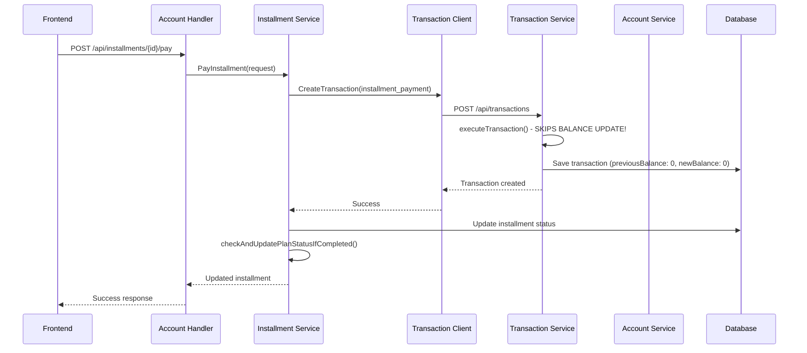

# Transaction Service & Installment System Architecture

## Overview

Esta documentación describe el funcionamiento completo del sistema de transacciones e instalments, incluyendo la arquitectura de servicios, flujos de datos y las interacciones entre componentes.

## Table of Contents

1. [Transaction Service Architecture](#transaction-service-architecture)
2. [Installment System Architecture](#installment-system-architecture)
3. [Account Service Integration](#account-service-integration)
4. [Service Interactions](#service-interactions)
5. [Data Flow Diagrams](#data-flow-diagrams)
6. [Identified Issues](#identified-issues)
7. [Recommendations](#recommendations)

---

## 1. Transaction Service Architecture

### 1.1 Core Components

#### TransactionService (Orchestrator)
- **Location**: `backend/services/transaction-service/internal/core/service/transaction_service_impl.go`
- **Purpose**: Main business logic service for transaction operations
- **Implements**: SOLID principles with dependency injection

#### Key Dependencies:
```go
type TransactionService struct {
    transactionRepo    TransactionRepositoryInterface
    ruleService       TransactionRuleServiceInterface
    auditService      TransactionAuditServiceInterface
    externalService   ExternalServiceInterface
    accountService    interfaces.AccountServiceInterface
}
```

### 1.2 Transaction Processing Flow

#### CreateTransaction Workflow:
1. **Validation Phase**
   - User validation via `externalService.ValidateUser()`
   - Transaction entity validation via `transaction.Validate()`
   - Pre-transaction business rules validation

2. **Creation Phase**
   - Create transaction with `PENDING` status
   - Save to repository for audit trail

3. **Execution Phase**
   - Check for `recordOnly` metadata flag
   - Execute balance updates via `executeTransaction()`
   - Mark as `COMPLETED` or `FAILED`

4. **Audit Phase**
   - Log transaction changes for compliance

#### Transaction Execution Engine:
```go
func (s *TransactionService) executeTransaction(transaction *Transaction) error {
    switch transaction.Type {
    case TransactionTypeWalletDeposit, TransactionTypeAccountDeposit:
        return s.executeDeposit(transaction)
    case TransactionTypeWalletWithdrawal, TransactionTypeAccountWithdraw:
        return s.executeWithdrawal(transaction)
    case TransactionTypeWalletTransfer, TransactionTypeAccountTransfer:
        return s.executeTransfer(transaction)
    case TransactionTypeCreditCharge, TransactionTypeDebitPurchase:
        return s.executePurchaseOrPayment(transaction)
    case TransactionTypeCreditPayment:
        return s.executeCreditPayment(transaction)
    default:
        // ⚠️ ISSUE: InstallmentPayment types fall here - no balance update!
        return nil
    }
}
```

### 1.3 Transaction Types Support

#### Supported Balance Updates:
- ✅ **Wallet Operations**: Deposit, Withdrawal, Transfer
- ✅ **Account Operations**: Deposit, Withdrawal, Transfer
- ✅ **Credit Operations**: Charge, Payment
- ✅ **Debit Operations**: Purchase
- ❌ **Installment Operations**: Payment, Refund (NOT IMPLEMENTED)

#### Transaction Entity Support:
```go
// Defined in transaction.go
TransactionTypeInstallmentPayment TransactionType = "installment_payment"
TransactionTypeInstallmentRefund  TransactionType = "installment_refund"

// Validation includes installment types
func (t *Transaction) IsValidTransactionType() bool {
    validTypes := []TransactionType{
        // ... other types ...
        TransactionTypeInstallmentPayment,
        TransactionTypeInstallmentRefund,
    }
    // ✅ VALIDATION WORKS
}
```

### 1.4 Account Service Integration

#### Balance Update Operations:
```go
// Deposit funds
accountService.AddFunds(accountID, amount, description, transactionID)

// Withdraw funds  
accountService.WithdrawFunds(accountID, amount, description, transactionID)

// Credit operations
accountService.UpdateCreditUsage(accountID, amount, description, transactionID)
```

---

## 2. Installment System Architecture

### 2.1 Core Components

#### InstallmentService
- **Location**: `backend/services/account-service/internal/core/service/installment_service.go`
- **Purpose**: Orchestrates installment payment processing and plan management

#### Key Responsibilities:
1. **Payment Processing**: Delegates to Transaction Service
2. **Plan Management**: Status updates and completion detection
3. **Business Rules**: Validation and workflow enforcement

### 2.2 Payment Processing Flow

#### PayInstallment Workflow:
```go
func (s *InstallmentService) PayInstallment(request *PayInstallmentRequest) (*Installment, error) {
    // 1. Validation Phase
    installment := s.validateInstallment(request.InstallmentID)
    account := s.validateAccount(request.AccountID)
    
    // 2. Payment Delegation
    transaction := s.transactionClient.CreateTransaction({
        Type: "installment_payment",
        UserID: request.UserID,
        Amount: installment.Amount,
        FromAccountID: request.AccountID,
        // ... other fields
    })
    
    // 3. Status Update
    installment.Status = "paid"
    installment.PaidAt = time.Now()
    installment.TransactionID = transaction.ID
    
    // 4. Plan Completion Check
    s.checkAndUpdatePlanStatusIfCompleted(installment.PlanID)
    
    return installment, nil
}
```

### 2.3 Plan Completion Automation

#### Automatic Status Detection:
```go
func (s *InstallmentService) checkAndUpdatePlanStatusIfCompleted(planID string) {
    plan := s.getInstallmentPlan(planID)
    installments := s.getInstallmentsByPlan(planID)
    
    allPaid := true
    for _, installment := range installments {
        if installment.Status != "paid" {
            allPaid = false
            break
        }
    }
    
    if allPaid && plan.Status == "active" {
        // Update plan status
        plan.Status = "completed"
        plan.CompletedAt = time.Now()
        
        // Record completion transaction
        s.transactionClient.CreateTransaction({
            Type: "installment_completion",
            Description: "Plan completion",
            // ⚠️ ISSUE: This fails with 500 error
        })
    }
}
```

### 2.4 Integration Points

#### Transaction Client Communication:
- **Protocol**: HTTP REST API
- **Endpoint**: `POST /api/transactions`
- **Authentication**: Service-to-service tokens
- **Error Handling**: Retry logic and fallback mechanisms

---

## 3. Account Service Integration

### 3.1 Service Architecture

#### Account Service Role:
- **Primary**: Account balance management
- **Secondary**: Installment orchestration
- **Integration**: Transaction service delegation

#### Key Interfaces:
```go
type AccountServiceInterface interface {
    GetAccountInfo(accountID string) (*AccountInfo, error)
    AddFunds(accountID string, amount float64, description, transactionID string) (*Account, error)
    WithdrawFunds(accountID string, amount float64, description, transactionID string) (*Account, error)
    UpdateCreditUsage(accountID string, amount float64, description, transactionID string) (*Account, error)
}
```

### 3.2 Balance Update Mechanisms

#### Fund Operations:
1. **AddFunds**: Increases account balance
2. **WithdrawFunds**: Decreases account balance + validation
3. **UpdateCreditUsage**: Modifies credit utilization

#### Transaction Recording:
- Each balance change creates transaction record
- `previousBalance` and `newBalance` fields should be populated
- ⚠️ **Current Issue**: These fields remain 0 in all transactions

---

## 4. Service Interactions

### 4.1 Installment Payment Flow



### 4.2 Current vs Expected Flow

#### Current (Broken) Flow:
1. ✅ Installment payment request received
2. ✅ Transaction created with correct type
3. ❌ **executeTransaction() skips InstallmentPayment type**
4. ✅ Transaction saved with status "completed"
5. ❌ **Account balance NOT updated**
6. ✅ Installment marked as paid
7. ✅ Plan completion detected
8. ❌ **Completion transaction fails with 500 error**

#### Expected (Fixed) Flow:
1. ✅ Installment payment request received
2. ✅ Transaction created with correct type
3. ✅ **executeTransaction() processes InstallmentPayment**
4. ✅ **Account balance updated via WithdrawFunds()**
5. ✅ Transaction saved with correct previousBalance/newBalance
6. ✅ Installment marked as paid
7. ✅ Plan completion detected
8. ✅ **Completion transaction succeeds**

---

## 5. Data Flow Diagrams

### 5.1 Transaction Processing

```
┌─────────────────┐    ┌──────────────────┐    ┌─────────────────┐
│   Client App    │───▶│  Account Service │───▶│Transaction Service│
└─────────────────┘    └──────────────────┘    └─────────────────┘
                                │                        │
                                ▼                        ▼
                       ┌──────────────────┐    ┌─────────────────┐
                       │Installment Service│    │ Account Service │
                       └──────────────────┘    └─────────────────┘
                                │                        │
                                ▼                        ▼
                       ┌──────────────────┐    ┌─────────────────┐
                       │    Database      │    │    Database     │
                       │   (Installments) │    │   (Accounts)    │
                       └──────────────────┘    └─────────────────┘
```

### 5.2 Current Balance Update Gap

```
Transaction Service executeTransaction()
├── WalletDeposit ──────▶ executeDeposit() ──────▶ accountService.AddFunds()
├── WalletWithdrawal ───▶ executeWithdrawal() ───▶ accountService.WithdrawFunds()
├── CreditCharge ───────▶ executePurchase() ─────▶ accountService.UpdateCreditUsage()
├── InstallmentPayment ─▶ default case ──────────▶ ❌ NO ACTION
└── InstallmentRefund ──▶ default case ──────────▶ ❌ NO ACTION
```

---

## 6. Identified Issues

### 6.1 Critical Issues

#### 🔴 **Issue #1: Installment Payments Don't Update Balances**
- **Location**: `TransactionService.executeTransaction()`
- **Problem**: `InstallmentPayment` and `InstallmentRefund` types fall through to default case
- **Impact**: Accounts maintain same balance despite successful payments
- **Evidence**: All transactions show `previousBalance: 0, newBalance: 0`

#### 🔴 **Issue #2: Plan Completion Transaction Fails**
- **Location**: `InstallmentService.checkAndUpdatePlanStatusIfCompleted()`
- **Problem**: Completion transaction recording returns 500 error
- **Impact**: Plans complete but no transaction record of completion

### 6.2 Secondary Issues

#### 🟡 **Issue #3: Transaction Metadata Inconsistency**
- **Problem**: `recordOnly` flag handling not standardized
- **Impact**: Confusion about when balance updates should occur

#### 🟡 **Issue #4: Error Handling Gaps**
- **Problem**: Some transaction failures don't properly rollback
- **Impact**: Potential data inconsistency

---

## 7. Recommendations

### 7.1 Immediate Fixes (Critical Priority)

#### Fix #1: Add Installment Payment Support to executeTransaction()
```go
func (s *TransactionService) executeTransaction(transaction *Transaction) error {
    switch transaction.Type {
    // ... existing cases ...
    case TransactionTypeInstallmentPayment:
        return s.executeInstallmentPayment(transaction)
    case TransactionTypeInstallmentRefund:
        return s.executeInstallmentRefund(transaction)
    default:
        return nil
    }
}

// New method to handle installment payments
func (s *TransactionService) executeInstallmentPayment(transaction *Transaction) error {
    // Installment payments are withdrawals from the paying account
    return s.executeWithdrawal(transaction)
}

// New method to handle installment refunds
func (s *TransactionService) executeInstallmentRefund(transaction *Transaction) error {
    // Installment refunds are deposits to the account
    return s.executeDeposit(transaction)
}
```

#### Fix #2: Investigate Plan Completion Transaction Error
- Add detailed logging to completion transaction creation
- Verify transaction type validity for completion events
- Implement proper error handling and retry logic

### 7.2 Medium-Term Improvements

#### Improvement #1: Enhanced Balance Tracking
```go
type Transaction struct {
    // ... existing fields ...
    PreviousBalance float64 `json:"previousBalance"`
    NewBalance      float64 `json:"newBalance"`
    BalanceChange   float64 `json:"balanceChange"`
}
```

#### Improvement #2: Transaction Rollback Mechanism
- Implement comprehensive rollback for failed transactions
- Add compensation transactions for complex operations
- Improve error recovery workflows

### 7.3 Long-Term Architecture Enhancements

#### Enhancement #1: Event-Driven Architecture
- Implement domain events for transaction state changes
- Decouple services using message queues
- Improve system resilience and scalability

#### Enhancement #2: Comprehensive Audit Trail
- Enhanced transaction logging
- Complete user action tracking
- Regulatory compliance improvements

---

## 8. Testing Strategy

### 8.1 Unit Tests Required
- [ ] `executeInstallmentPayment()` functionality
- [ ] `executeInstallmentRefund()` functionality
- [ ] Plan completion logic
- [ ] Balance update verification

### 8.2 Integration Tests Required
- [ ] End-to-end installment payment flow
- [ ] Account balance consistency
- [ ] Error handling and rollback scenarios
- [ ] Multi-service transaction coordination

### 8.3 Performance Tests
- [ ] High-volume installment processing
- [ ] Concurrent payment handling
- [ ] Database transaction performance

---

## 9. Conclusion

El sistema de installments está funcionalmente completo pero tiene una **brecha crítica** en la actualización de balances. La implementación actual:

✅ **Funciona correctamente**:
- Creación y validación de transacciones
- Gestión de estados de installments
- Detección automática de planes completados
- Integración UI-backend

❌ **Requiere corrección inmediata**:
- Actualización de balances en pagos de installments
- Registro de transacciones de completitud de planes
- Consistencia en metadatos de transacciones

La solución es **simple pero crítica**: agregar soporte explícito para tipos de transacciones de installments en el `TransactionService.executeTransaction()` method. Una vez implementado, el sistema funcionará completamente según el diseño arquitectónico.

---

## 10. Quick Implementation Guide

Para resolver los problemas identificados:

1. **Editar**: `transaction_service_impl.go`
2. **Agregar**: Casos para `InstallmentPayment` y `InstallmentRefund`
3. **Implementar**: Métodos específicos de ejecución
4. **Probar**: Flujo completo de pagos
5. **Verificar**: Actualización de balances

**Tiempo estimado**: 2-4 horas de desarrollo + testing
**Impacto**: Resolución completa de inconsistencias de balance
**Riesgo**: Bajo (cambios aislados en lógica existente)