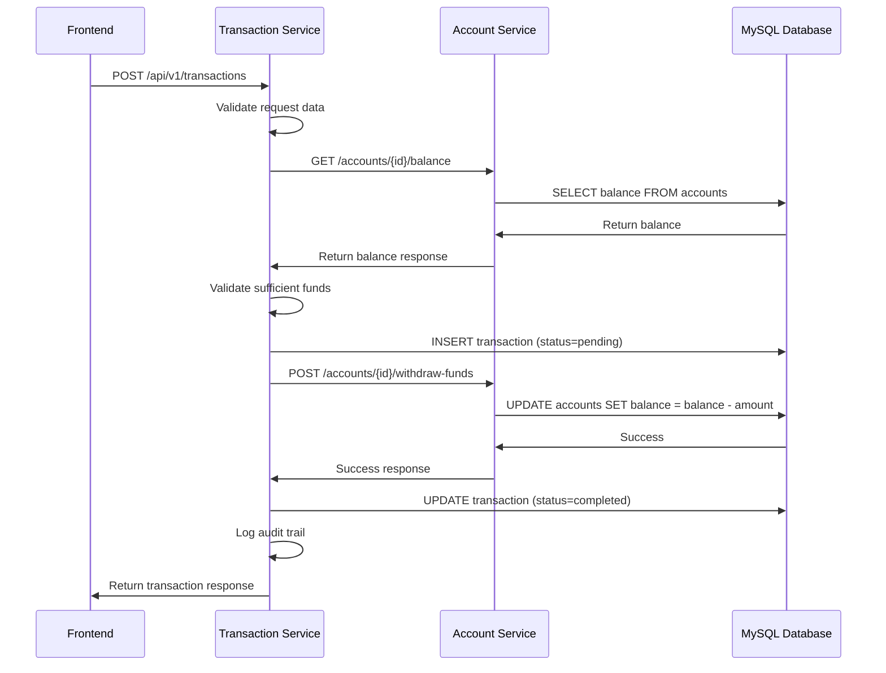

# Transaction Service - Arquitectura e Integración Completa

## Índice
1. [Visión General](#visión-general)
2. [Arquitectura del Servicio](#arquitectura-del-servicio)
3. [Integración con Frontend](#integración-con-frontend)
4. [Integración con Microservicios](#integración-con-microservicios)
5. [Flujos de Transacciones](#flujos-de-transacciones)
6. [APIs y Endpoints](#apis-y-endpoints)
7. [Manejo de Errores](#manejo-de-errores)
8. [Casos de Uso Detallados](#casos-de-uso-detallados)
9. [Configuración y Deployment](#configuración-y-deployment)

---

## Visión General

El **Transaction Service** es el orquestador central de todas las operaciones financieras en FinTrack. Su responsabilidad principal es coordinar transacciones entre diferentes tipos de cuentas, tarjetas y billeteras, asegurando la consistencia de datos y la integridad de los balances.

### Características Principales:
- ✅ **Validación Pre-transacción**: Verificación de fondos y límites antes de procesar
- ✅ **Actualización Real de Balances**: Comunicación directa con account-service
- ✅ **Rollback Automático**: Reversión de cambios en caso de errores
- ✅ **Soporte Multi-tipo**: Wallets, cuentas, tarjetas de crédito/débito
- ✅ **Auditoría Completa**: Registro detallado de todas las operaciones
- ✅ **Arquitectura de Microservicios**: Comunicación HTTP entre servicios

---

## Arquitectura del Servicio

### Estructura de Capas (Clean Architecture)

```
┌─────────────────────────────────────────────────────────┐
│                    FRONTEND (Angular)                   │
│                     Port: 4200                         │
└─────────────────────┬───────────────────────────────────┘
                      │ HTTP Calls
                      ▼
┌─────────────────────────────────────────────────────────┐
│              TRANSACTION SERVICE                        │
│                   Port: 8083                           │
│                                                         │
│  ┌─────────────────────────────────────────────────┐   │
│  │             Presentation Layer                   │   │
│  │  • HTTP Handlers                                │   │
│  │  • Request/Response DTOs                        │   │
│  │  • Input Validation                             │   │
│  │  • CORS Middleware                              │   │
│  └─────────────────────────────────────────────────┘   │
│                         │                               │
│  ┌─────────────────────────────────────────────────┐   │
│  │              Business Layer                      │   │
│  │  • Transaction Service Implementation           │   │
│  │  • Business Rules & Validation                  │   │
│  │  • Transaction Orchestration                    │   │
│  │  • Balance Update Logic                         │   │
│  │  • Rollback Mechanisms                          │   │
│  └─────────────────────────────────────────────────┘   │
│                         │                               │
│  ┌─────────────────────────────────────────────────┐   │
│  │            Infrastructure Layer                  │   │
│  │  • MySQL Repository                             │   │
│  │  • HTTP Client (Account Service)                │   │
│  │  • External Service Adapters                    │   │
│  │  • Audit Service                                │   │
│  └─────────────────────────────────────────────────┘   │
└─────────────────────┬───────────────────────────────────┘
                      │ HTTP Calls
                      ▼
┌─────────────────────────────────────────────────────────┐
│                ACCOUNT SERVICE                          │
│                  Port: 8081                            │
│  • Account Balance Management                          │
│  • Credit Limit Validation                             │
│  • Account Status Verification                         │
└─────────────────────────────────────────────────────────┘
                      │
                      ▼
┌─────────────────────────────────────────────────────────┐
│                  MYSQL DATABASE                         │
│                   Port: 3306                           │
│  • Shared database fintrack                           │
│  • Tables: transactions, accounts, cards              │
└─────────────────────────────────────────────────────────┘
```

### Componentes Principales

#### 1. **Transaction Service Core**
```go
type TransactionService struct {
    transactionRepo TransactionRepositoryInterface
    ruleService     TransactionRuleServiceInterface  
    auditService    TransactionAuditServiceInterface
    externalService ExternalServiceInterface
    accountService  AccountServiceInterface
}
```

#### 2. **Account Service Client**
```go
type AccountClient struct {
    baseURL    string
    httpClient *http.Client
}
```

#### 3. **Transaction Entity**
```go
type Transaction struct {
    ID              string
    Type            TransactionType
    Status          TransactionStatus
    Amount          float64
    Currency        string
    FromAccountID   *string
    ToAccountID     *string
    FromCardID      *string
    ToCardID        *string
    UserID          string
    Description     string
    PaymentMethod   PaymentMethod
    // ... más campos
}
```

---

## Integración con Frontend

### Flujo Frontend → Transaction Service

#### 1. **Autenticación y Headers**
```typescript
// Angular Service
@Injectable()
export class TransactionService {
  private apiUrl = 'http://localhost:8083/api/v1/transactions';
  
  private getHeaders(): HttpHeaders {
    return new HttpHeaders({
      'Content-Type': 'application/json',
      'Authorization': `Bearer ${this.authService.getToken()}`,
      'X-User-ID': this.authService.getUserId()
    });
  }
}
```

#### 2. **Crear Transacción desde Frontend**
```typescript
// Frontend Request
createTransaction(transaction: CreateTransactionRequest): Observable<Transaction> {
  return this.http.post<Transaction>(`${this.apiUrl}`, transaction, {
    headers: this.getHeaders()
  });
}

// Ejemplo de uso en componente
createWalletDeposit() {
  const transaction: CreateTransactionRequest = {
    type: 'wallet_deposit',
    amount: 1000.00,
    currency: 'ARS',
    toAccountId: this.selectedAccountId,
    description: 'Depósito en billetera',
    paymentMethod: 'bank_transfer'
  };
  
  this.transactionService.createTransaction(transaction).subscribe({
    next: (result) => {
      this.showSuccess('Depósito realizado exitosamente');
      this.refreshBalance();
    },
    error: (error) => {
      this.showError('Error al procesar depósito: ' + error.message);
    }
  });
}
```

#### 3. **Tipos de Transacciones desde Frontend**

##### **Depósitos en Billetera**
```typescript
depositToWallet(accountId: string, amount: number): Observable<Transaction> {
  return this.createTransaction({
    type: 'wallet_deposit',
    amount: amount,
    currency: 'ARS',
    toAccountId: accountId,
    description: 'Depósito en billetera',
    paymentMethod: 'bank_transfer'
  });
}
```

##### **Transferencias Entre Cuentas**
```typescript
transferBetweenAccounts(fromAccount: string, toAccount: string, amount: number): Observable<Transaction> {
  return this.createTransaction({
    type: 'account_transfer', 
    amount: amount,
    currency: 'ARS',
    fromAccountId: fromAccount,
    toAccountId: toAccount,
    description: `Transferencia a cuenta ${toAccount}`,
    paymentMethod: 'wallet'
  });
}
```

##### **Compras con Tarjeta**
```typescript
purchaseWithCard(cardId: string, amount: number, merchant: string): Observable<Transaction> {
  return this.createTransaction({
    type: 'debit_purchase',
    amount: amount,
    currency: 'ARS', 
    fromCardId: cardId,
    description: `Compra en ${merchant}`,
    merchantName: merchant,
    paymentMethod: 'debit_card'
  });
}
```

#### 4. **Manejo de Estados en Frontend**
```typescript
// Estado de transacción en componente
interface TransactionState {
  status: 'idle' | 'processing' | 'success' | 'error';
  transaction?: Transaction;
  errorMessage?: string;
}

processTransaction(transactionData: any) {
  this.state.status = 'processing';
  
  this.transactionService.createTransaction(transactionData).subscribe({
    next: (transaction) => {
      this.state.status = 'success';
      this.state.transaction = transaction;
      this.updateAccountBalances();
    },
    error: (error) => {
      this.state.status = 'error';
      this.state.errorMessage = error.error?.message || 'Error desconocido';
    }
  });
}
```

---

## Integración con Microservicios

### 1. **Comunicación con Account Service**

#### **Endpoints del Account Service utilizados:**

```http
GET    /api/v1/accounts/{id}/balance          # Obtener balance
POST   /api/v1/accounts/{id}/add-funds        # Agregar fondos
POST   /api/v1/accounts/{id}/withdraw-funds   # Retirar fondos
POST   /api/v1/accounts/{id}/credit-usage     # Actualizar uso crédito
GET    /api/v1/accounts/{id}/info             # Info de cuenta
GET    /api/v1/accounts/{id}/validate         # Validar cuenta
```

#### **Implementación del Cliente HTTP:**
```go
// account_client.go
func (c *AccountClient) GetAccountBalance(accountID string) (*AccountBalanceResponse, error) {
    url := fmt.Sprintf("%s/api/v1/accounts/%s/balance", c.baseURL, accountID)
    
    resp, err := c.httpClient.Get(url)
    if err != nil {
        return nil, fmt.Errorf("failed to get balance: %w", err)
    }
    defer resp.Body.Close()
    
    if resp.StatusCode != http.StatusOK {
        return nil, fmt.Errorf("account service returned status: %d", resp.StatusCode)
    }
    
    var balance AccountBalanceResponse
    if err := json.NewDecoder(resp.Body).Decode(&balance); err != nil {
        return nil, fmt.Errorf("failed to decode response: %w", err)
    }
    
    return &balance, nil
}
```

### 2. **Secuencia de Comunicación Típica**



### 3. **Manejo de Rollbacks en Transferencias**

```go
// executeTransfer en transaction_service_impl.go
func (s *TransactionService) executeTransfer(transaction *Transaction) error {
    // 1. Retirar de cuenta origen
    if err := s.executeWithdrawal(transaction); err != nil {
        return fmt.Errorf("failed to withdraw from source: %w", err)
    }
    
    // 2. Depositar en cuenta destino
    if err := s.executeDeposit(transaction); err != nil {
        // ¡ROLLBACK! Restaurar fondos en cuenta origen
        rollbackErr := s.rollbackWithdrawal(transaction)
        if rollbackErr != nil {
            return fmt.Errorf("transfer failed and rollback failed - original: %w, rollback: %v", err, rollbackErr)
        }
        return fmt.Errorf("failed to deposit to destination: %w", err)
    }
    
    return nil
}
```

---

## Flujos de Transacciones

### 1. **Flujo Completo: Transferencia Entre Cuentas**

```
┌─────────────────┐    ┌─────────────────┐    ┌─────────────────┐
│    FRONTEND     │    │  TRANSACTION    │    │   ACCOUNT       │
│                 │    │    SERVICE      │    │   SERVICE       │
└─────────┬───────┘    └─────────┬───────┘    └─────────┬───────┘
          │                      │                      │
          │ POST /transactions   │                      │
          ├─────────────────────►│                      │
          │                      │                      │
          │                      │ GET /balance (origen)│
          │                      ├─────────────────────►│
          │                      │                      │
          │                      │ Balance: $5000       │
          │                      │◄─────────────────────┤
          │                      │                      │
          │                      │ Validar fondos OK    │
          │                      │                      │
          │                      │ GET /validate (dest) │
          │                      ├─────────────────────►│
          │                      │                      │
          │                      │ Account valid        │
          │                      │◄─────────────────────┤
          │                      │                      │
          │                      │ INSERT transaction   │
          │                      │ (status=pending)     │
          │                      │                      │
          │                      │ POST /withdraw $1000 │
          │                      ├─────────────────────►│
          │                      │                      │
          │                      │ Withdraw success     │
          │                      │◄─────────────────────┤
          │                      │                      │
          │                      │ POST /add-funds $1000│
          │                      ├─────────────────────►│
          │                      │                      │
          │                      │ Deposit success      │
          │                      │◄─────────────────────┤
          │                      │                      │
          │                      │ UPDATE transaction   │
          │                      │ (status=completed)   │
          │                      │                      │
          │ Transaction Success  │                      │
          │◄─────────────────────┤                      │
          │                      │                      │
```

### 2. **Flujo de Error con Rollback**

```
┌─────────────────┐    ┌─────────────────┐    ┌─────────────────┐
│    FRONTEND     │    │  TRANSACTION    │    │   ACCOUNT       │
│                 │    │    SERVICE      │    │   SERVICE       │
└─────────┬───────┘    └─────────┬───────┘    └─────────┬───────┘
          │                      │                      │
          │ POST /transactions   │                      │
          ├─────────────────────►│                      │
          │                      │                      │
          │                      │ POST /withdraw $1000 │
          │                      ├─────────────────────►│
          │                      │                      │
          │                      │ Withdraw success     │
          │                      │◄─────────────────────┤
          │                      │                      │
          │                      │ POST /add-funds $1000│
          │                      ├─────────────────────►│
          │                      │                      │
          │                      │ ERROR: Account closed│
          │                      │◄─────────────────────┤
          │                      │                      │
          │                      │ ROLLBACK NEEDED!     │
          │                      │                      │
          │                      │ POST /add-funds $1000│
          │                      │ (restore to origin)  │
          │                      ├─────────────────────►│
          │                      │                      │
          │                      │ Rollback success     │
          │                      │◄─────────────────────┤
          │                      │                      │
          │                      │ UPDATE transaction   │
          │                      │ (status=failed)      │
          │                      │                      │
          │ ERROR: Transfer      │                      │
          │ failed (rolled back) │                      │
          │◄─────────────────────┤                      │
          │                      │                      │
```

---

## APIs y Endpoints

### **Transaction Service Endpoints**

#### **1. Crear Transacción**
```http
POST /api/v1/transactions
Content-Type: application/json
X-User-ID: user-uuid

{
  "type": "wallet_transfer",
  "amount": 1500.00,
  "currency": "ARS", 
  "fromAccountId": "acc-123",
  "toAccountId": "acc-456",
  "description": "Transferencia a Juan",
  "paymentMethod": "wallet"
}
```

**Response Success (201):**
```json
{
  "id": "txn-789",
  "referenceId": "REF-2024-001",
  "type": "wallet_transfer",
  "status": "completed",
  "amount": 1500.00,
  "currency": "ARS",
  "fromAccountId": "acc-123", 
  "toAccountId": "acc-456",
  "userId": "user-uuid",
  "initiatedBy": "user-uuid",
  "description": "Transferencia a Juan",
  "paymentMethod": "wallet",
  "previousBalance": 5000.00,
  "newBalance": 3500.00,
  "processedAt": "2024-09-25T10:30:00Z",
  "createdAt": "2024-09-25T10:29:55Z",
  "updatedAt": "2024-09-25T10:30:00Z"
}
```

**Response Error (400):**
```json
{
  "error": "insufficient_funds",
  "message": "Fondos insuficientes: disponible 800.00, solicitado 1500.00",
  "code": 400,
  "details": {
    "available": 800.00,
    "requested": 1500.00,
    "shortfall": 700.00
  }
}
```

#### **2. Listar Transacciones**
```http
GET /api/v1/transactions?page=1&pageSize=20&type=wallet_transfer&status=completed
X-User-ID: user-uuid
```

**Response (200):**
```json
{
  "transactions": [
    {
      "id": "txn-789",
      "type": "wallet_transfer", 
      "status": "completed",
      "amount": 1500.00,
      "description": "Transferencia a Juan",
      "createdAt": "2024-09-25T10:30:00Z"
    }
  ],
  "total": 1,
  "page": 1,
  "pageSize": 20
}
```

#### **3. Obtener Transacción Específica**
```http
GET /api/v1/transactions/{id}
X-User-ID: user-uuid
```

#### **4. Procesar Transacción Pendiente**
```http
POST /api/v1/transactions/{id}/process
X-User-ID: user-uuid
```

#### **5. Revertir Transacción**
```http
POST /api/v1/transactions/{id}/reverse
Content-Type: application/json
X-User-ID: user-uuid

{
  "reason": "Transacción realizada por error"
}
```

### **Tipos de Transacción Soportados**

| Tipo | Código | Descripción | Validaciones |
|------|--------|-------------|--------------|
| Depósito Billetera | `wallet_deposit` | Agregar fondos a billetera | Cuenta destino válida |
| Retiro Billetera | `wallet_withdrawal` | Retirar fondos de billetera | Fondos suficientes |
| Transferencia Billetera | `wallet_transfer` | Transferir entre billeteras | Ambas cuentas válidas + fondos |
| Depósito Cuenta | `account_deposit` | Depósito en cuenta bancaria | Cuenta activa |
| Retiro Cuenta | `account_withdraw` | Retiro de cuenta bancaria | Fondos + límites diarios |
| Transferencia Cuenta | `account_transfer` | Entre cuentas bancarias | Ambas activas + fondos |
| Cargo Crédito | `credit_charge` | Compra con tarjeta de crédito | Límite disponible |
| Pago Crédito | `credit_payment` | Pago de tarjeta de crédito | Monto válido |
| Compra Débito | `debit_purchase` | Compra con débito | Fondos en cuenta |
| Retiro Débito | `debit_withdrawal` | Retiro ATM con débito | Fondos + límites ATM |

---

## Manejo de Errores

### **Tipos de Error y Códigos HTTP**

#### **1. Errores de Validación (400)**
```json
{
  "error": "validation_error",
  "message": "Datos de entrada inválidos",
  "code": 400,
  "details": {
    "field": "amount",
    "issue": "amount must be positive"
  }
}
```

#### **2. Fondos Insuficientes (400)**
```json
{
  "error": "insufficient_funds", 
  "message": "Fondos insuficientes en la cuenta",
  "code": 400,
  "details": {
    "available": 500.00,
    "requested": 1000.00,
    "accountId": "acc-123"
  }
}
```

#### **3. Cuenta No Encontrada (404)**
```json
{
  "error": "account_not_found",
  "message": "La cuenta especificada no existe o no está activa", 
  "code": 404,
  "details": {
    "accountId": "acc-999"
  }
}
```

#### **4. Límite de Crédito Excedido (400)**
```json
{
  "error": "credit_limit_exceeded",
  "message": "Límite de crédito insuficiente",
  "code": 400,
  "details": {
    "availableCredit": 2000.00,
    "requestedAmount": 2500.00,
    "cardId": "card-123"
  }
}
```

#### **5. Error de Comunicación con Servicios (503)**
```json
{
  "error": "service_unavailable",
  "message": "Error de comunicación con el servicio de cuentas",
  "code": 503,
  "details": {
    "service": "account-service",
    "operation": "get_balance"
  }
}
```

#### **6. Error de Rollback (500)**
```json
{
  "error": "rollback_failed", 
  "message": "La transacción falló y no se pudo revertir completamente",
  "code": 500,
  "details": {
    "originalError": "destination account closed",
    "rollbackError": "failed to restore funds to source account",
    "transactionId": "txn-789"
  }
}
```

### **Manejo de Errores en Frontend**
```typescript
// error-handler.service.ts
@Injectable()
export class ErrorHandlerService {
  
  handleTransactionError(error: HttpErrorResponse): string {
    switch (error.error?.error) {
      case 'insufficient_funds':
        return `Fondos insuficientes. Disponible: $${error.error.details.available}`;
        
      case 'account_not_found':
        return 'La cuenta seleccionada no está disponible';
        
      case 'credit_limit_exceeded':
        return `Límite de crédito excedido. Disponible: $${error.error.details.availableCredit}`;
        
      case 'service_unavailable':
        return 'Servicio temporalmente no disponible. Intente más tarde.';
        
      case 'rollback_failed':
        return 'Error crítico en la transacción. Contacte al soporte.';
        
      default:
        return 'Error desconocido al procesar la transacción';
    }
  }
}
```

---

## Casos de Uso Detallados

### **Caso 1: Usuario deposita $10,000 en su billetera**

#### **Frontend (Angular)**
```typescript
// wallet.component.ts
depositFunds() {
  const request: CreateTransactionRequest = {
    type: 'wallet_deposit',
    amount: 10000.00,
    currency: 'ARS',
    toAccountId: this.userWalletId,
    description: 'Depósito en billetera desde transferencia bancaria',
    paymentMethod: 'bank_transfer'
  };
  
  this.transactionService.createTransaction(request).subscribe({
    next: (transaction) => {
      this.notificationService.showSuccess('Depósito realizado exitosamente');
      this.walletBalance += transaction.amount;
      this.transactionHistory.unshift(transaction);
    },
    error: (error) => {
      const message = this.errorHandler.handleTransactionError(error);
      this.notificationService.showError(message);
    }
  });
}
```

#### **Transaction Service Processing**
```go
// transaction_service_impl.go
func (s *TransactionService) CreateTransaction(userID string, request *CreateTransactionRequest) (*Transaction, error) {
    // 1. Validar datos de entrada
    if err := s.validateTransactionRequest(request); err != nil {
        return nil, fmt.Errorf("validation failed: %w", err)
    }
    
    // 2. Crear entidad de transacción
    transaction := &Transaction{
        ID:          generateUUID(),
        Type:        TransactionTypeWalletDeposit,
        Status:      TransactionStatusPending,
        Amount:      request.Amount,
        Currency:    request.Currency,
        ToAccountID: &request.ToAccountID,
        UserID:      userID,
        InitiatedBy: userID,
        Description: request.Description,
        CreatedAt:   time.Now(),
    }
    
    // 3. Validaciones pre-transacción
    if err := s.performPreTransactionValidations(transaction); err != nil {
        return nil, fmt.Errorf("pre-validation failed: %w", err)
    }
    
    // 4. Guardar en BD como pendiente
    savedTransaction, err := s.transactionRepo.Save(transaction)
    if err != nil {
        return nil, fmt.Errorf("failed to save transaction: %w", err)
    }
    
    // 5. Ejecutar actualización de balance
    if err := s.executeTransaction(savedTransaction); err != nil {
        // Marcar como fallida
        savedTransaction.Status = TransactionStatusFailed
        savedTransaction.FailureReason = err.Error()
        s.transactionRepo.Update(savedTransaction)
        return nil, fmt.Errorf("transaction execution failed: %w", err)
    }
    
    // 6. Marcar como completada
    savedTransaction.Status = TransactionStatusCompleted
    now := time.Now()
    savedTransaction.ProcessedAt = &now
    
    updatedTransaction, err := s.transactionRepo.Update(savedTransaction)
    if err != nil {
        return nil, fmt.Errorf("failed to update transaction status: %w", err)
    }
    
    // 7. Registro de auditoría
    s.auditService.LogTransactionChange(
        updatedTransaction.ID,
        "complete_transaction", 
        &TransactionStatusPending,
        &TransactionStatusCompleted,
        userID,
        "Deposit completed successfully",
    )
    
    return updatedTransaction, nil
}
```

#### **Account Service Integration**
```go
// account_client.go  
func (s *TransactionService) executeDeposit(transaction *Transaction) error {
    // Llamada HTTP al account-service
    _, err := s.accountService.AddFunds(
        stringValue(transaction.ToAccountID),
        transaction.Amount,
        fmt.Sprintf("Deposit - %s", transaction.Description),
        transaction.ID,
    )
    return err
}

func (c *AccountClient) AddFunds(accountID string, amount float64, description, referenceID string) (*UpdateBalanceResponse, error) {
    request := AddFundsRequest{
        Amount:      amount,
        Description: description,
        ReferenceID: referenceID,
    }
    
    jsonData, _ := json.Marshal(request)
    url := fmt.Sprintf("%s/api/v1/accounts/%s/add-funds", c.baseURL, accountID)
    
    resp, err := c.httpClient.Post(url, "application/json", bytes.NewBuffer(jsonData))
    if err != nil {
        return nil, fmt.Errorf("failed to add funds: %w", err)
    }
    defer resp.Body.Close()
    
    if resp.StatusCode != http.StatusOK {
        return nil, fmt.Errorf("account service returned status: %d", resp.StatusCode)
    }
    
    var response UpdateBalanceResponse
    if err := json.NewDecoder(resp.Body).Decode(&response); err != nil {
        return nil, fmt.Errorf("failed to decode response: %w", err)
    }
    
    return &response, nil
}
```

### **Caso 2: Usuario transfiere $5,000 entre billeteras**

#### **Frontend Implementation**
```typescript
// transfer.component.ts
transferBetweenWallets() {
  if (this.fromAccount === this.toAccount) {
    this.showError('No puedes transferir a la misma cuenta');
    return;
  }
  
  const request: CreateTransactionRequest = {
    type: 'wallet_transfer',
    amount: this.transferAmount,
    currency: 'ARS',
    fromAccountId: this.fromAccount,
    toAccountId: this.toAccount,
    description: `Transferencia a ${this.recipientName}`,
    paymentMethod: 'wallet'
  };
  
  this.isProcessing = true;
  
  this.transactionService.createTransaction(request).subscribe({
    next: (transaction) => {
      this.isProcessing = false;
      this.showSuccess(`Transferencia de $${transaction.amount} completada exitosamente`);
      this.router.navigate(['/transactions', transaction.id]);
    },
    error: (error) => {
      this.isProcessing = false;
      const message = this.errorHandler.handleTransactionError(error);
      this.showError(message);
    }
  });
}
```

#### **Backend Processing with Rollback**
```go
// executeTransfer in transaction_service_impl.go
func (s *TransactionService) executeTransfer(transaction *Transaction) error {
    // Paso 1: Retirar de cuenta origen
    withdrawErr := s.executeWithdrawal(transaction)
    if withdrawErr != nil {
        return fmt.Errorf("failed to withdraw from source account: %w", withdrawErr)
    }
    
    // Paso 2: Depositar en cuenta destino  
    depositErr := s.executeDeposit(transaction)
    if depositErr != nil {
        // ¡ROLLBACK CRÍTICO!
        log.Printf("Transfer deposit failed, attempting rollback for transaction %s", transaction.ID)
        
        rollbackErr := s.rollbackWithdrawal(transaction)
        if rollbackErr != nil {
            // Error crítico: transacción falló Y rollback falló
            log.Printf("CRITICAL: Rollback failed for transaction %s: %v", transaction.ID, rollbackErr)
            
            // Notificar al sistema de monitoreo
            s.alertingService.SendCriticalAlert("ROLLBACK_FAILED", map[string]interface{}{
                "transactionId": transaction.ID,
                "originalError": depositErr.Error(),
                "rollbackError": rollbackErr.Error(),
                "amount": transaction.Amount,
                "fromAccount": *transaction.FromAccountID,
                "toAccount": *transaction.ToAccountID,
            })
            
            return fmt.Errorf("transfer failed and rollback failed - original error: %w, rollback error: %v", depositErr, rollbackErr)
        }
        
        log.Printf("Successfully rolled back transaction %s", transaction.ID)
        return fmt.Errorf("failed to deposit to destination account: %w", depositErr)
    }
    
    log.Printf("Transfer completed successfully for transaction %s", transaction.ID)
    return nil
}

// rollbackWithdrawal restaura fondos a la cuenta origen
func (s *TransactionService) rollbackWithdrawal(transaction *Transaction) error {
    _, err := s.accountService.AddFunds(
        stringValue(transaction.FromAccountID),
        transaction.Amount,
        fmt.Sprintf("Rollback - %s", transaction.Description),
        fmt.Sprintf("rollback-%s", transaction.ID),
    )
    
    if err != nil {
        return fmt.Errorf("failed to rollback funds to source account: %w", err)
    }
    
    return nil
}
```

---

## Configuración y Deployment

### **Variables de Entorno**

#### **Transaction Service**
```bash
# .env file for transaction-service
PORT=8083
DB_HOST=localhost
DB_PORT=3306
DB_USER=fintrack_user
DB_PASSWORD=secure_password
DB_NAME=fintrack

# Service URLs
ACCOUNT_SERVICE_URL=http://localhost:8081
USER_SERVICE_URL=http://localhost:8082
NOTIFICATION_SERVICE_URL=http://localhost:8084

# Security
JWT_SECRET=your_jwt_secret_key
BCRYPT_COST=12

# Monitoring
LOG_LEVEL=info
ENABLE_METRICS=true
METRICS_PORT=9090
```

### **Docker Configuration**

#### **Dockerfile**
```dockerfile
# Dockerfile for transaction-service
FROM golang:1.21-alpine AS builder

WORKDIR /app
COPY go.mod go.sum ./
RUN go mod download

COPY . .
RUN CGO_ENABLED=0 GOOS=linux go build -o transaction-service ./cmd

FROM alpine:3.19
RUN apk --no-cache add ca-certificates tzdata
WORKDIR /root/

COPY --from=builder /app/transaction-service .

EXPOSE 8083

CMD ["./transaction-service"]
```

#### **docker-compose.yml**
```yaml
version: '3.8'

services:
  mysql:
    image: mysql:8.0
    environment:
      MYSQL_ROOT_PASSWORD: root_password
      MYSQL_DATABASE: fintrack
      MYSQL_USER: fintrack_user 
      MYSQL_PASSWORD: secure_password
    ports:
      - "3306:3306"
    volumes:
      - mysql_data:/var/lib/mysql
      - ./database/migrations:/docker-entrypoint-initdb.d

  account-service:
    build: ./backend/services/account-service
    ports:
      - "8081:8081"
    environment:
      - DB_HOST=mysql
      - DB_PORT=3306
      - DB_USER=fintrack_user
      - DB_PASSWORD=secure_password
      - DB_NAME=fintrack
    depends_on:
      - mysql

  transaction-service:
    build: ./backend/services/transaction-service  
    ports:
      - "8083:8083"
    environment:
      - DB_HOST=mysql
      - DB_PORT=3306
      - DB_USER=fintrack_user
      - DB_PASSWORD=secure_password
      - DB_NAME=fintrack
      - ACCOUNT_SERVICE_URL=http://account-service:8081
    depends_on:
      - mysql
      - account-service

  frontend:
    build: ./frontend
    ports:
      - "4200:80"
    environment:
      - API_BASE_URL=http://localhost:8083

volumes:
  mysql_data:
```

### **Comandos de Deployment**

#### **Desarrollo Local**
```bash
# Levantar toda la stack
docker-compose up --build

# Solo transaction service + dependencies
docker-compose up --build mysql account-service transaction-service

# Logs específicos
docker-compose logs -f transaction-service

# Rebuild específico
docker-compose build --no-cache transaction-service
```

#### **Producción con Docker Swarm**
```bash
# Init swarm
docker swarm init

# Deploy stack
docker stack deploy -c docker-compose.prod.yml fintrack

# Scale services
docker service scale fintrack_transaction-service=3
docker service scale fintrack_account-service=2

# Monitor
docker service ls
docker service logs fintrack_transaction-service
```

### **Health Checks y Monitoring**

#### **Health Check Endpoint**
```go
// health.go
func (r *Router) healthCheck(w http.ResponseWriter, req *http.Request) {
    health := HealthCheckResponse{
        Status:    "healthy",
        Service:   "transaction-service",
        Version:   "1.0.0", 
        Timestamp: time.Now().UTC(),
        Dependencies: map[string]string{
            "database":        s.checkDatabaseHealth(),
            "account-service": s.checkAccountServiceHealth(),
        },
    }
    
    // Determine overall status
    allHealthy := true
    for _, status := range health.Dependencies {
        if status != "healthy" {
            allHealthy = false
            break
        }
    }
    
    if !allHealthy {
        health.Status = "degraded"
        w.WriteHeader(http.StatusServiceUnavailable)
    } else {
        w.WriteHeader(http.StatusOK)
    }
    
    json.NewEncoder(w).Encode(health)
}
```

#### **Metrics Endpoint**
```http
GET /metrics

# Response (Prometheus format)
transaction_service_requests_total{method="POST",endpoint="/transactions",status="200"} 1234
transaction_service_requests_total{method="POST",endpoint="/transactions",status="400"} 56  
transaction_service_request_duration_seconds{method="POST",endpoint="/transactions"} 0.150
transaction_service_account_service_calls_total{operation="get_balance",status="success"} 800
transaction_service_account_service_calls_total{operation="get_balance",status="error"} 12
transaction_service_rollbacks_total 5
```

### **Testing de Integración**

#### **Script de Testing**
```bash
#!/bin/bash
# test_integration.sh

echo "Testing Transaction Service Integration..."

# 1. Health check
echo "1. Checking service health..."
curl -f http://localhost:8083/health || exit 1

# 2. Create wallet deposit
echo "2. Testing wallet deposit..."
curl -X POST http://localhost:8083/api/v1/transactions \
  -H "Content-Type: application/json" \
  -H "X-User-ID: test-user-123" \
  -d '{
    "type": "wallet_deposit",
    "amount": 1000.00,
    "currency": "ARS", 
    "toAccountId": "test-account-456",
    "description": "Test deposit"
  }' || exit 1

# 3. Test transfer
echo "3. Testing wallet transfer..."
curl -X POST http://localhost:8083/api/v1/transactions \
  -H "Content-Type: application/json" \
  -H "X-User-ID: test-user-123" \
  -d '{
    "type": "wallet_transfer",
    "amount": 500.00,
    "currency": "ARS",
    "fromAccountId": "test-account-456", 
    "toAccountId": "test-account-789",
    "description": "Test transfer"
  }' || exit 1

# 4. Test insufficient funds
echo "4. Testing insufficient funds error..."
curl -X POST http://localhost:8083/api/v1/transactions \
  -H "Content-Type: application/json" \
  -H "X-User-ID: test-user-123" \
  -d '{
    "type": "wallet_withdrawal",
    "amount": 10000.00,
    "currency": "ARS",
    "fromAccountId": "test-account-456",
    "description": "Test insufficient funds"
  }' 

echo "All integration tests passed!"
```

---

## Conclusión

El Transaction Service ahora funciona como un **orquestador completo** que:

1. **Recibe requests del frontend** Angular con validación completa
2. **Se comunica con account-service** vía HTTP para operaciones reales de balance
3. **Maneja rollbacks automáticos** para mantener consistencia
4. **Proporciona APIs REST completas** con manejo robusto de errores
5. **Registra auditoría detallada** de todas las operaciones
6. **Soporta múltiples tipos de transacciones** (wallet, account, credit, debit)

La arquitectura es **resiliente, escalable y mantenible**, siguiendo principios de Clean Architecture y microservicios, preparada para un entorno de producción.