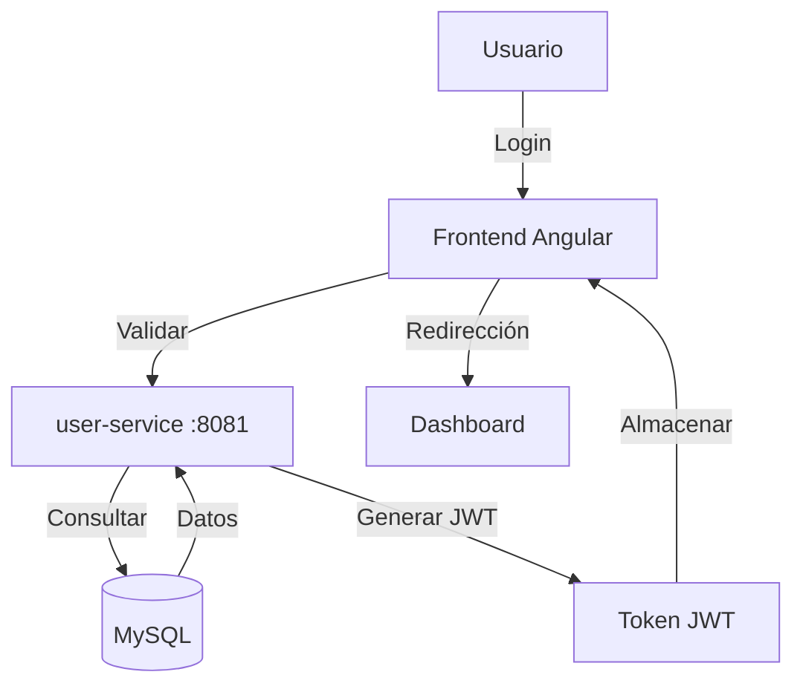
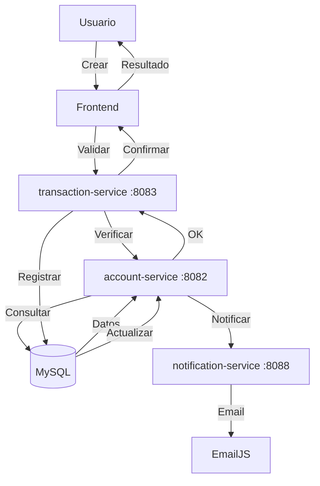
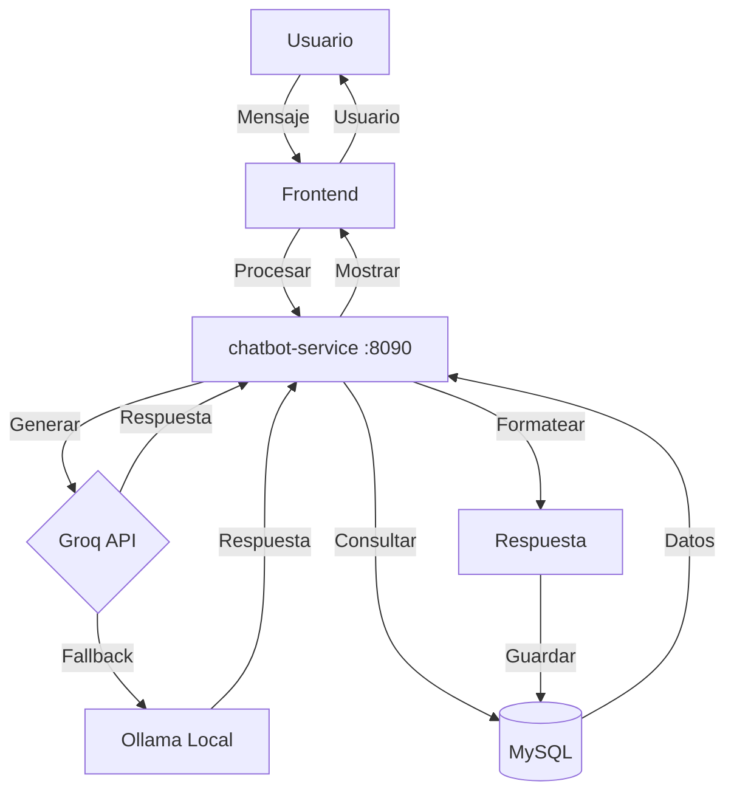
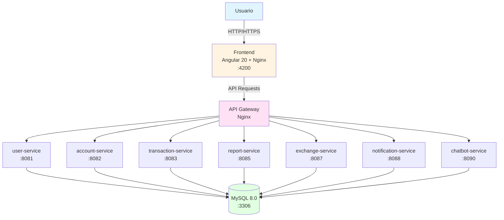
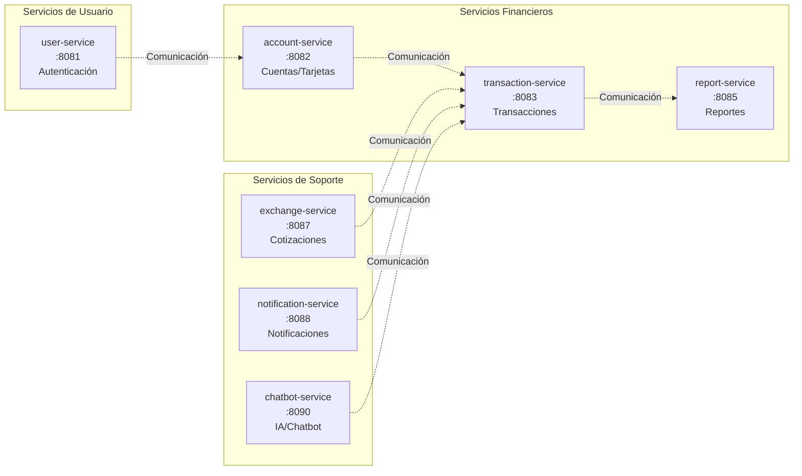

<!-- 
NOTAS DE FORMATO APA PARA EXPORTACIÓN:
- Márgenes: 2.54 cm (1 pulgada) en todos los lados
- Fuente: Times New Roman 12pt
- Interlineado: Doble espacio
- Numeración de páginas: Esquina superior derecha, comenzar desde portada (pero no mostrar número en portada)
- Encabezado running head: "FINTRACK: PLATAFORMA DE GESTIÓN FINANCIERA PERSONAL" (máximo 50 caracteres) en todas las páginas excepto portada
- Sangría: Primera línea de cada párrafo con sangría de 1.27 cm (0.5 pulgadas), excepto resumen
- Alineación: Texto alineado a la izquierda (justificado)
-->

<div style="text-align: center; margin-top: 2in;">

**FinTrack: Plataforma de Gestión Financiera Personal**

<br><br><br>

Alexis Ezequiel Medina

<br><br>

Universidad Nacional Tecnológica de Córdoba

Tecnicatura en Programación

<br><br>

Trabajo de Tesis

<br><br>

Enero, 2025

</div>

---

## Resumen

FinTrack es una plataforma web integral de gestión financiera personal desarrollada como trabajo de tesis para la Tecnicatura en Programación de la Universidad Nacional Tecnológica de Córdoba. El proyecto surge de la necesidad de centralizar la gestión de múltiples cuentas bancarias, tarjetas de crédito/débito y billeteras virtuales dispersas en diferentes aplicaciones. La solución implementa una arquitectura de microservicios con 8 servicios independientes desarrollados en Go (Golang) y un frontend en Angular 20, utilizando MySQL como base de datos y Docker para la contenedorización. La plataforma permite a los usuarios visualizar su situación financiera en tiempo real, analizar gastos e ingresos mediante reportes detallados y gráficos interactivos, gestionar transacciones con soporte multi-divisa (ARS, USD), consultar información mediante un chatbot inteligente con procesamiento de lenguaje natural, y recibir notificaciones automáticas sobre vencimientos y eventos importantes. El proyecto demuestra la aplicación práctica de conocimientos en desarrollo full-stack, arquitectura de sistemas distribuidos, integración de servicios externos, implementación de inteligencia artificial y DevOps, resultando en una aplicación funcional que cumple objetivos académicos y resuelve un problema real de gestión financiera personal.

---

## Tabla de Contenidos

1. Objetivo de la Aplicación
2. Motivación del Desarrollo
3. Herramientas de Desarrollo
4. Gestor de Base de Datos
5. Instalación y Acceso
6. Repositorio GitHub
7. Dificultades Técnicas
8. Estado de Implementación
9. Alcances y Características Principales
10. Mejoras a Futuro
11. Conclusión
12. Referencias
13. Figuras

---

# Objetivo de la Aplicación

FinTrack es una plataforma web integral de gestión financiera personal diseñada para centralizar y simplificar el manejo de finanzas digitales. El objetivo principal es proporcionar a los usuarios una solución unificada que les permita:

- Centralizar la gestión de múltiples cuentas bancarias, tarjetas de crédito/débito y billeteras virtuales
- Visualizar de forma consolidada su situación financiera en tiempo real
- Analizar sus gastos e ingresos mediante reportes detallados y gráficos interactivos
- Gestionar transacciones financieras con soporte multi-divisa (ARS, USD)
- Consultar información financiera mediante un chatbot inteligente con procesamiento de lenguaje natural
- Recibir notificaciones automáticas sobre vencimientos de tarjetas y eventos importantes

La aplicación está diseñada como un proyecto académico de tesis que demuestra la implementación de arquitectura de microservicios, tecnologías modernas y buenas prácticas de ingeniería de software.

---

## Motivación del Desarrollo

### Contexto Personal y Académico

Este proyecto surge como trabajo de tesis para la Tecnicatura en Programación de la Universidad Nacional Tecnológica de Córdoba. La motivación principal fue:

1. **Aplicar conocimientos adquiridos**: Integrar conceptos de desarrollo web, bases de datos, arquitectura de software y sistemas distribuidos en un proyecto real y funcional.

2. **Resolver un problema personal**: Como estudiante, experimenté la dificultad de gestionar múltiples cuentas bancarias, tarjetas y billeteras virtuales (MercadoPago, Ualá, Brubank) dispersas en diferentes aplicaciones. No existía una solución gratuita y accesible que centralizara toda esta información.

3. **Demostrar competencias técnicas**: El proyecto permite demostrar dominio en:
   - Desarrollo full-stack (Frontend y Backend)
   - Arquitectura de microservicios
   - Integración de servicios externos (APIs de cotizaciones, servicios de email)
   - Implementación de IA/ML (chatbot conversacional)
   - DevOps y contenedores (Docker)

### ¿Es para un Cliente Real?

No, este es un proyecto académico desarrollado como trabajo de tesis. Sin embargo, el diseño y la arquitectura están pensados para ser escalables y potencialmente comercializables en el futuro. La aplicación puede servir como:

- **Portfolio profesional**: Demostración de habilidades técnicas
- **Base para futuros proyectos**: Arquitectura reutilizable
- **Prototipo funcional**: Base para un producto comercial futuro

---

## Herramientas de Desarrollo

### Stack Tecnológico Completo

#### Frontend

- **Framework**: Angular 20.0+ (TypeScript)
- **UI Library**: Angular Material + CDK
- **Estado**: Angular Signals (reactive state management)
- **Routing**: Angular Router con guards (authGuard, guestGuard, permissionGuard)
- **Forms**: Angular Reactive Forms
- **Build Tool**: Angular CLI con Webpack
- **Node.js**: 18.19.0+
- **Package Manager**: npm

#### Backend

- **Lenguaje**: Go 1.24+ (Golang)
- **Framework Web**: Gin Web Framework
- **ORM**: GORM (para algunos servicios) + database/sql nativo
- **Autenticación**: JWT (JSON Web Tokens)
- **Validación**: go-playground/validator
- **Documentación API**: Swagger/OpenAPI (implementado en algunos servicios)

#### Base de Datos

- **Motor**: MySQL 8.0+
- **Charset**: utf8mb4
- **Collation**: utf8mb4_unicode_ci
- **Storage Engine**: InnoDB
- **Conexión**: Connection pooling (máx. 25 conexiones por servicio)

#### Infraestructura y DevOps

- **Contenedores**: Docker 20.10+ y Docker Compose 2.0+
- **Proxy/API Gateway**: Nginx
- **CI/CD**: GitHub Actions (configurado en `.github/workflows/ci-cd.yml`)
- **Monitoreo**: Health checks implementados en todos los servicios

#### Servicios Externos e Integraciones

- **IA/LLM**: 
  - Groq API (llama-3.1-8b-instant) - Principal
  - Ollama (qwen2.5:3b) - Fallback local
- **Email**: EmailJS (para notificaciones)
- **Cotizaciones**: DolarAPI.com (cotizaciones USD/ARS en tiempo real)
- **PDF Generation**: gofpdf (generación de reportes PDF)

#### Herramientas de Desarrollo

- **Control de Versiones**: Git
- **IDE/Editor**: Visual Studio Code / Cursor
- **Testing**: 
  - Backend: Go testing package
  - Frontend: Jasmine + Karma
- **Linting**: ESLint, Prettier (frontend)
- **Documentación**: Markdown, Swagger

### Arquitectura de Microservicios

La aplicación está dividida en 8 microservicios principales, cada uno con responsabilidades específicas y bien definidas. La Tabla 1 presenta la distribución de servicios, puertos y tecnologías utilizadas. La arquitectura completa del sistema se visualiza en las Figuras 4 y 5, presentadas en la sección de Diagramas y Flujos de Proceso.

**Tabla 1**  
*Arquitectura de microservicios de FinTrack*

| Servicio | Puerto | Tecnología | Responsabilidad |
|----------|--------|------------|------------------|
| user-service | 8081 | Go + Gin | Autenticación, registro, gestión de usuarios |
| account-service | 8082 | Go + Gin + GORM | Gestión de cuentas bancarias y tarjetas |
| transaction-service | 8083 | Go + Gin | Procesamiento de transacciones financieras |
| report-service | 8085 | Go + Gin | Generación de reportes y análisis financiero |
| exchange-service | 8087 | Go + Gin | Cotizaciones de divisas (USD/ARS) |
| notification-service | 8088 | Go + Gin | Notificaciones por email (vencimientos, alertas) |
| chatbot-service | 8090 | Go + Gin + Groq/Ollama | Chatbot inteligente con IA |
| frontend | 4200 | Angular 20 + Nginx | Interfaz de usuario web |

*Nota*. La arquitectura implementa un patrón de microservicios con comunicación mediante API Gateway.

---

## Gestor de Base de Datos

### MySQL 8.0 - Configuración y Acceso

#### Especificaciones Técnicas

- **Versión**: MySQL 8.0+
- **Motor de Almacenamiento**: InnoDB (transaccional, ACID compliant)
- **Charset**: utf8mb4 (soporte completo para emojis y caracteres especiales)
- **Collation**: utf8mb4_unicode_ci
- **Puerto**: 3306
- **Base de Datos**: `fintrack`
- **Usuario**: `fintrack_user`
- **Contraseña**: Configurable via variables de entorno

#### Estructura de la Base de Datos

La base de datos está organizada en las siguientes tablas principales:

- **users**: Información de usuarios y autenticación
- **user_profiles**: Perfiles extendidos de usuarios
- **accounts**: Cuentas bancarias (ahorro, corriente, crédito)
- **cards**: Tarjetas de crédito y débito
- **transactions**: Transacciones financieras (depósitos, retiros, transferencias)
- **installments**: Planes de cuotas y pagos
- **notifications**: Historial de notificaciones
- **conversation_history**: Historial de conversaciones del chatbot

#### Acceso a la Base de Datos

##### Opción 1: Adminer (Interfaz Web)

- **URL**: http://localhost:8080
- **Sistema**: MySQL
- **Servidor**: mysql
- **Usuario**: fintrack_user
- **Contraseña**: fintrack_password
- **Base de datos**: fintrack

##### Opción 2: Cliente MySQL (Línea de Comandos)

```bash
mysql -h localhost -P 3306 -u fintrack_user -p fintrack
```

##### Opción 3: Desde Docker

```bash
docker exec -it fintrack-mysql mysql -u fintrack_user -p fintrack
```

#### Migraciones y Scripts

Las migraciones de base de datos se encuentran organizadas en la carpeta `database/migrations/`. La Tabla 2 presenta la estructura de versiones de las migraciones implementadas.

**Tabla 2**  
*Migraciones de Base de Datos*

| Versión | Archivo | Descripción |
|---------|---------|-------------|
| V1 | 01_V1__users.sql | Tabla de usuarios y autenticación |
| V2 | 02_V2__user_profiles.sql | Perfiles extendidos de usuarios |
| V3 | 03_V3__accounts_extended_fields.sql | Campos extendidos para cuentas bancarias |
| V4 | 04_V4__cards.sql | Tabla de tarjetas de crédito y débito |
| V5 | 05_V5__card_balance.sql | Campos de balance en tarjetas |
| V6 | 06_V6__transactions.sql | Tabla de transacciones financieras |
| V7 | 07_V7__installments.sql | Tabla de planes de cuotas |
| V8 | 08_V8__notifications.sql | Tabla de historial de notificaciones |
| V9 | 09_V9__conversation_history.sql | Historial de conversaciones del chatbot |
| V10 | 10_V10__add_installment_transaction_types.sql | Tipos de transacción para cuotas |

*Nota*. Las migraciones se ejecutan secuencialmente según el número de versión.

---

## Instalación y Acceso

### Prerrequisitos

- **Docker**: 20.10+ (Descargar Docker Desktop: https://www.docker.com/products/docker-desktop)
- **Docker Compose**: 2.0+ (incluido en Docker Desktop)
- **Git**: Para clonar el repositorio
- **8 GB RAM mínimo**: Recomendado para ejecutar todos los servicios
- **20 GB espacio en disco**: Para imágenes Docker y volúmenes

### Instalación Local (Desarrollo)

#### Paso 1: Clonar el Repositorio

```bash
git clone <repository-url>
cd PS
```

#### Paso 2: Configurar Variables de Entorno (Opcional)

```bash
# Copiar archivo de ejemplo
cp config_example.json config.json

# Editar config.json si es necesario
# Por defecto, la aplicación funciona con la configuración de docker-compose.yml
```

#### Paso 3: Levantar los Servicios con Docker Compose

```bash
# Construir e iniciar todos los servicios
docker-compose up -d --build

# Verificar el estado de los servicios
docker-compose ps

# Ver logs de todos los servicios
docker-compose logs -f

# Ver logs de un servicio específico
docker-compose logs -f frontend
```

#### Paso 4: Esperar la Inicialización

Los servicios tardan aproximadamente 2-3 minutos en inicializarse completamente:
- MySQL: ~30 segundos
- Servicios Go: ~20-40 segundos cada uno
- Frontend: ~10 segundos

#### Paso 5: Acceder a la Aplicación

- **Frontend (Aplicación Web)**: http://localhost:4200
- **Adminer (Gestor de BD)**: http://localhost:8080
- **API Gateway**: http://localhost:4200/api

### Instalación para Producción

#### Hosting Recomendado

Para producción, se recomienda:

1. **Cloud Providers**:
   - **AWS**: EC2 + RDS (MySQL) + ECS/EKS
   - **Google Cloud**: Compute Engine + Cloud SQL + GKE
   - **Azure**: Virtual Machines + Azure Database for MySQL + AKS
   - **DigitalOcean**: Droplets + Managed Databases

2. **Configuración Mínima de Servidor**:
   - **CPU**: 4 cores
   - **RAM**: 8 GB
   - **Disco**: 50 GB SSD
   - **Red**: 100 Mbps

3. **Pasos para Despliegue**:
   ```bash
   # 1. Clonar repositorio en servidor
   git clone <repository-url>
   cd PS
   
   # 2. Configurar variables de entorno de producción
   # Editar docker-compose.yml con credenciales reales
   
   # 3. Construir imágenes
   docker-compose build
   
   # 4. Iniciar servicios
   docker-compose up -d
   
   # 5. Configurar dominio y SSL (Nginx reverse proxy)
   # 6. Configurar backup automático de MySQL
   ```

### Acceso Móvil

**Estado Actual**: La aplicación está diseñada como web responsive, accesible desde navegadores móviles. No hay aplicaciones nativas para Google Play Store o Apple App Store en esta versión.

**Futuro**: Se planea desarrollar aplicaciones móviles nativas usando React Native.

---

## Repositorio GitHub

### Link al Repositorio

**Repositorio Principal**: https://github.com/[usuario]/[repositorio]

**Nota**: Reemplazar `[usuario]` y `[repositorio]` con la información real del repositorio.

### Estructura del Repositorio

El repositorio está organizado siguiendo una arquitectura de microservicios. La Tabla 3 presenta la estructura principal de directorios y archivos del proyecto.

**Tabla 3**  
*Estructura del Repositorio FinTrack*

| Directorio/Archivo | Ruta | Descripción |
|-------------------|------|-------------|
| Backend | backend/services/ | Microservicios desarrollados en Go |
| user-service | backend/services/user-service/ | Servicio de autenticación y gestión de usuarios |
| account-service | backend/services/account-service/ | Servicio de gestión de cuentas y tarjetas |
| transaction-service | backend/services/transaction-service/ | Servicio de procesamiento de transacciones |
| report-service | backend/services/report-service/ | Servicio de generación de reportes |
| exchange-service | backend/services/exchange-service/ | Servicio de cotizaciones de divisas |
| notification-service | backend/services/notification-service/ | Servicio de envío de notificaciones |
| chatbot-service | backend/services/chatbot-service/ | Servicio de chatbot con IA |
| Frontend | frontend/src/app/ | Aplicación Angular con componentes y servicios |
| Base de Datos | database/ | Scripts SQL y migraciones de base de datos |
| Migraciones | database/migrations/ | Scripts de versionado de base de datos |
| Esquemas | database/schemas/ | Definiciones de esquemas y estructuras |
| Configuración Docker | docker/ | Archivos de configuración para Nginx |
| Documentación | docs/ | Documentación técnica y de usuario |
| Orquestación | docker-compose.yml | Configuración de servicios Docker Compose |
| CI/CD | .github/workflows/ | Pipelines de integración continua |
| Documentación raíz | README.md | Documentación principal del proyecto |

*Nota*. La estructura sigue el patrón de microservicios con separación clara de responsabilidades.

### CI/CD Pipeline

El proyecto incluye un pipeline de CI/CD configurado en `.github/workflows/ci-cd.yml` que:
- Ejecuta tests automáticos
- Construye imágenes Docker
- Valida la sintaxis del código
- Genera documentación

---

## Dificultades Técnicas

Durante el desarrollo del proyecto, se enfrentaron las siguientes dificultades técnicas y sus soluciones:

### 1. Arquitectura de Microservicios

**Problema**: Coordinar múltiples servicios independientes, manejar comunicación entre servicios y mantener consistencia de datos.

**Solución**:
- Implementación de API Gateway con Nginx para enrutamiento
- Uso de JWT para autenticación distribuida
- Health checks en todos los servicios para monitoreo
- Variables de entorno para configuración flexible

### 2. Integración de IA (Chatbot)

**Problema**: Integrar un modelo de lenguaje grande (LLM) de forma eficiente y con bajo costo.

**Solución**:
- Implementación de doble proveedor: Groq API (principal) y Ollama (fallback local)
- Uso de modelos ligeros (llama-3.1-8b-instant, qwen2.5:3b)
- Sistema de caché para respuestas frecuentes
- Timeout y retry logic para manejo de errores

### 3. Generación de PDFs con Acentos

**Problema**: Los caracteres especiales (acentos, ñ) no se renderizaban correctamente en los PDFs generados.

**Solución**:
- Implementación de función `encodeToLatin1` para convertir UTF-8 a ISO-8859-1
- Uso de gofpdf con codificación Latin1
- Normalización de nombres de archivos para evitar problemas con caracteres especiales

### 4. Sincronización de Servicios Docker

**Problema**: Los servicios se iniciaban antes de que MySQL estuviera completamente listo, causando errores de conexión.

**Solución**:
- Implementación de health checks en MySQL
- Uso de `depends_on` con `condition: service_healthy` en docker-compose.yml
- Scripts de inicialización con retry logic
- Delays estratégicos en servicios críticos

### 5. Gestión de Estado en Frontend

**Problema**: Manejar estado reactivo entre múltiples componentes y servicios.

**Solución**:
- Migración a Angular Signals para estado reactivo
- Implementación de servicios singleton para estado compartido
- Uso de RxJS para operaciones asíncronas
- Guards de ruta para protección de acceso

### 6. Conversión de Divisas en Tiempo Real

**Problema**: Obtener y mantener actualizadas las cotizaciones USD/ARS.

**Solución**:
- Integración con DolarAPI.com
- Implementación de servicio de exchange dedicado
- Caché de cotizaciones con TTL (Time To Live)
- Fallback a valores por defecto en caso de error

### 7. Notificaciones por Email

**Problema**: Enviar emails sin servidor SMTP propio.

**Solución**:
- Integración con EmailJS (servicio gratuito)
- Templates HTML personalizados
- Sistema de jobs programados (cron) para notificaciones automáticas
- Logging de intentos de envío para debugging

### 8. Rendimiento de Consultas SQL

**Problema**: Consultas lentas en tablas con muchos registros.

**Solución**:
- Implementación de índices en columnas frecuentemente consultadas
- Connection pooling (máximo 25 conexiones por servicio)
- Optimización de queries con EXPLAIN
- Paginación en endpoints de listado

---

## Estado de Implementación

### Estado Actual

**Implementado y Funcional**

La aplicación está completamente implementada y funcional en ambiente de desarrollo local. Todas las funcionalidades principales están operativas:

- Autenticación y registro de usuarios
- Gestión de cuentas bancarias
- Gestión de tarjetas de crédito/débito
- Registro y consulta de transacciones
- Generación de reportes con gráficos
- Chatbot inteligente con IA
- Notificaciones por email
- Cotizaciones de divisas en tiempo real
- Exportación de reportes a PDF
- Dashboard con resumen financiero

### Dónde se Implementa

#### Ambiente de Desarrollo

- **Ubicación**: Local (máquina del desarrollador)
- **Acceso**: http://localhost:4200
- **Base de Datos**: MySQL en contenedor Docker
- **Estado**: Funcional y en uso activo

#### Ambiente de Producción

- **Estado**: No desplegado aún
- **Razón**: Proyecto académico, no requiere despliegue en producción
- **Recomendación para futuro**: Despliegue en cloud (AWS, GCP, Azure o DigitalOcean)

### Disponibilidad Pública

- **Google Play Store**: No disponible
- **Apple App Store**: No disponible
- **Web Pública**: No disponible (solo local)
- **Repositorio GitHub**: Disponible (si está configurado como público)

---

## Alcances y Características Principales

### Funcionalidades Implementadas

#### 1. Gestión de Usuarios y Autenticación

- Registro de nuevos usuarios
- Inicio de sesión con JWT
- Gestión de perfiles de usuario
- Sistema de roles y permisos (User, Admin, Operator, Treasurer)
- Recuperación de contraseña (estructura preparada)

#### 2. Dashboard Principal

- Vista consolidada de balances (ARS y USD)
- Resumen de transacciones recientes (últimas 10)
- Indicadores financieros clave
- Navegación rápida a módulos principales

#### 3. Gestión de Cuentas

- Creación de cuentas bancarias (Ahorro, Corriente, Crédito)
- Soporte multi-moneda (ARS, USD)
- Visualización de saldos y límites
- Gestión de fondos (depósitos, retiros)
- Historial de movimientos por cuenta

#### 4. Gestión de Tarjetas

- Registro de tarjetas de crédito y débito
- Visualización de información de tarjetas (últimos 4 dígitos, vencimiento)
- Gestión de tarjetas activas/inactivas
- Tarjeta por defecto
- Seguimiento de límites de crédito
- Notificaciones de vencimiento

#### 5. Transacciones Financieras

- Registro manual de transacciones
- Tipos de transacción:
  - Depósitos y retiros de cuentas
  - Depósitos y retiros de billeteras virtuales
  - Cargos y pagos de crédito
  - Pagos de cuotas
- Filtros avanzados (fecha, tipo, categoría)
- Historial completo con paginación
- Detalles de cada transacción

#### 6. Sistema de Cuotas (Installments)

- Creación de planes de cuotas
- Seguimiento de pagos
- Cálculo automático de intereses
- Estado de cuotas (pendiente, pagada, vencida)
- Integración con transacciones

#### 7. Reportes y Analytics

- **Reporte de Transacciones**:
  - Gráficos de ingresos vs gastos
  - Análisis por tipo de transacción
  - Filtros por período (fecha inicio/fin)
  - Exportación a PDF
  - Exportación a CSV
- **Reporte de Cuotas**: Estado de planes de cuotas
- **Reporte de Cuentas**: Resumen de cuentas y tarjetas
- **Reporte de Gastos vs Ingresos**: Análisis de flujo de efectivo
- **Reporte de Notificaciones**: Estadísticas del sistema

#### 8. Chatbot Inteligente

- Procesamiento de lenguaje natural (español)
- Consultas sobre:
  - Gastos e ingresos
  - Estado de tarjetas
  - Planes de cuotas
  - Balance general
  - Top comercios
- Contexto conversacional
- Inferencia automática de períodos (hoy, ayer, esta semana, este mes)
- Historial de conversaciones

#### 9. Notificaciones

- Notificaciones por email (EmailJS)
- Alertas de vencimiento de tarjetas
- Recordatorios de pagos de cuotas
- Notificaciones de transacciones importantes
- Jobs programados (cron) para envío automático

#### 10. Cotizaciones de Divisas

- Cotizaciones USD/ARS en tiempo real
- Integración con DolarAPI.com
- Conversión automática en transacciones
- Visualización de tipos de cambio en dashboard

### Diagramas y Flujos de Proceso

Se presentan diagramas de flujo que corresponden a los principales procesos de la aplicación FinTrack: autenticación de usuario, procesamiento de transacciones, funcionamiento del chatbot inteligente y la arquitectura general de microservicios. Estos se referencian en las Figuras 1, 2, 3, 4 y 5 respectivamente, incluidas en el apartado Figuras al final de este documento.

El flujo de autenticación (ver Figura 1) muestra el proceso completo desde que el usuario ingresa sus credenciales hasta que accede al dashboard principal. El flujo de transacciones (ver Figura 2) ilustra la comunicación entre los diferentes servicios para procesar una transacción financiera. El flujo del chatbot (ver Figura 3) detalla cómo se procesa una consulta utilizando inteligencia artificial. Finalmente, la arquitectura de microservicios se presenta en dos diagramas complementarios (ver Figuras 4 y 5) que muestran la estructura general del sistema y el detalle de comunicación entre servicios.

### Gráficos y Visualizaciones

La aplicación incluye gráficos interactivos en el módulo de reportes:

- **Gráfico de Torta**: Transacciones por tipo
- **Gráfico de Línea**: Flujo de transacciones en el tiempo
- **Gráfico de Barras**: Top gastos por categoría/comercio
- **Métricas KPI**: Total ingresos, total gastos, balance neto

---

## Mejoras a Futuro

### Corto Plazo (3-6 meses)

1. **Aplicaciones Móviles**
   - Desarrollo de apps nativas con React Native
   - Publicación en Google Play Store y Apple App Store
   - Notificaciones push nativas

2. **Integración con APIs Bancarias Reales**
   - Integración con Open Banking (Argentina)
   - Sincronización automática de transacciones
   - Validación automática de tarjetas

3. **Mejoras de Seguridad**
   - Autenticación de dos factores (2FA)
   - Encriptación end-to-end de datos sensibles
   - Auditoría completa de acciones de usuario
   - Rate limiting más estricto

4. **Optimización de Rendimiento**
   - Implementación de Redis para caché
   - CDN para assets estáticos
   - Lazy loading de módulos en frontend
   - Optimización de queries SQL

### Mediano Plazo (6-12 meses)

5. **Funcionalidades Avanzadas**
   - Presupuestos y metas de ahorro
   - Análisis predictivo de gastos (ML)
   - Recomendaciones personalizadas de ahorro
   - Categorización automática inteligente de transacciones

6. **Integraciones Adicionales**
   - Integración con servicios de facturación electrónica
   - Exportación a Excel avanzada
   - Integración con calendarios (recordatorios)
   - Sincronización con servicios de contabilidad

7. **Colaboración y Compartir**
   - Cuentas compartidas (familias, grupos)
   - Presupuestos colaborativos
   - Compartir reportes con otros usuarios

8. **Mejoras del Chatbot**
   - Soporte multi-idioma
   - Voz a texto y texto a voz
   - Integración con asistentes virtuales (Google Assistant, Alexa)

### Largo Plazo (12+ meses)

9. **Escalabilidad**
   - Migración a Kubernetes (K8s)
   - Implementación de message queues (RabbitMQ/Kafka)
   - Base de datos distribuida (sharding)
   - Microservicios adicionales (analytics-service, recommendation-service)

10. **Monetización (si se comercializa)**
    - Planes premium con funcionalidades avanzadas
    - API pública para desarrolladores
    - Marketplace de integraciones

11. **Internacionalización**
    - Soporte para múltiples países
    - Integración con sistemas bancarios internacionales
    - Conversión automática de múltiples monedas

12. **Inteligencia Artificial Avanzada**
    - Detección de fraudes
    - Predicción de ingresos
    - Asesoramiento financiero personalizado
    - Análisis de sentimiento en transacciones

---

## Conclusión

FinTrack representa un proyecto académico completo y funcional que demuestra la aplicación práctica de conocimientos en desarrollo de software, arquitectura de sistemas y tecnologías modernas. El proyecto logra su objetivo principal de centralizar la gestión financiera personal mediante una plataforma web intuitiva y robusta.

### Logros Principales

**Arquitectura Escalable**: Implementación exitosa de arquitectura de microservicios con 8 servicios independientes y comunicados.

**Stack Tecnológico Moderno**: Uso de tecnologías de vanguardia (Angular 20, Go 1.24+, MySQL 8.0, Docker) que demuestran competencia técnica.

**Funcionalidades Completas**: Todas las funcionalidades principales están implementadas y funcionando correctamente, desde gestión de cuentas hasta chatbot inteligente.

**Calidad de Código**: Aplicación de buenas prácticas (SOLID, clean code, testing) y documentación completa.

**Experiencia de Usuario**: Interfaz moderna, responsive y accesible que facilita la gestión financiera.

### Impacto y Valor

El proyecto tiene valor tanto académico como profesional:

- **Académico**: Cumple con los requisitos de tesis, demostrando dominio técnico y capacidad de desarrollo de software complejo.
- **Profesional**: Sirve como portfolio técnico que demuestra habilidades en full-stack development, arquitectura de software y DevOps.
- **Personal**: Resuelve un problema real (gestión financiera centralizada) que el desarrollador experimentó.

### Lecciones Aprendidas

1. **Arquitectura de Microservicios**: Aprendizaje profundo sobre diseño de sistemas distribuidos, comunicación entre servicios y manejo de fallos.

2. **Integración de IA**: Experiencia práctica en integración de modelos de lenguaje, optimización de costos y manejo de timeouts.

3. **DevOps**: Dominio de Docker, Docker Compose, health checks y orquestación de servicios.

4. **Resolución de Problemas**: Desarrollo de habilidades para identificar, diagnosticar y resolver problemas técnicos complejos.

### Proyección Futura

Aunque actualmente es un proyecto académico, FinTrack tiene potencial comercial si se decide continuar su desarrollo. La arquitectura escalable, el código bien estructurado y las funcionalidades completas proporcionan una base sólida para:

- Lanzamiento como producto SaaS
- Servir como base para proyectos similares
- Continuar como proyecto open-source
- Utilizar como referencia técnica en futuros desarrollos

### Reflexión Final

Este proyecto ha sido una experiencia de aprendizaje integral que combina teoría y práctica, resultando en una aplicación funcional que no solo cumple objetivos académicos, sino que también resuelve un problema real. La combinación de tecnologías modernas, arquitectura sólida y atención al detalle hace de FinTrack un proyecto destacable que demuestra competencia técnica y capacidad de desarrollo de software de calidad profesional.

---

## Referencias

<div style="text-indent: -36pt; padding-left: 36pt;">

Angular. (2025). *Documentación oficial de Angular*. https://angular.io/docs

Docker Inc. (2025). *Documentación de Docker*. https://docs.docker.com/

DolarAPI. (2025). *API de cotizaciones del dólar*. https://dolarapi.com/

Go Development Team. (2025). *Documentación oficial de Go*. https://go.dev/doc/

Groq. (2025). *Documentación de Groq API*. https://console.groq.com/docs

MySQL. (2025). *Documentación oficial de MySQL*. https://dev.mysql.com/doc/

The Gin Web Framework. (2025). *Documentación de Gin Framework*. https://gin-gonic.com/docs/

</div>

---

## Figuras

**Figura 1**  
*Flujo de Autenticación de Usuario*



*Nota*. El diagrama muestra el flujo completo de autenticación desde el ingreso de credenciales hasta el acceso al dashboard, incluyendo la generación y almacenamiento del token JWT.

---

**Figura 2**  
*Flujo de Procesamiento de Transacción*



*Nota*. El diagrama ilustra el proceso completo de una transacción financiera, incluyendo validación, verificación de saldo, registro en base de datos y envío de notificaciones por email.

---

**Figura 3**  
*Flujo de Procesamiento del Chatbot Inteligente*



*Nota*. El diagrama detalla el procesamiento de consultas mediante inteligencia artificial, con un sistema de fallback entre Groq API (principal) y Ollama (local), incluyendo la consulta de datos financieros y el almacenamiento del historial.

---

**Figura 4**  
*Diagrama de Arquitectura de Microservicios*



*Nota*. El diagrama presenta la arquitectura completa del sistema, mostrando la comunicación entre el usuario, frontend, API Gateway, los 7 microservicios backend y la base de datos MySQL compartida.

---

**Figura 5**  
*Detalle de Microservicios Backend*



*Nota*. El diagrama muestra la organización de los microservicios en tres categorías funcionales: Servicios de Usuario, Servicios Financieros y Servicios de Soporte, con sus respectivas líneas de comunicación entre componentes.

---

*Nota del autor*: Este documento técnico fue desarrollado como parte del trabajo de tesis para la Tecnicatura en Programación de la Universidad Nacional Tecnológica de Córdoba. Para más información sobre el proyecto, consultar el repositorio en GitHub.

*Última actualización: Enero, 2025*
