# FinTrack - Arquitectura Técnica Detallada

## 📋 Información del Documento

- **Proyecto:** FinTrack - Plataforma de Gestión Financiera
- **Versión:** 1.0
- **Fecha:** Enero 2024
- **Autor:** Estudiante UNT - Tecnicatura en Programación

---

## 🏗️ Arquitectura General del Sistema

### Patrón Arquitectónico: Microservicios

FinTrack implementa una arquitectura de microservicios para garantizar:
- **Escalabilidad horizontal**
- **Mantenibilidad**
- **Despliegue independiente**
- **Tolerancia a fallos**
- **Tecnologías heterogéneas**

### Diagrama de Arquitectura de Alto Nivel

```mermaid
graph TB
    subgraph "Frontend Layer"
        WEB["🌐 Web App (React)"] 
        MOB["📱 Mobile App (React Native)"]
        PWA["📲 PWA"]
    end
    
    subgraph "API Gateway Layer"
        GATEWAY["🚪 API Gateway (Kong/Nginx)"]
        LB["⚖️ Load Balancer"]
        AUTH["🔐 Auth Service"]
    end
    
    subgraph "Microservices Layer"
        USER["👤 User Service (Go)"]
        ACCOUNT["🏦 Account Service (Go)"]
        CARD["💳 Card Service (Go)"]
        WALLET["💰 Wallet Service (Go)"]
        TRANS["🔄 Transaction Service (Go)"]
        NOTIF["🔔 Notification Service (Go)"]
        CHAT["🤖 Chatbot Service (Go)"]
        REPORT["📊 Report Service (Go)"]
        EXCHANGE["💱 Exchange Service (Go)"]
    end
    
    subgraph "Data Layer"
        MYSQL[("🐬 MySQL")]
        REDIS[("🔴 Redis Cache")]
        MONGO[("🍃 MongoDB (Logs)")]
        S3[("☁️ File Storage")]
    end
    
    subgraph "External Services"
        BANK["🏛️ Banking APIs (Sandbox)"]
        EXCHANGE_API["💹 Exchange Rate API"]
        SMS["📱 SMS Gateway"]
        EMAIL["📧 Email Service"]
        AI["🧠 AI/ML Service"]
    end
    
    WEB --> GATEWAY
    MOB --> GATEWAY
    PWA --> GATEWAY
    
    GATEWAY --> LB
    LB --> AUTH
    LB --> USER
    LB --> ACCOUNT
    LB --> CARD
    LB --> WALLET
    LB --> TRANS
    LB --> NOTIF
    LB --> CHAT
    LB --> REPORT
    LB --> EXCHANGE
    
    USER --> MYSQL
    ACCOUNT --> MYSQL
    CARD --> MYSQL
    WALLET --> MYSQL
    TRANS --> MYSQL
    
    USER --> REDIS
    ACCOUNT --> REDIS
    WALLET --> REDIS
    
    NOTIF --> MONGO
    CHAT --> MONGO
    REPORT --> MONGO
    
    REPORT --> S3
    
    CARD --> BANK
    EXCHANGE --> EXCHANGE_API
    NOTIF --> SMS
    NOTIF --> EMAIL
    CHAT --> AI
```



---

## 🛠️ Stack Tecnológico

### Frontend

#### Web Application
- **Framework:** Angular 20+ con TypeScript
- **Estado Global:** NgRx (Store, Effects, Entity)
- **UI Library:** Angular Material + CDK
- **Routing:** Angular Router
- **Forms:** Angular Reactive Forms
- **Charts:** ng2-charts / ngx-charts
- **PWA:** Angular Service Worker
- **Build Tool:** Angular CLI con Webpack
- **Testing:** Jasmine + Karma + Protractor

#### Mobile Application
- **Framework:** React Native 0.72+
- **Navigation:** React Navigation v6
- **Estado:** Redux Toolkit
- **UI:** React Native Elements
- **Push Notifications:** React Native Firebase
- **Biometrics:** React Native Biometrics

### Backend

#### Microservicios
- **Lenguaje:** Go 1.24+ LTS
- **Framework:** Gin Web Framework
- **API Documentation:** Swagger/OpenAPI 3.0 con go-swagger
- **Validation:** go-playground/validator
- **Authentication:** JWT + middleware personalizado
- **Rate Limiting:** Gin rate limiting middleware
- **Security:** CORS middleware, secure headers

#### API Gateway
- **Opción 1:** Kong Gateway (Open Source)
- **Opción 2:** Nginx + Lua scripts
- **Features:**
  - Rate limiting
  - Authentication
  - Request/Response transformation
  - Load balancing
  - Monitoring

### Base de Datos

#### MySQL (Principal)
```sql
-- Configuración recomendada
version: 8.0+
connection_pooling: ProxySQL
replication: Master-Slave
backup_strategy: mysqldump + S3
monitoring: performance_schema
```

#### Redis (Cache & Sessions)
```redis
# Configuración
version: 7+
mode: Cluster (3 masters, 3 slaves)
persistence: RDB + AOF
max_memory_policy: allkeys-lru
```

#### MongoDB (Logs & Analytics)
```javascript
// Configuración
version: 6+
replicaSet: 3 nodes
sharding: Por fecha
indexes: Compound indexes para queries frecuentes
```

### DevOps & Infraestructura

#### Containerización
- **Docker:** Containers para cada microservicio
- **Docker Compose:** Desarrollo local
- **Multi-stage builds:** Optimización de imágenes

#### Orquestación
- **Kubernetes:** Producción (Minikube para desarrollo)
- **Helm Charts:** Gestión de deployments
- **Ingress Controller:** Nginx Ingress

#### CI/CD
- **GitHub Actions:** Pipeline de CI/CD
- **Stages:**
  1. Lint & Test
  2. Build & Security Scan
  3. Deploy to Staging
  4. Integration Tests
  5. Deploy to Production

#### Monitoring & Observabilidad
- **Logs:** ELK Stack (Elasticsearch, Logstash, Kibana)
- **Metrics:** Prometheus + Grafana
- **Tracing:** Jaeger
- **APM:** New Relic (free tier)
- **Uptime:** UptimeRobot

---

## 🔐 Seguridad

### Autenticación y Autorización

#### JWT Strategy
```javascript
// Estructura del JWT
{
  "sub": "user_id",
  "email": "user@example.com",
  "roles": ["user", "premium"],
  "permissions": ["read:accounts", "write:transactions"],
  "iat": 1640995200,
  "exp": 1641081600,
  "iss": "fintrack-auth",
  "aud": "fintrack-api"
}
```

#### Roles y Permisos
```typescript
enum UserRole {
  USER = 'user',
  OPERATOR = 'operator', 
  ADMIN = 'admin',
  TREASURER = 'treasurer'
}

const PERMISSIONS = {
  'read:own_accounts': [UserRole.USER, UserRole.OPERATOR, UserRole.ADMIN],
  'read:all_accounts': [UserRole.ADMIN, UserRole.TREASURER],
  'write:transactions': [UserRole.USER, UserRole.OPERATOR],
  'admin:users': [UserRole.ADMIN],
  'treasury:reports': [UserRole.TREASURER, UserRole.ADMIN]
};
```

### Cifrado y Protección de Datos

#### Datos en Tránsito
- **TLS 1.3** para todas las comunicaciones
- **Certificate Pinning** en aplicaciones móviles
- **HSTS** headers

#### Datos en Reposo
- **AES-256** para datos sensibles
- **bcrypt** para passwords (cost factor: 12)
- **Encryption at rest** en bases de datos

#### PCI DSS Compliance (Sandbox)
```typescript
// Tokenización de tarjetas
interface CardToken {
  token: string;          // "tok_1234567890abcdef"
  last4: string;          // "4242"
  brand: string;          // "visa"
  exp_month: number;      // 12
  exp_year: number;       // 2025
  fingerprint: string;    // Hash único de la tarjeta
}
```

### Auditoría y Compliance

#### Audit Trail
```typescript
interface AuditLog {
  id: string;
  userId: string;
  action: string;         // "CREATE_TRANSACTION"
  resource: string;       // "transaction:123"
  timestamp: Date;
  ipAddress: string;
  userAgent: string;
  metadata: Record<string, any>;
  result: 'SUCCESS' | 'FAILURE';
}
```

---

## 📊 Escalabilidad y Performance

### Estrategias de Escalabilidad

#### Horizontal Scaling
- **Load Balancing:** Round-robin con health checks
- **Auto-scaling:** Basado en CPU/Memory/Request rate
- **Database Sharding:** Por user_id hash

#### Caching Strategy
```typescript
// Cache Layers
const CACHE_STRATEGY = {
  // L1: Application Cache (In-Memory)
  application: {
    ttl: 300, // 5 minutes
    maxSize: '100MB'
  },
  
  // L2: Redis Cache
  redis: {
    ttl: 3600, // 1 hour
    keyPattern: 'fintrack:{service}:{resource}:{id}'
  },
  
  // L3: CDN Cache (Static Assets)
  cdn: {
    ttl: 86400, // 24 hours
    provider: 'CloudFlare'
  }
};
```

#### Database Optimization
```sql
-- Índices estratégicos
CREATE INDEX CONCURRENTLY idx_transactions_user_date 
ON transactions(user_id, created_at DESC);

CREATE INDEX CONCURRENTLY idx_accounts_user_status 
ON accounts(user_id, status) WHERE status = 'active';

-- Particionamiento por fecha
CREATE TABLE transactions_2024_01 PARTITION OF transactions
FOR VALUES FROM ('2024-01-01') TO ('2024-02-01');
```

### Performance Targets

| Métrica | Target | Crítico |
|---------|--------|----------|
| Response Time (API) | < 200ms | < 500ms |
| Page Load Time | < 2s | < 5s |
| Database Query | < 100ms | < 300ms |
| Uptime | 99.9% | 99.5% |
| Concurrent Users | 10,000 | 50,000 |

---

## 🔄 Integración con APIs Externas

### Banking APIs (Sandbox)

#### Mercado Pago (Sandbox)
```typescript
interface MercadoPagoConfig {
  baseURL: 'https://api.mercadopago.com';
  sandbox: {
    baseURL: 'https://api.mercadopago.com';
    accessToken: process.env.MP_SANDBOX_TOKEN;
  };
  webhooks: {
    endpoint: '/webhooks/mercadopago';
    events: ['payment.created', 'payment.updated'];
  };
}
```

#### Stripe (Test Mode)
```typescript
interface StripeConfig {
  apiKey: process.env.STRIPE_TEST_KEY;
  webhookSecret: process.env.STRIPE_WEBHOOK_SECRET;
  features: {
    paymentIntents: true;
    setupIntents: true;
    customers: true;
    paymentMethods: true;
  };
}
```

### Exchange Rate API

#### Fixer.io (Free Tier)
```typescript
interface ExchangeRateService {
  provider: 'fixer.io';
  endpoint: 'http://data.fixer.io/api/latest';
  apiKey: process.env.FIXER_API_KEY;
  baseCurrency: 'USD';
  targetCurrencies: ['ARS', 'EUR', 'BRL'];
  cacheTime: 3600; // 1 hour
}
```

### AI/ML Services

#### OpenAI API (Chatbot)
```typescript
interface ChatbotConfig {
  provider: 'openai';
  model: 'gpt-3.5-turbo';
  maxTokens: 150;
  temperature: 0.7;
  systemPrompt: `
    Eres un asistente financiero de FinTrack.
    Ayudas a usuarios con consultas sobre sus cuentas,
    transacciones y servicios financieros.
    Siempre mantén un tono profesional y amigable.
  `;
}
```

---

## 🧪 Testing Strategy

### Pirámide de Testing

#### Unit Tests (70%)
- **Framework:** Jest + Supertest
- **Coverage:** > 80%
- **Scope:** Funciones puras, servicios, utilidades

```typescript
// Ejemplo: Transaction Service Test
describe('TransactionService', () => {
  it('should create a valid transaction', async () => {
    const transaction = await transactionService.create({
      fromAccountId: 'acc_123',
      toAccountId: 'acc_456',
      amount: 1000,
      currency: 'ARS',
      description: 'Test transfer'
    });
    
    expect(transaction.status).toBe('pending');
    expect(transaction.amount).toBe(1000);
  });
});
```

#### Integration Tests (20%)
- **Framework:** Jest + Docker Compose
- **Scope:** API endpoints, database interactions

```typescript
// Ejemplo: API Integration Test
describe('POST /api/transactions', () => {
  it('should create transaction with valid auth', async () => {
    const response = await request(app)
      .post('/api/transactions')
      .set('Authorization', `Bearer ${validToken}`)
      .send(validTransactionData)
      .expect(201);
      
    expect(response.body.data.id).toBeDefined();
  });
});
```

#### E2E Tests (10%)
- **Framework:** Playwright
- **Scope:** User journeys críticos

```typescript
// Ejemplo: E2E Test
test('user can transfer money', async ({ page }) => {
  await page.goto('/login');
  await page.fill('[data-testid=email]', 'test@example.com');
  await page.fill('[data-testid=password]', 'password123');
  await page.click('[data-testid=login-button]');
  
  await page.goto('/transfer');
  await page.fill('[data-testid=recipient]', 'recipient@example.com');
  await page.fill('[data-testid=amount]', '1000');
  await page.click('[data-testid=transfer-button]');
  
  await expect(page.locator('[data-testid=success-message]')).toBeVisible();
});
```

### Performance Testing
- **Tool:** Artillery.js
- **Load Testing:** 1000 concurrent users
- **Stress Testing:** Hasta punto de falla

---

## 📈 Monitoring y Observabilidad

### Métricas Clave (KPIs)

#### Business Metrics
```typescript
const BUSINESS_METRICS = {
  // Transacciones
  'transactions.count': 'Counter',
  'transactions.volume': 'Gauge',
  'transactions.success_rate': 'Histogram',
  
  // Usuarios
  'users.active_daily': 'Gauge',
  'users.registration_rate': 'Counter',
  'users.retention_rate': 'Histogram',
  
  // Revenue
  'revenue.total': 'Counter',
  'revenue.per_user': 'Histogram'
};
```

#### Technical Metrics
```typescript
const TECHNICAL_METRICS = {
  // Performance
  'http.request.duration': 'Histogram',
  'http.request.size': 'Histogram',
  'http.response.size': 'Histogram',
  
  // Database
  'db.query.duration': 'Histogram',
  'db.connections.active': 'Gauge',
  'db.connections.idle': 'Gauge',
  
  // Cache
  'cache.hit_rate': 'Histogram',
  'cache.miss_rate': 'Histogram'
};
```

### Alerting Rules
```yaml
# Prometheus Alerting Rules
groups:
  - name: fintrack.rules
    rules:
      - alert: HighErrorRate
        expr: rate(http_requests_total{status=~"5.."}[5m]) > 0.1
        for: 5m
        labels:
          severity: critical
        annotations:
          summary: "High error rate detected"
          
      - alert: DatabaseConnectionsHigh
        expr: db_connections_active > 80
        for: 2m
        labels:
          severity: warning
        annotations:
          summary: "Database connections approaching limit"
```

---

## 🚀 Deployment Strategy

### Environments

#### Development
- **Infrastructure:** Docker Compose
- **Database:** PostgreSQL container
- **Cache:** Redis container
- **Hot Reload:** Enabled

#### Staging
- **Infrastructure:** Kubernetes (Minikube)
- **Database:** PostgreSQL (single instance)
- **Cache:** Redis (single instance)
- **Data:** Sanitized production data

#### Production
- **Infrastructure:** Kubernetes cluster
- **Database:** PostgreSQL (Master-Slave)
- **Cache:** Redis Cluster
- **CDN:** CloudFlare
- **Monitoring:** Full observability stack

### Blue-Green Deployment
```yaml
# Kubernetes Deployment Strategy
apiVersion: apps/v1
kind: Deployment
metadata:
  name: fintrack-api
spec:
  strategy:
    type: RollingUpdate
    rollingUpdate:
      maxSurge: 1
      maxUnavailable: 0
  replicas: 3
  selector:
    matchLabels:
      app: fintrack-api
  template:
    metadata:
      labels:
        app: fintrack-api
        version: v1.2.0
    spec:
      containers:
      - name: api
        image: fintrack/api:v1.2.0
        ports:
        - containerPort: 3000
        env:
        - name: NODE_ENV
          value: "production"
        livenessProbe:
          httpGet:
            path: /health
            port: 3000
          initialDelaySeconds: 30
          periodSeconds: 10
        readinessProbe:
          httpGet:
            path: /ready
            port: 3000
          initialDelaySeconds: 5
          periodSeconds: 5
```

---

## 💰 Costos y Recursos

### Infraestructura (Estimación Mensual)

#### Desarrollo/Testing (Free Tier)
- **Hosting:** Heroku Free / Railway
- **Database:** PostgreSQL Free (1GB)
- **Cache:** Redis Free (30MB)
- **Monitoring:** New Relic Free
- **Total:** $0/mes

#### Producción (Startup)
- **Hosting:** DigitalOcean Droplets ($50)
- **Database:** Managed PostgreSQL ($15)
- **Cache:** Managed Redis ($10)
- **CDN:** CloudFlare Pro ($20)
- **Monitoring:** New Relic Pro ($25)
- **Total:** ~$120/mes

### Recursos de Desarrollo

#### Hardware Mínimo
- **CPU:** 4 cores
- **RAM:** 16GB
- **Storage:** 256GB SSD
- **Network:** Banda ancha estable

#### Software
- **IDE:** VS Code (Free)
- **Database Tools:** pgAdmin, Redis Commander
- **API Testing:** Postman/Insomnia
- **Design:** Figma (Free)

---

## 📚 Documentación y Estándares

### API Documentation
- **OpenAPI 3.0** specification
- **Swagger UI** para testing interactivo
- **Postman Collections** para cada microservicio

### Code Standards
- **ESLint + Prettier** para formatting
- **Conventional Commits** para mensajes de commit
- **Semantic Versioning** para releases
- **TypeScript** strict mode

### Architecture Decision Records (ADRs)
```markdown
# ADR-001: Elección de Microservicios

## Status
Accepted

## Context
Necesitamos una arquitectura que permita escalabilidad
y desarrollo independiente de funcionalidades.

## Decision
Implementar arquitectura de microservicios con API Gateway.

## Consequences
- ✅ Escalabilidad independiente
- ✅ Tecnologías heterogéneas
- ❌ Complejidad operacional
- ❌ Latencia de red entre servicios
```

---

## 🔮 Roadmap Técnico

### Fase 1: MVP (3 meses)
- ✅ Autenticación básica
- ✅ Gestión de cuentas
- ✅ Transacciones simples
- ✅ Dashboard básico

### Fase 2: Core Features (2 meses)
- 🔄 Integración con APIs bancarias
- 🔄 Chatbot básico
- 🔄 Notificaciones
- 🔄 Reportes básicos

### Fase 3: Advanced Features (3 meses)
- ⏳ Multi-currency
- ⏳ AI/ML analytics
- ⏳ Mobile app
- ⏳ Advanced security

### Fase 4: Scale & Optimize (2 meses)
- ⏳ Performance optimization
- ⏳ Advanced monitoring
- ⏳ Disaster recovery
- ⏳ Compliance audit

---

## 📞 Contacto y Soporte

### Equipo de Desarrollo
- **Arquitecto:** Estudiante UNT
- **Email:** fintrack.dev@example.com
- **Repository:** https://github.com/unt-student/fintrack
- **Documentation:** https://fintrack-docs.netlify.app

### Recursos Adicionales
- **Slack Workspace:** fintrack-dev.slack.com
- **Jira Board:** fintrack.atlassian.net
- **Confluence:** fintrack.confluence.com

---

*Documento generado para la Tesis de Tecnicatura en Programación - UNT*
*Versión 1.0 - Enero 2024*