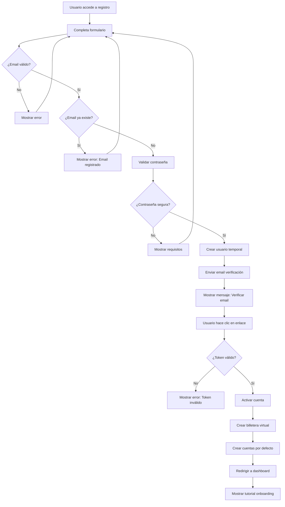
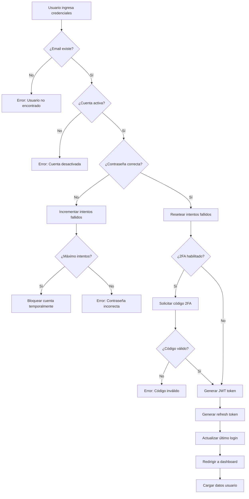
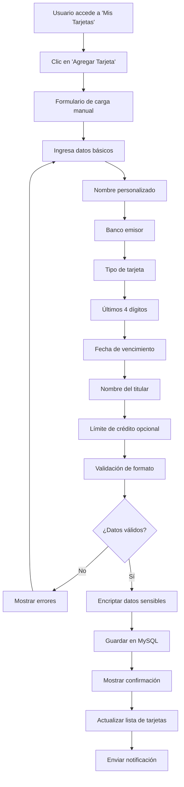
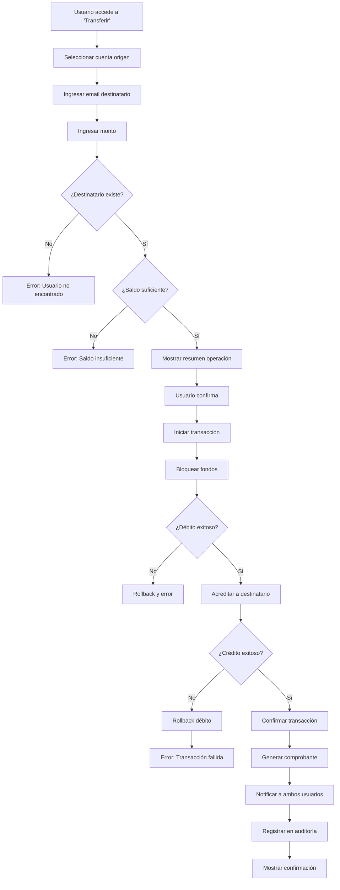
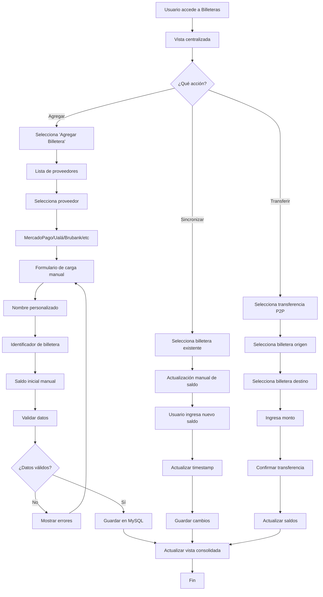
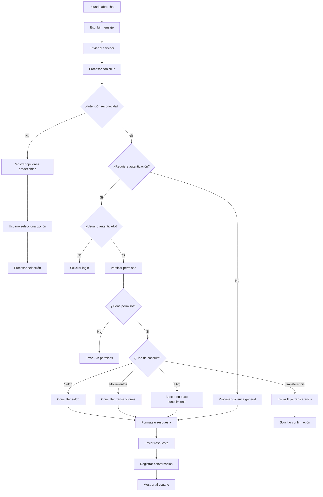
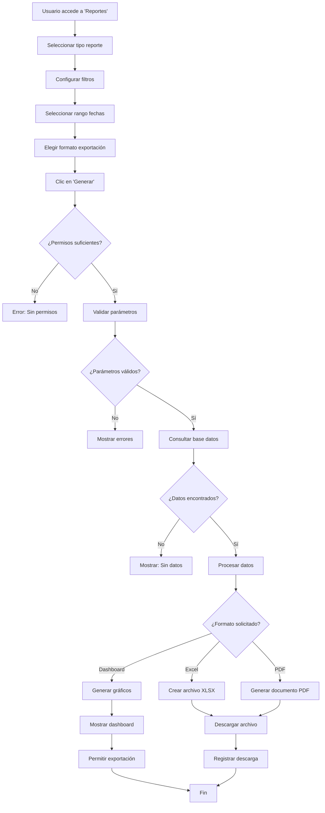
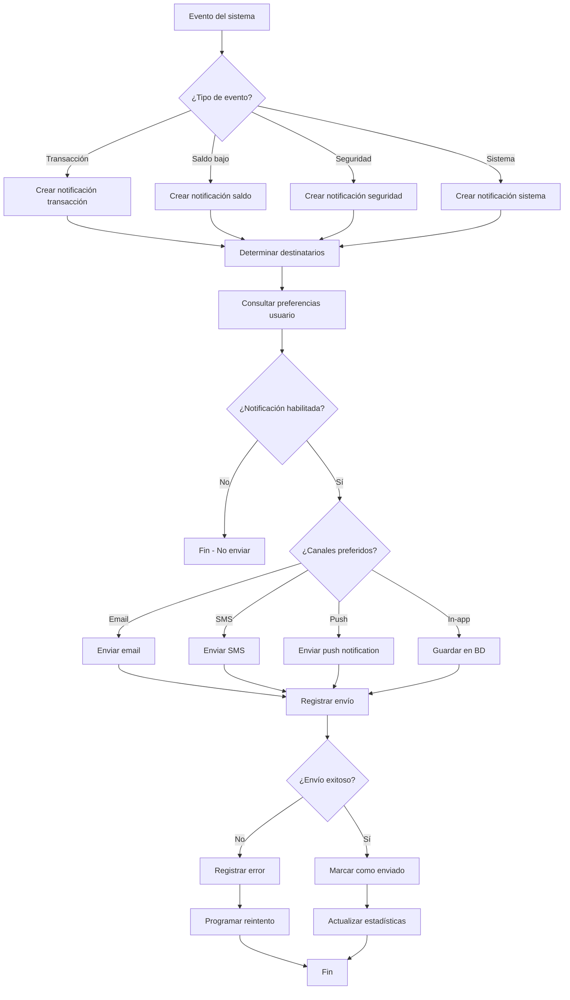

# FinTrack - Diagramas de Flujo de Trabajo

## Índice
1. [Flujo de Registro de Usuario](#flujo-de-registro-de-usuario)
2. [Flujo de Autenticación](#flujo-de-autenticación)
3. [Flujo de Vinculación de Tarjeta](#flujo-de-vinculación-de-tarjeta)
4. [Flujo de Transferencia entre Usuarios](#flujo-de-transferencia-entre-usuarios)
5. [Flujo de Carga de Billetera](#flujo-de-carga-de-billetera)
6. [Flujo de Interacción con Chatbot](#flujo-de-interacción-con-chatbot)
7. [Flujo de Generación de Reportes](#flujo-de-generación-de-reportes)
8. [Flujo de Notificaciones](#flujo-de-notificaciones)

---

## Flujo de Registro de Usuario

**Descripción**: Este flujo maneja el proceso completo de registro, desde la captura de datos hasta la activación de la cuenta y creación de recursos iniciales.

**Puntos Críticos**:
- Validación de email único
- Verificación por email obligatoria
- Creación automática de billetera y cuentas
- Tutorial de onboarding

---

## Flujo de Autenticación

**Descripción**: Proceso de autenticación con validaciones de seguridad, soporte para 2FA y generación de tokens JWT.

**Puntos Críticos**:
- Protección contra ataques de fuerza bruta
- Soporte opcional para 2FA
- Gestión de tokens JWT y refresh
- Logging de intentos de acceso

---

## Flujo de Carga Manual de Tarjeta

**Descripción**: Proceso de carga manual de tarjetas sin integración con APIs externas, almacenando datos básicos de forma segura.

**Puntos Críticos**:
- Validación de formato de datos
- Encriptación de información sensible
- Almacenamiento seguro en MySQL
- Interfaz intuitiva para carga manual

---

## Flujo de Transferencia entre Usuarios

**Descripción**: Proceso de transferencia con validaciones, transacciones atómicas y notificaciones.

**Puntos Críticos**:
- Validación de destinatario y saldo
- Transacciones atómicas (rollback en caso de error)
- Notificaciones a ambas partes
- Registro de auditoría completo

---

## Flujo de Gestión de Billeteras Virtuales Centralizadas

**Descripción**: Proceso de gestión centralizada de múltiples billeteras virtuales con carga manual de datos y sincronización controlada por el usuario.

**Puntos Críticos**:
- Gestión centralizada de múltiples billeteras
- Carga manual de datos
- Sincronización manual de saldos
- Vista consolidada de activos digitales

---

## Flujo de Interacción con Chatbot

**Descripción**: Flujo de procesamiento de consultas del chatbot con NLP y diferentes tipos de respuestas.

**Puntos Críticos**:
- Procesamiento de lenguaje natural
- Autenticación para operaciones sensibles
- Diferentes tipos de consultas
- Registro de conversaciones

---

## Flujo de Generación de Reportes

**Descripción**: Proceso de generación de reportes con múltiples formatos y filtros personalizables.

**Puntos Críticos**:
- Validación de permisos por rol
- Filtros flexibles de datos
- Múltiples formatos de exportación
- Optimización de consultas grandes

---

## Flujo de Notificaciones

**Descripción**: Sistema de notificaciones multi-canal con preferencias de usuario y manejo de errores.

**Puntos Críticos**:
- Múltiples canales de notificación
- Respeto a preferencias de usuario
- Manejo de errores y reintentos
- Registro de estadísticas

---

## Arquitectura de Flujos

### Patrones Comunes Identificados

1. **Validación en Capas**
   - Validación frontend (Angular UX)
   - Validación backend (Go seguridad)
   - Validación de negocio (lógica)

2. **Manejo de Errores**
   - Errores específicos por contexto
   - Logging detallado con Go
   - Recuperación automática cuando es posible

3. **Transacciones Atómicas**
   - Operaciones financieras con rollback MySQL
   - Consistencia de datos
   - Auditoría completa

4. **Carga Manual de Datos**
   - Formularios intuitivos en Angular
   - Validación client-side y server-side
   - Almacenamiento seguro en MySQL
   - Sincronización manual controlada por usuario

5. **Notificaciones Asíncronas**
   - Procesamiento en background
   - Múltiples canales
   - Preferencias de usuario

### Consideraciones de Performance

- **Caching**: Redis para datos de sesión y billeteras consolidadas
- **Queue System**: Para procesamiento asíncrono con Go
- **Database Optimization**: Índices en user_id y provider_id, consultas optimizadas con GORM
- **API Rate Limiting**: Protección contra abuso con middleware Go
- **Microservicios**: Arquitectura independiente por funcionalidad

### Monitoreo y Alertas

- **Métricas de Negocio**: Transacciones, usuarios activos
- **Métricas Técnicas**: Latencia, errores, throughput
- **Alertas Automáticas**: Fallos críticos, performance degradation
- **Dashboards**: Tiempo real para operaciones

---

*Diagramas de flujo para FinTrack - Tecnicatura en Programación UNT*  
*Versión 1.0 - Enero 2025*