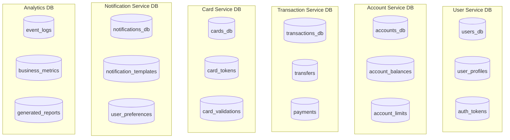

# FinTrack - Diseño de Base de Datos

## 📋 Información del Documento

- **Proyecto:** FinTrack - Plataforma de Gestión Financiera
- **Versión:** 1.0
- **Fecha:** Enero 2024
- **Autor:** Estudiante UNT - Tecnicatura en Programación
- **SGBD:** MySQL 8.0+

---

## 🗄️ Arquitectura de Datos

### Estrategia de Base de Datos

#### Patrón: Database per Service
- Cada microservicio tiene su propia base de datos
- Comunicación entre servicios via APIs
- Consistencia eventual para datos distribuidos
- Transacciones distribuidas para operaciones complejas

#### Stack de Base de Datos
- **Principal:** MySQL 8.0+
- **Cache:** Redis 7+
- **Search:** Elasticsearch 8+ (opcional)
- **Message Queue:** RabbitMQ 3.11+

#### Distribución de Bases de Datos



---

## 📊 Modelo Entidad-Relación Principal

### Diagrama ER Consolidado

```mermaid
erDiagram
    USERS {
        varchar id PK
        varchar email UK
        varchar password_hash
        varchar first_name
        varchar last_name
        varchar phone
        date date_of_birth
        enum status
        enum role
        datetime created_at
        datetime updated_at
        datetime last_login
        boolean email_verified
        boolean phone_verified
        json preferences
    }
    
    CARDS {
        varchar id PK
        varchar user_id FK
        varchar card_name
        varchar bank_name
        enum card_type
        enum brand
        varchar last_four_digits
        varchar expiry_month
        varchar expiry_year
        varchar cardholder_name
        decimal credit_limit
        boolean is_active
        datetime created_at
        datetime updated_at
    }
    
    VIRTUAL_WALLETS {
        varchar id PK
        varchar user_id FK
        varchar wallet_name
        varchar provider_id FK
        varchar wallet_identifier
        decimal balance
        varchar currency
        decimal daily_limit
        decimal monthly_limit
        boolean is_active
        datetime last_sync
        datetime created_at
        datetime updated_at
    }
    
    WALLET_PROVIDERS {
        varchar id PK
        varchar name
        varchar display_name
        varchar logo_url
        boolean is_active
        json configuration
        datetime created_at
        datetime updated_at
    }
    
    TRANSACTIONS {
        varchar id PK
        varchar user_id FK
        varchar source_id FK
        varchar destination_id FK
        varchar source_type
        varchar destination_type
        varchar transaction_type
        decimal amount
        varchar currency
        varchar description
        varchar category
        varchar status
        datetime processed_at
        datetime created_at
    }
    
    USERS ||--o{ CARDS : owns
    USERS ||--o{ VIRTUAL_WALLETS : has
    USERS ||--o{ TRANSACTIONS : makes
    VIRTUAL_WALLETS }o--|| WALLET_PROVIDERS : belongs_to
    CARDS ||--o{ TRANSACTIONS : source
    VIRTUAL_WALLETS ||--o{ TRANSACTIONS : source
    CARDS ||--o{ TRANSACTIONS : destination
    VIRTUAL_WALLETS ||--o{ TRANSACTIONS : destination
    
    OLD_USERS {
        uuid id PK
        varchar email UK
        varchar password_hash
        varchar first_name
        varchar last_name
        varchar phone
        date date_of_birth
        enum status
        enum role
        timestamp created_at
        timestamp updated_at
        timestamp last_login
        boolean email_verified
        boolean phone_verified
        json preferences
    }
    
    USER_PROFILES {
        uuid id PK
        uuid user_id FK
        varchar document_type
        varchar document_number
        varchar address
        varchar city
        varchar country
        varchar occupation
        decimal monthly_income
        enum risk_profile
        timestamp created_at
        timestamp updated_at
    }
    
    ACCOUNTS {
        uuid id PK
        uuid user_id FK
        varchar account_number UK
        varchar account_name
        enum account_type
        enum currency
        decimal balance
        decimal available_balance
        decimal daily_limit
        decimal monthly_limit
        enum status
        timestamp created_at
        timestamp updated_at
        json metadata
    }
    
    CARDS {
        uuid id PK
        uuid user_id FK
        uuid account_id FK
        varchar token UK
        varchar last_four
        varchar brand
        varchar card_type
        date expiry_date
        enum status
        decimal daily_limit
        decimal monthly_limit
        timestamp created_at
        timestamp updated_at
        timestamp last_used
    }
    
    TRANSACTIONS {
        uuid id PK
        uuid account_id FK
        uuid related_account_id FK
        varchar transaction_type
        decimal amount
        enum currency
        decimal exchange_rate
        decimal fee
        varchar description
        enum status
        varchar reference_number UK
        json metadata
        timestamp created_at
        timestamp processed_at
        timestamp settled_at
    }
    
    TRANSFERS {
        uuid id PK
        uuid from_account_id FK
        uuid to_account_id FK
        uuid transaction_id FK
        decimal amount
        enum currency
        varchar description
        enum status
        varchar verification_code
        timestamp expires_at
        timestamp created_at
        timestamp completed_at
    }
    
    NOTIFICATIONS {
        uuid id PK
        uuid user_id FK
        varchar type
        varchar channel
        varchar title
        text content
        json data
        enum status
        timestamp created_at
        timestamp sent_at
        timestamp read_at
    }
    
    AUDIT_LOGS {
        uuid id PK
        uuid user_id FK
        varchar action
        varchar resource_type
        varchar resource_id
        json old_values
        json new_values
        varchar ip_address
        varchar user_agent
        timestamp created_at
    }
    
    EXCHANGE_RATES {
        uuid id PK
        varchar from_currency
        varchar to_currency
        decimal rate
        varchar source
        timestamp valid_from
        timestamp valid_to
        timestamp created_at
    }
    
    USERS ||--|| USER_PROFILES : has
    USERS ||--o{ ACCOUNTS : owns
    USERS ||--o{ CARDS : owns
    USERS ||--o{ NOTIFICATIONS : receives
    USERS ||--o{ AUDIT_LOGS : generates
    
    ACCOUNTS ||--o{ TRANSACTIONS : has
    ACCOUNTS ||--o{ TRANSFERS : participates
    ACCOUNTS ||--o{ CARDS : linked_to
    
    TRANSACTIONS ||--o| TRANSFERS : creates
    
    CARDS ||--o{ TRANSACTIONS : processes
```



---

## 🏗️ Esquemas de Base de Datos por Servicio

### 👤 User Service Database (MySQL)

#### Tabla: users
```sql
CREATE TABLE users (
    id VARCHAR(36) PRIMARY KEY DEFAULT (UUID()),
    email VARCHAR(255) UNIQUE NOT NULL,
    password_hash VARCHAR(255) NOT NULL,
    first_name VARCHAR(100) NOT NULL,
    last_name VARCHAR(100) NOT NULL,
    phone VARCHAR(20),
    date_of_birth DATE,
    status ENUM('active', 'inactive', 'suspended', 'pending_verification') DEFAULT 'active',
    role ENUM('user', 'operator', 'admin', 'treasurer') DEFAULT 'user',
    created_at DATETIME DEFAULT CURRENT_TIMESTAMP,
    updated_at DATETIME DEFAULT CURRENT_TIMESTAMP ON UPDATE CURRENT_TIMESTAMP,
    last_login DATETIME,
    email_verified BOOLEAN DEFAULT FALSE,
    phone_verified BOOLEAN DEFAULT FALSE,
    preferences JSON,
    
    CONSTRAINT users_email_format CHECK (email REGEXP '^[A-Za-z0-9._%+-]+@[A-Za-z0-9.-]+\\.[A-Za-z]{2,}$'),
    CONSTRAINT users_phone_format CHECK (phone REGEXP '^\\+?[1-9][0-9]{1,14}$'),
    CONSTRAINT users_age_check CHECK (date_of_birth <= DATE_SUB(CURDATE(), INTERVAL 18 YEAR))
);

-- Índices
CREATE INDEX idx_users_email ON users(email);
CREATE INDEX idx_users_status ON users(status);
CREATE INDEX idx_users_created_at ON users(created_at);
CREATE INDEX idx_users_last_login ON users(last_login);
```

#### Tabla: user_profiles
```sql
CREATE TABLE user_profiles (
    id UUID PRIMARY KEY DEFAULT gen_random_uuid(),
    user_id UUID NOT NULL REFERENCES users(id) ON DELETE CASCADE,
    document_type VARCHAR(20),
    document_number VARCHAR(50),
    address TEXT,
    city VARCHAR(100),
    country VARCHAR(2) DEFAULT 'AR',
    occupation VARCHAR(100),
    monthly_income DECIMAL(15,2),
    risk_profile risk_profile_type DEFAULT 'medium',
    created_at TIMESTAMP WITH TIME ZONE DEFAULT NOW(),
    updated_at TIMESTAMP WITH TIME ZONE DEFAULT NOW(),
    
    CONSTRAINT user_profiles_user_unique UNIQUE(user_id),
    CONSTRAINT user_profiles_document_unique UNIQUE(document_type, document_number),
    CONSTRAINT user_profiles_income_positive CHECK (monthly_income >= 0)
);

CREATE TYPE risk_profile_type AS ENUM ('low', 'medium', 'high');

-- Índices
CREATE INDEX idx_user_profiles_user_id ON user_profiles(user_id);
CREATE INDEX idx_user_profiles_document ON user_profiles(document_type, document_number);
```

#### Tabla: auth_tokens
```sql
CREATE TABLE auth_tokens (
    id UUID PRIMARY KEY DEFAULT gen_random_uuid(),
    user_id UUID NOT NULL REFERENCES users(id) ON DELETE CASCADE,
    token_hash VARCHAR(255) NOT NULL,
    token_type token_type_enum NOT NULL,
    expires_at TIMESTAMP WITH TIME ZONE NOT NULL,
    used_at TIMESTAMP WITH TIME ZONE,
    created_at TIMESTAMP WITH TIME ZONE DEFAULT NOW(),
    metadata JSONB DEFAULT '{}',
    
    CONSTRAINT auth_tokens_not_expired CHECK (expires_at > created_at)
);

CREATE TYPE token_type_enum AS ENUM ('access', 'refresh', 'email_verification', 'password_reset', 'two_factor');

-- Índices
CREATE INDEX idx_auth_tokens_user_id ON auth_tokens(user_id);
CREATE INDEX idx_auth_tokens_hash ON auth_tokens(token_hash);
CREATE INDEX idx_auth_tokens_expires ON auth_tokens(expires_at);

-- Limpieza automática de tokens expirados
CREATE OR REPLACE FUNCTION cleanup_expired_tokens()
RETURNS void AS $$
BEGIN
    DELETE FROM auth_tokens WHERE expires_at < NOW();
END;
$$ LANGUAGE plpgsql;
```

### 🏦 Account Service Database (MySQL)

#### Tabla: cards (carga manual)
```sql
CREATE TABLE cards (
    id VARCHAR(36) PRIMARY KEY DEFAULT (UUID()),
    user_id VARCHAR(36) NOT NULL,
    card_name VARCHAR(100) NOT NULL,
    bank_name VARCHAR(100) NOT NULL,
    card_type ENUM('credit', 'debit', 'prepaid') NOT NULL,
    brand ENUM('visa', 'mastercard', 'amex', 'other') NOT NULL,
    last_four_digits VARCHAR(4) NOT NULL,
    expiry_month VARCHAR(2) NOT NULL,
    expiry_year VARCHAR(4) NOT NULL,
    cardholder_name VARCHAR(100) NOT NULL,
    credit_limit DECIMAL(15,2) DEFAULT NULL,
    is_active BOOLEAN DEFAULT TRUE,
    created_at DATETIME DEFAULT CURRENT_TIMESTAMP,
    updated_at DATETIME DEFAULT CURRENT_TIMESTAMP ON UPDATE CURRENT_TIMESTAMP
);

CREATE TYPE account_type_enum AS ENUM ('checking', 'savings', 'usd_account');
CREATE TYPE currency_enum AS ENUM ('ARS', 'USD', 'EUR');
CREATE TYPE account_status_enum AS ENUM ('active', 'inactive', 'frozen', 'closed');

-- Función para generar número de cuenta
CREATE OR REPLACE FUNCTION generate_account_number()
RETURNS VARCHAR(20) AS $$
DECLARE
    new_number VARCHAR(20);
    exists_check INTEGER;
BEGIN
    LOOP
        new_number := 'FT' || LPAD(floor(random() * 1000000000000000000)::text, 16, '0');
        SELECT COUNT(*) INTO exists_check FROM accounts WHERE account_number = new_number;
        EXIT WHEN exists_check = 0;
    END LOOP;
    RETURN new_number;
END;
$$ LANGUAGE plpgsql;

-- Trigger para auto-generar número de cuenta
CREATE OR REPLACE FUNCTION set_account_number()
RETURNS TRIGGER AS $$
BEGIN
    IF NEW.account_number IS NULL OR NEW.account_number = '' THEN
        NEW.account_number := generate_account_number();
    END IF;
    RETURN NEW;
END;
$$ LANGUAGE plpgsql;

CREATE TRIGGER trigger_set_account_number
    BEFORE INSERT ON accounts
    FOR EACH ROW
    EXECUTE FUNCTION set_account_number();

-- Índices
CREATE INDEX idx_accounts_user_id ON accounts(user_id);
CREATE INDEX idx_accounts_status ON accounts(status);
CREATE INDEX idx_accounts_currency ON accounts(currency);
CREATE INDEX idx_accounts_created_at ON accounts(created_at);
```

#### Tabla: account_balances_history
```sql
CREATE TABLE account_balances_history (
    id UUID PRIMARY KEY DEFAULT gen_random_uuid(),
    account_id UUID NOT NULL REFERENCES accounts(id) ON DELETE CASCADE,
    previous_balance DECIMAL(15,2) NOT NULL,
    new_balance DECIMAL(15,2) NOT NULL,
    change_amount DECIMAL(15,2) NOT NULL,
    change_reason VARCHAR(100) NOT NULL,
    transaction_id UUID, -- Referencia a la transacción que causó el cambio
    created_at TIMESTAMP WITH TIME ZONE DEFAULT NOW()
);

-- Índices
CREATE INDEX idx_balance_history_account_id ON account_balances_history(account_id);
CREATE INDEX idx_balance_history_created_at ON account_balances_history(created_at);
CREATE INDEX idx_balance_history_transaction_id ON account_balances_history(transaction_id);

-- Particionamiento por fecha (mensual)
CREATE TABLE account_balances_history_y2024m01 PARTITION OF account_balances_history
FOR VALUES FROM ('2024-01-01') TO ('2024-02-01');

CREATE TABLE account_balances_history_y2024m02 PARTITION OF account_balances_history
FOR VALUES FROM ('2024-02-01') TO ('2024-03-01');
```

### 💳 Card Service Database

#### Tabla: cards
```sql
CREATE TABLE cards (
    id UUID PRIMARY KEY DEFAULT gen_random_uuid(),
    user_id UUID NOT NULL, -- Referencia externa
    account_id UUID NOT NULL, -- Referencia externa
    token VARCHAR(255) UNIQUE NOT NULL, -- Token de la tarjeta (no datos reales)
    last_four VARCHAR(4) NOT NULL,
    brand card_brand_enum NOT NULL,
    card_type card_type_enum NOT NULL,
    expiry_date DATE NOT NULL,
    status card_status_enum DEFAULT 'active',
    daily_limit DECIMAL(15,2) DEFAULT 500000.00,
    monthly_limit DECIMAL(15,2) DEFAULT 5000000.00,
    created_at TIMESTAMP WITH TIME ZONE DEFAULT NOW(),
    updated_at TIMESTAMP WITH TIME ZONE DEFAULT NOW(),
    last_used TIMESTAMP WITH TIME ZONE,
    metadata JSONB DEFAULT '{}',
    
    CONSTRAINT cards_expiry_future CHECK (expiry_date > CURRENT_DATE),
    CONSTRAINT cards_last_four_format CHECK (last_four ~ '^[0-9]{4}$'),
    CONSTRAINT cards_limits_positive CHECK (daily_limit > 0 AND monthly_limit > 0)
);

CREATE TYPE card_brand_enum AS ENUM ('visa', 'mastercard', 'amex', 'maestro');
CREATE TYPE card_type_enum AS ENUM ('debit', 'credit', 'prepaid');
CREATE TYPE card_status_enum AS ENUM ('active', 'inactive', 'expired', 'blocked');

-- Índices
CREATE INDEX idx_cards_user_id ON cards(user_id);
CREATE INDEX idx_cards_account_id ON cards(account_id);
CREATE INDEX idx_cards_token ON cards(token);
CREATE INDEX idx_cards_status ON cards(status);
CREATE INDEX idx_cards_expiry ON cards(expiry_date);
```

#### Tabla: card_transactions
```sql
CREATE TABLE card_transactions (
    id UUID PRIMARY KEY DEFAULT gen_random_uuid(),
    card_id UUID NOT NULL REFERENCES cards(id) ON DELETE CASCADE,
    transaction_id UUID NOT NULL, -- Referencia externa
    amount DECIMAL(15,2) NOT NULL,
    currency currency_enum NOT NULL,
    merchant_name VARCHAR(255),
    merchant_category VARCHAR(100),
    authorization_code VARCHAR(50),
    status card_transaction_status DEFAULT 'pending',
    created_at TIMESTAMP WITH TIME ZONE DEFAULT NOW(),
    processed_at TIMESTAMP WITH TIME ZONE,
    
    CONSTRAINT card_transactions_amount_positive CHECK (amount > 0)
);

CREATE TYPE card_transaction_status AS ENUM ('pending', 'approved', 'declined', 'reversed');

-- Índices
CREATE INDEX idx_card_transactions_card_id ON card_transactions(card_id);
CREATE INDEX idx_card_transactions_status ON card_transactions(status);
CREATE INDEX idx_card_transactions_created_at ON card_transactions(created_at);
```

### 💸 Transaction Service Database

#### Tabla: transactions
```sql
CREATE TABLE transactions (
    id UUID PRIMARY KEY DEFAULT gen_random_uuid(),
    account_id UUID NOT NULL, -- Cuenta origen
    related_account_id UUID, -- Cuenta destino (para transferencias)
    transaction_type transaction_type_enum NOT NULL,
    amount DECIMAL(15,2) NOT NULL,
    currency currency_enum NOT NULL,
    exchange_rate DECIMAL(10,6) DEFAULT 1.0,
    fee DECIMAL(15,2) DEFAULT 0.00,
    description TEXT,
    status transaction_status_enum DEFAULT 'pending',
    reference_number VARCHAR(50) UNIQUE NOT NULL,
    external_reference VARCHAR(255), -- Referencia del sistema externo
    metadata JSONB DEFAULT '{}',
    created_at TIMESTAMP WITH TIME ZONE DEFAULT NOW(),
    processed_at TIMESTAMP WITH TIME ZONE,
    settled_at TIMESTAMP WITH TIME ZONE,
    
    CONSTRAINT transactions_amount_positive CHECK (amount > 0),
    CONSTRAINT transactions_fee_non_negative CHECK (fee >= 0),
    CONSTRAINT transactions_exchange_rate_positive CHECK (exchange_rate > 0)
);

CREATE TYPE transaction_type_enum AS ENUM (
    'deposit',
    'withdrawal', 
    'transfer_out',
    'transfer_in',
    'card_payment',
    'card_refund',
    'fee',
    'interest',
    'currency_exchange'
);

CREATE TYPE transaction_status_enum AS ENUM (
    'pending',
    'processing',
    'completed',
    'failed',
    'cancelled',
    'reversed'
);

-- Función para generar número de referencia
CREATE OR REPLACE FUNCTION generate_reference_number()
RETURNS VARCHAR(50) AS $$
DECLARE
    new_ref VARCHAR(50);
    exists_check INTEGER;
BEGIN
    LOOP
        new_ref := 'TXN' || TO_CHAR(NOW(), 'YYYYMMDD') || LPAD(floor(random() * 1000000)::text, 6, '0');
        SELECT COUNT(*) INTO exists_check FROM transactions WHERE reference_number = new_ref;
        EXIT WHEN exists_check = 0;
    END LOOP;
    RETURN new_ref;
END;
$$ LANGUAGE plpgsql;

-- Trigger para auto-generar número de referencia
CREATE OR REPLACE FUNCTION set_reference_number()
RETURNS TRIGGER AS $$
BEGIN
    IF NEW.reference_number IS NULL OR NEW.reference_number = '' THEN
        NEW.reference_number := generate_reference_number();
    END IF;
    RETURN NEW;
END;
$$ LANGUAGE plpgsql;

CREATE TRIGGER trigger_set_reference_number
    BEFORE INSERT ON transactions
    FOR EACH ROW
    EXECUTE FUNCTION set_reference_number();

-- Índices
CREATE INDEX idx_transactions_account_id ON transactions(account_id);
CREATE INDEX idx_transactions_related_account ON transactions(related_account_id);
CREATE INDEX idx_transactions_type ON transactions(transaction_type);
CREATE INDEX idx_transactions_status ON transactions(status);
CREATE INDEX idx_transactions_created_at ON transactions(created_at);
CREATE INDEX idx_transactions_reference ON transactions(reference_number);

-- Particionamiento por fecha (mensual)
CREATE TABLE transactions_y2024m01 PARTITION OF transactions
FOR VALUES FROM ('2024-01-01') TO ('2024-02-01');
```

#### Tabla: transfers
```sql
CREATE TABLE transfers (
    id UUID PRIMARY KEY DEFAULT gen_random_uuid(),
    from_account_id UUID NOT NULL,
    to_account_id UUID NOT NULL,
    transaction_id UUID NOT NULL REFERENCES transactions(id),
    amount DECIMAL(15,2) NOT NULL,
    currency currency_enum NOT NULL,
    description TEXT,
    status transfer_status_enum DEFAULT 'pending',
    verification_code VARCHAR(10),
    verification_attempts INTEGER DEFAULT 0,
    expires_at TIMESTAMP WITH TIME ZONE,
    created_at TIMESTAMP WITH TIME ZONE DEFAULT NOW(),
    completed_at TIMESTAMP WITH TIME ZONE,
    
    CONSTRAINT transfers_amount_positive CHECK (amount > 0),
    CONSTRAINT transfers_different_accounts CHECK (from_account_id != to_account_id),
    CONSTRAINT transfers_verification_attempts CHECK (verification_attempts >= 0 AND verification_attempts <= 3)
);

CREATE TYPE transfer_status_enum AS ENUM (
    'pending',
    'awaiting_verification',
    'processing',
    'completed',
    'failed',
    'cancelled',
    'expired'
);

-- Índices
CREATE INDEX idx_transfers_from_account ON transfers(from_account_id);
CREATE INDEX idx_transfers_to_account ON transfers(to_account_id);
CREATE INDEX idx_transfers_transaction_id ON transfers(transaction_id);
CREATE INDEX idx_transfers_status ON transfers(status);
CREATE INDEX idx_transfers_created_at ON transfers(created_at);
```

### 🔔 Notification Service Database

#### Tabla: notifications
```sql
CREATE TABLE notifications (
    id UUID PRIMARY KEY DEFAULT gen_random_uuid(),
    user_id UUID NOT NULL,
    type notification_type_enum NOT NULL,
    channel notification_channel_enum NOT NULL,
    title VARCHAR(255) NOT NULL,
    content TEXT NOT NULL,
    data JSONB DEFAULT '{}',
    status notification_status_enum DEFAULT 'pending',
    priority notification_priority_enum DEFAULT 'normal',
    scheduled_at TIMESTAMP WITH TIME ZONE DEFAULT NOW(),
    sent_at TIMESTAMP WITH TIME ZONE,
    delivered_at TIMESTAMP WITH TIME ZONE,
    read_at TIMESTAMP WITH TIME ZONE,
    expires_at TIMESTAMP WITH TIME ZONE,
    created_at TIMESTAMP WITH TIME ZONE DEFAULT NOW(),
    
    CONSTRAINT notifications_scheduled_future CHECK (scheduled_at >= created_at)
);

CREATE TYPE notification_type_enum AS ENUM (
    'transaction_completed',
    'transfer_received',
    'low_balance',
    'card_transaction',
    'login_alert',
    'security_alert',
    'system_maintenance',
    'promotional'
);

CREATE TYPE notification_channel_enum AS ENUM ('email', 'sms', 'push', 'in_app');
CREATE TYPE notification_status_enum AS ENUM ('pending', 'sent', 'delivered', 'failed', 'cancelled');
CREATE TYPE notification_priority_enum AS ENUM ('low', 'normal', 'high', 'urgent');

-- Índices
CREATE INDEX idx_notifications_user_id ON notifications(user_id);
CREATE INDEX idx_notifications_type ON notifications(type);
CREATE INDEX idx_notifications_status ON notifications(status);
CREATE INDEX idx_notifications_scheduled_at ON notifications(scheduled_at);
CREATE INDEX idx_notifications_created_at ON notifications(created_at);
```

#### Tabla: notification_preferences
```sql
CREATE TABLE notification_preferences (
    id UUID PRIMARY KEY DEFAULT gen_random_uuid(),
    user_id UUID NOT NULL,
    notification_type notification_type_enum NOT NULL,
    email_enabled BOOLEAN DEFAULT TRUE,
    sms_enabled BOOLEAN DEFAULT FALSE,
    push_enabled BOOLEAN DEFAULT TRUE,
    in_app_enabled BOOLEAN DEFAULT TRUE,
    created_at TIMESTAMP WITH TIME ZONE DEFAULT NOW(),
    updated_at TIMESTAMP WITH TIME ZONE DEFAULT NOW(),
    
    CONSTRAINT notification_preferences_user_type_unique UNIQUE(user_id, notification_type)
);

-- Índices
CREATE INDEX idx_notification_preferences_user_id ON notification_preferences(user_id);
```

### 📊 Analytics Database

#### Tabla: event_logs
```sql
CREATE TABLE event_logs (
    id UUID PRIMARY KEY DEFAULT gen_random_uuid(),
    user_id UUID,
    session_id VARCHAR(255),
    event_type VARCHAR(100) NOT NULL,
    event_name VARCHAR(255) NOT NULL,
    properties JSONB DEFAULT '{}',
    user_agent TEXT,
    ip_address INET,
    referrer TEXT,
    page_url TEXT,
    created_at TIMESTAMP WITH TIME ZONE DEFAULT NOW()
);

-- Índices
CREATE INDEX idx_event_logs_user_id ON event_logs(user_id);
CREATE INDEX idx_event_logs_event_type ON event_logs(event_type);
CREATE INDEX idx_event_logs_created_at ON event_logs(created_at);
CREATE INDEX idx_event_logs_session_id ON event_logs(session_id);

-- Particionamiento por fecha (diario para analytics)
CREATE TABLE event_logs_y2024m01d01 PARTITION OF event_logs
FOR VALUES FROM ('2024-01-01') TO ('2024-01-02');
```

#### Tabla: business_metrics
```sql
CREATE TABLE business_metrics (
    id UUID PRIMARY KEY DEFAULT gen_random_uuid(),
    metric_name VARCHAR(100) NOT NULL,
    metric_value DECIMAL(15,4) NOT NULL,
    metric_unit VARCHAR(50),
    dimensions JSONB DEFAULT '{}',
    period_start TIMESTAMP WITH TIME ZONE NOT NULL,
    period_end TIMESTAMP WITH TIME ZONE NOT NULL,
    created_at TIMESTAMP WITH TIME ZONE DEFAULT NOW(),
    
    CONSTRAINT business_metrics_period_valid CHECK (period_end > period_start)
);

-- Índices
CREATE INDEX idx_business_metrics_name ON business_metrics(metric_name);
CREATE INDEX idx_business_metrics_period ON business_metrics(period_start, period_end);
CREATE INDEX idx_business_metrics_created_at ON business_metrics(created_at);
```

---

## 🔄 Procedimientos Almacenados y Funciones

### Función: Transferencia Atómica
```sql
CREATE OR REPLACE FUNCTION execute_transfer(
    p_from_account_id UUID,
    p_to_account_id UUID,
    p_amount DECIMAL(15,2),
    p_currency currency_enum,
    p_description TEXT DEFAULT NULL
)
RETURNS UUID AS $$
DECLARE
    v_transfer_id UUID;
    v_from_balance DECIMAL(15,2);
    v_transaction_id UUID;
BEGIN
    -- Verificar saldo suficiente
    SELECT balance INTO v_from_balance 
    FROM accounts 
    WHERE id = p_from_account_id AND status = 'active'
    FOR UPDATE;
    
    IF v_from_balance IS NULL THEN
        RAISE EXCEPTION 'Cuenta origen no encontrada o inactiva';
    END IF;
    
    IF v_from_balance < p_amount THEN
        RAISE EXCEPTION 'Saldo insuficiente';
    END IF;
    
    -- Verificar cuenta destino
    IF NOT EXISTS (SELECT 1 FROM accounts WHERE id = p_to_account_id AND status = 'active') THEN
        RAISE EXCEPTION 'Cuenta destino no encontrada o inactiva';
    END IF;
    
    -- Crear transacción de débito
    INSERT INTO transactions (
        account_id, related_account_id, transaction_type, 
        amount, currency, description, status
    ) VALUES (
        p_from_account_id, p_to_account_id, 'transfer_out',
        p_amount, p_currency, p_description, 'completed'
    ) RETURNING id INTO v_transaction_id;
    
    -- Crear transacción de crédito
    INSERT INTO transactions (
        account_id, related_account_id, transaction_type,
        amount, currency, description, status
    ) VALUES (
        p_to_account_id, p_from_account_id, 'transfer_in',
        p_amount, p_currency, p_description, 'completed'
    );
    
    -- Actualizar saldos
    UPDATE accounts 
    SET balance = balance - p_amount,
        available_balance = available_balance - p_amount,
        updated_at = NOW()
    WHERE id = p_from_account_id;
    
    UPDATE accounts 
    SET balance = balance + p_amount,
        available_balance = available_balance + p_amount,
        updated_at = NOW()
    WHERE id = p_to_account_id;
    
    -- Crear registro de transferencia
    INSERT INTO transfers (
        from_account_id, to_account_id, transaction_id,
        amount, currency, description, status, completed_at
    ) VALUES (
        p_from_account_id, p_to_account_id, v_transaction_id,
        p_amount, p_currency, p_description, 'completed', NOW()
    ) RETURNING id INTO v_transfer_id;
    
    RETURN v_transfer_id;
EXCEPTION
    WHEN OTHERS THEN
        RAISE;
END;
$$ LANGUAGE plpgsql;
```

### Función: Cálculo de Métricas Diarias
```sql
CREATE OR REPLACE FUNCTION calculate_daily_metrics(
    p_date DATE DEFAULT CURRENT_DATE
)
RETURNS void AS $$
DECLARE
    v_start_date TIMESTAMP WITH TIME ZONE;
    v_end_date TIMESTAMP WITH TIME ZONE;
BEGIN
    v_start_date := p_date::timestamp;
    v_end_date := (p_date + INTERVAL '1 day')::timestamp;
    
    -- Total de transacciones
    INSERT INTO business_metrics (metric_name, metric_value, metric_unit, period_start, period_end)
    SELECT 
        'daily_transaction_count',
        COUNT(*),
        'count',
        v_start_date,
        v_end_date
    FROM transactions
    WHERE created_at >= v_start_date AND created_at < v_end_date;
    
    -- Volumen total transaccionado
    INSERT INTO business_metrics (metric_name, metric_value, metric_unit, period_start, period_end)
    SELECT 
        'daily_transaction_volume_' || currency,
        SUM(amount),
        currency::text,
        v_start_date,
        v_end_date
    FROM transactions
    WHERE created_at >= v_start_date AND created_at < v_end_date
      AND status = 'completed'
    GROUP BY currency;
    
    -- Usuarios activos
    INSERT INTO business_metrics (metric_name, metric_value, metric_unit, period_start, period_end)
    SELECT 
        'daily_active_users',
        COUNT(DISTINCT account_id),
        'count',
        v_start_date,
        v_end_date
    FROM transactions
    WHERE created_at >= v_start_date AND created_at < v_end_date;
    
END;
$$ LANGUAGE plpgsql;
```

---

## 🔒 Seguridad y Auditoría

### Tabla de Auditoría Universal
```sql
CREATE TABLE audit_logs (
    id UUID PRIMARY KEY DEFAULT gen_random_uuid(),
    table_name VARCHAR(100) NOT NULL,
    record_id UUID NOT NULL,
    operation audit_operation NOT NULL,
    old_values JSONB,
    new_values JSONB,
    user_id UUID,
    session_id VARCHAR(255),
    ip_address INET,
    user_agent TEXT,
    created_at TIMESTAMP WITH TIME ZONE DEFAULT NOW()
);

CREATE TYPE audit_operation AS ENUM ('INSERT', 'UPDATE', 'DELETE');

-- Función genérica de auditoría
CREATE OR REPLACE FUNCTION audit_trigger_function()
RETURNS TRIGGER AS $$
DECLARE
    old_data JSONB;
    new_data JSONB;
BEGIN
    IF TG_OP = 'DELETE' THEN
        old_data := to_jsonb(OLD);
        new_data := NULL;
    ELSIF TG_OP = 'UPDATE' THEN
        old_data := to_jsonb(OLD);
        new_data := to_jsonb(NEW);
    ELSIF TG_OP = 'INSERT' THEN
        old_data := NULL;
        new_data := to_jsonb(NEW);
    END IF;
    
    INSERT INTO audit_logs (
        table_name, record_id, operation, old_values, new_values,
        user_id, session_id, ip_address
    ) VALUES (
        TG_TABLE_NAME,
        COALESCE(NEW.id, OLD.id),
        TG_OP::audit_operation,
        old_data,
        new_data,
        current_setting('app.current_user_id', true)::UUID,
        current_setting('app.current_session_id', true),
        current_setting('app.current_ip_address', true)::INET
    );
    
    RETURN COALESCE(NEW, OLD);
END;
$$ LANGUAGE plpgsql;

-- Aplicar auditoría a tablas críticas
CREATE TRIGGER audit_users_trigger
    AFTER INSERT OR UPDATE OR DELETE ON users
    FOR EACH ROW EXECUTE FUNCTION audit_trigger_function();

CREATE TRIGGER audit_accounts_trigger
    AFTER INSERT OR UPDATE OR DELETE ON accounts
    FOR EACH ROW EXECUTE FUNCTION audit_trigger_function();

CREATE TRIGGER audit_transactions_trigger
    AFTER INSERT OR UPDATE OR DELETE ON transactions
    FOR EACH ROW EXECUTE FUNCTION audit_trigger_function();
```

### Políticas de Seguridad (RLS)
```sql
-- Habilitar Row Level Security
ALTER TABLE accounts ENABLE ROW LEVEL SECURITY;
ALTER TABLE transactions ENABLE ROW LEVEL SECURITY;
ALTER TABLE cards ENABLE ROW LEVEL SECURITY;

-- Política para que usuarios solo vean sus propios datos
CREATE POLICY user_accounts_policy ON accounts
    FOR ALL TO application_role
    USING (user_id = current_setting('app.current_user_id')::UUID);

CREATE POLICY user_transactions_policy ON transactions
    FOR ALL TO application_role
    USING (
        account_id IN (
            SELECT id FROM accounts 
            WHERE user_id = current_setting('app.current_user_id')::UUID
        )
    );

-- Política para administradores (acceso completo)
CREATE POLICY admin_full_access ON accounts
    FOR ALL TO admin_role
    USING (true);
```

---

## 📈 Optimización y Performance

### Índices Compuestos Estratégicos
```sql
-- Consultas frecuentes de transacciones por usuario y fecha
CREATE INDEX idx_transactions_user_date ON transactions (
    account_id, created_at DESC
) WHERE status = 'completed';

-- Búsqueda de transferencias pendientes
CREATE INDEX idx_transfers_pending ON transfers (
    status, created_at
) WHERE status IN ('pending', 'awaiting_verification');

-- Notificaciones no leídas por usuario
CREATE INDEX idx_notifications_unread ON notifications (
    user_id, created_at DESC
) WHERE read_at IS NULL;

-- Tarjetas activas por usuario
CREATE INDEX idx_cards_user_active ON cards (
    user_id, status
) WHERE status = 'active';
```

### Vistas Materializadas para Reportes
```sql
-- Vista de saldos consolidados por usuario
CREATE MATERIALIZED VIEW user_balance_summary AS
SELECT 
    user_id,
    currency,
    SUM(balance) as total_balance,
    SUM(available_balance) as total_available,
    COUNT(*) as account_count,
    MAX(updated_at) as last_updated
FROM accounts
WHERE status = 'active'
GROPU BY user_id, currency;

CREATE UNIQUE INDEX idx_user_balance_summary ON user_balance_summary (user_id, currency);

-- Refrescar automáticamente cada hora
CREATE OR REPLACE FUNCTION refresh_balance_summary()
RETURNS void AS $$
BEGIN
    REFRESH MATERIALIZED VIEW CONCURRENTLY user_balance_summary;
END;
$$ LANGUAGE plpgsql;

-- Programar refresh automático
SELECT cron.schedule('refresh-balance-summary', '0 * * * *', 'SELECT refresh_balance_summary();');
```

### Particionamiento Avanzado
```sql
-- Particionamiento de transacciones por año y mes
CREATE TABLE transactions_y2024 PARTITION OF transactions
FOR VALUES FROM ('2024-01-01') TO ('2025-01-01');

CREATE TABLE transactions_y2024_q1 PARTITION OF transactions_y2024
FOR VALUES FROM ('2024-01-01') TO ('2024-04-01');

CREATE TABLE transactions_y2024_q2 PARTITION OF transactions_y2024
FOR VALUES FROM ('2024-04-01') TO ('2024-07-01');

-- Función para crear particiones automáticamente
CREATE OR REPLACE FUNCTION create_monthly_partitions()
RETURNS void AS $$
DECLARE
    start_date DATE;
    end_date DATE;
    table_name TEXT;
BEGIN
    start_date := date_trunc('month', CURRENT_DATE + INTERVAL '1 month');
    end_date := start_date + INTERVAL '1 month';
    table_name := 'transactions_' || to_char(start_date, 'YYYY_MM');
    
    EXECUTE format(
        'CREATE TABLE IF NOT EXISTS %I PARTITION OF transactions FOR VALUES FROM (%L) TO (%L)',
        table_name, start_date, end_date
    );
END;
$$ LANGUAGE plpgsql;
```

---

## 🔄 Migración y Versionado

### Scripts de Migración
```sql
-- Tabla de control de migraciones
CREATE TABLE schema_migrations (
    version VARCHAR(20) PRIMARY KEY,
    description TEXT NOT NULL,
    applied_at TIMESTAMP WITH TIME ZONE DEFAULT NOW(),
    checksum VARCHAR(64) NOT NULL
);

-- Ejemplo de migración versionada
-- Migration: 001_initial_schema.sql
INSERT INTO schema_migrations (version, description, checksum)
VALUES ('001', 'Initial schema creation', 'abc123def456');

-- Migration: 002_add_exchange_rates.sql
CREATE TABLE exchange_rates (
    id UUID PRIMARY KEY DEFAULT gen_random_uuid(),
    from_currency currency_enum NOT NULL,
    to_currency currency_enum NOT NULL,
    rate DECIMAL(10,6) NOT NULL,
    source VARCHAR(50) NOT NULL,
    valid_from TIMESTAMP WITH TIME ZONE NOT NULL,
    valid_to TIMESTAMP WITH TIME ZONE,
    created_at TIMESTAMP WITH TIME ZONE DEFAULT NOW(),
    
    CONSTRAINT exchange_rates_rate_positive CHECK (rate > 0),
    CONSTRAINT exchange_rates_different_currencies CHECK (from_currency != to_currency)
);

INSERT INTO schema_migrations (version, description, checksum)
VALUES ('002', 'Add exchange rates table', 'def456ghi789');
```

---

## 📊 Monitoreo y Métricas

### Queries de Monitoreo
```sql
-- Monitoreo de performance de queries
CREATE VIEW slow_queries AS
SELECT 
    query,
    calls,
    total_time,
    mean_time,
    rows,
    100.0 * shared_blks_hit / nullif(shared_blks_hit + shared_blks_read, 0) AS hit_percent
FROM pg_stat_statements
ORDER BY total_time DESC
LIMIT 20;

-- Monitoreo de tamaño de tablas
CREATE VIEW table_sizes AS
SELECT 
    schemaname,
    tablename,
    pg_size_pretty(pg_total_relation_size(schemaname||'.'||tablename)) as size,
    pg_total_relation_size(schemaname||'.'||tablename) as size_bytes
FROM pg_tables
WHERE schemaname = 'public'
ORDER BY size_bytes DESC;

-- Monitoreo de conexiones activas
CREATE VIEW active_connections AS
SELECT 
    datname,
    usename,
    application_name,
    client_addr,
    state,
    query_start,
    state_change,
    query
FROM pg_stat_activity
WHERE state != 'idle'
ORDER BY query_start;
```

---

## 🚀 Deployment y Backup

### Estrategia de Backup
```bash
#!/bin/bash
# Script de backup automatizado

DB_NAME="fintrack_prod"
BACKUP_DIR="/backups/postgresql"
DATE=$(date +%Y%m%d_%H%M%S)

# Backup completo diario
pg_dump -h localhost -U postgres -d $DB_NAME -f "$BACKUP_DIR/full_backup_$DATE.sql"

# Backup incremental (WAL)
psql -h localhost -U postgres -d $DB_NAME -c "SELECT pg_start_backup('daily_backup');"
rsync -av /var/lib/postgresql/data/pg_wal/ $BACKUP_DIR/wal_backup_$DATE/
psql -h localhost -U postgres -d $DB_NAME -c "SELECT pg_stop_backup();"

# Limpiar backups antiguos (mantener 30 días)
find $BACKUP_DIR -name "*.sql" -mtime +30 -delete
find $BACKUP_DIR -name "wal_backup_*" -mtime +30 -exec rm -rf {} \;
```

### Docker Compose para Desarrollo
```yaml
version: '3.8'
services:
  postgres:
    image: postgres:15
    environment:
      POSTGRES_DB: fintrack_dev
      POSTGRES_USER: fintrack
      POSTGRES_PASSWORD: dev_password
    ports:
      - "5432:5432"
    volumes:
      - postgres_data:/var/lib/postgresql/data
      - ./init-scripts:/docker-entrypoint-initdb.d
    command: [
      "postgres",
      "-c", "log_statement=all",
      "-c", "log_destination=stderr",
      "-c", "logging_collector=on",
      "-c", "max_connections=200",
      "-c", "shared_preload_libraries=pg_stat_statements"
    ]

  redis:
    image: redis:7-alpine
    ports:
      - "6379:6379"
    volumes:
      - redis_data:/data

volumes:
  postgres_data:
  redis_data:
```

---

## 📞 Información de Contacto

### Documentación y Soporte
- **Autor:** Estudiante UNT - Tecnicatura en Programación
- **Email:** fintrack.database@example.com
- **Versión:** 1.0
- **Última actualización:** Enero 2024
- **Repositorio:** https://github.com/unt-student/fintrack-database

### Herramientas Recomendadas
- **Administración:** pgAdmin 4, DBeaver
- **Monitoreo:** pg_stat_statements, pgBadger
- **Migración:** Flyway, Liquibase
- **Backup:** pg_dump, WAL-E, Barman

---

*Documento de Diseño de Base de Datos para Tesis de Tecnicatura en Programación - UNT*
*Este esquema está optimizado para escalabilidad, seguridad y performance en entornos de producción*