# FinTrack - Metodología de Testing y Plan de Desarrollo

## 📋 Información del Documento

- **Proyecto:** FinTrack - Plataforma de Gestión Financiera
- **Versión:** 1.0
- **Fecha:** Enero 2024
- **Autor:** Estudiante UNT - Tecnicatura en Programación
- **Metodología:** Agile/Scrum con TDD

---

## 🧪 Estrategia de Testing

### Pirámide de Testing

```mermaid
graph TB
    subgraph "Testing Pyramid"
        E2E["🌐 E2E Tests<br/>5% - Selenium/Cypress<br/>Flujos críticos"]
        INTEGRATION["🔗 Integration Tests<br/>15% - TestContainers<br/>APIs y servicios"]
        UNIT["⚡ Unit Tests<br/>80% - Jest/JUnit<br/>Lógica de negocio"]
    end
    
    E2E --> INTEGRATION
    INTEGRATION --> UNIT
    
    style E2E fill:#ff6b6b
    style INTEGRATION fill:#4ecdc4
    style UNIT fill:#45b7d1
```



### Tipos de Testing por Capa

#### 🔧 Unit Testing (80%)
- **Cobertura objetivo:** 90%+
- **Herramientas:** Jest (Frontend), JUnit 5 (Backend)
- **Enfoque:** TDD (Test-Driven Development)
- **Scope:** Funciones puras, validaciones, cálculos

#### 🔗 Integration Testing (15%)
- **Cobertura objetivo:** 85%+
- **Herramientas:** TestContainers, WireMock
- **Enfoque:** Contratos entre servicios
- **Scope:** APIs, base de datos, servicios externos

#### 🌐 End-to-End Testing (5%)
- **Cobertura objetivo:** Flujos críticos
- **Herramientas:** Cypress, Playwright
- **Enfoque:** User journeys completos
- **Scope:** Funcionalidades core del negocio

---

## 🏗️ Metodología de Desarrollo

### Proceso TDD (Test-Driven Development)

```mermaid
flowchart LR
    RED["🔴 RED<br/>Escribir test que falle"] --> GREEN["🟢 GREEN<br/>Código mínimo para pasar"]
    GREEN --> REFACTOR["🔵 REFACTOR<br/>Mejorar código"]
    REFACTOR --> RED
    
    style RED fill:#ff6b6b
    style GREEN fill:#51cf66
    style REFACTOR fill:#339af0
```



#### Ciclo TDD Detallado

1. **🔴 RED Phase**
   - Escribir test unitario que falle
   - Definir comportamiento esperado
   - Ejecutar test (debe fallar)

2. **🟢 GREEN Phase**
   - Escribir código mínimo para pasar el test
   - No optimizar prematuramente
   - Ejecutar test (debe pasar)

3. **🔵 REFACTOR Phase**
   - Mejorar código sin cambiar funcionalidad
   - Eliminar duplicación
   - Mantener tests pasando

### Metodología Agile/Scrum

#### Sprint Planning
- **Duración:** 2 semanas
- **Ceremonias:** Planning, Daily, Review, Retrospective
- **Estimación:** Story Points (Fibonacci)
- **Definición de Done:** Tests + Code Review + Documentation

#### User Stories Template
```
Como [tipo de usuario]
Quiero [funcionalidad]
Para [beneficio/valor]

Criterios de Aceptación:
- [ ] Criterio 1
- [ ] Criterio 2
- [ ] Criterio 3

Definición de Done:
- [ ] Unit tests escritos y pasando
- [ ] Integration tests implementados
- [ ] Code review aprobado
- [ ] Documentación actualizada
- [ ] Deploy en staging exitoso
```

---

## 🧪 Plan de Testing por Módulo

### 👤 User Management Module

#### Unit Tests
```javascript
// Ejemplo: user.service.test.js
describe('UserService', () => {
  describe('createUser', () => {
    it('should create user with valid data', async () => {
      // Arrange
      const userData = {
        email: 'test@example.com',
        password: 'SecurePass123!',
        firstName: 'John',
        lastName: 'Doe'
      };
      
      // Act
      const result = await userService.createUser(userData);
      
      // Assert
      expect(result.id).toBeDefined();
      expect(result.email).toBe(userData.email);
      expect(result.password).toBeUndefined(); // No debe retornar password
    });
    
    it('should throw error for invalid email', async () => {
      // Arrange
      const userData = {
        email: 'invalid-email',
        password: 'SecurePass123!'
      };
      
      // Act & Assert
      await expect(userService.createUser(userData))
        .rejects.toThrow('Invalid email format');
    });
  });
});
```

#### Integration Tests
```javascript
// Ejemplo: user.integration.test.js
describe('User API Integration', () => {
  beforeAll(async () => {
    await testDb.setup();
  });
  
  afterAll(async () => {
    await testDb.teardown();
  });
  
  it('should register new user via API', async () => {
    // Arrange
    const userData = {
      email: 'integration@test.com',
      password: 'TestPass123!',
      firstName: 'Integration',
      lastName: 'Test'
    };
    
    // Act
    const response = await request(app)
      .post('/api/users/register')
      .send(userData)
      .expect(201);
    
    // Assert
    expect(response.body.user.email).toBe(userData.email);
    expect(response.body.token).toBeDefined();
    
    // Verify in database
    const dbUser = await User.findByEmail(userData.email);
    expect(dbUser).toBeDefined();
  });
});
```

### 💳 Account Management Module

#### Unit Tests - Casos Críticos
```javascript
describe('AccountService', () => {
  describe('transfer', () => {
    it('should transfer money between accounts', async () => {
      // Arrange
      const fromAccount = { id: '1', balance: 1000, currency: 'ARS' };
      const toAccount = { id: '2', balance: 500, currency: 'ARS' };
      const amount = 200;
      
      mockAccountRepo.findById
        .mockResolvedValueOnce(fromAccount)
        .mockResolvedValueOnce(toAccount);
      
      // Act
      const result = await accountService.transfer({
        fromAccountId: '1',
        toAccountId: '2',
        amount: amount,
        currency: 'ARS'
      });
      
      // Assert
      expect(result.status).toBe('completed');
      expect(mockAccountRepo.updateBalance).toHaveBeenCalledWith('1', 800);
      expect(mockAccountRepo.updateBalance).toHaveBeenCalledWith('2', 700);
    });
    
    it('should reject transfer with insufficient funds', async () => {
      // Arrange
      const fromAccount = { id: '1', balance: 100, currency: 'ARS' };
      const amount = 200;
      
      mockAccountRepo.findById.mockResolvedValue(fromAccount);
      
      // Act & Assert
      await expect(accountService.transfer({
        fromAccountId: '1',
        toAccountId: '2',
        amount: amount,
        currency: 'ARS'
      })).rejects.toThrow('Insufficient funds');
    });
  });
});
```

#### Integration Tests - Base de Datos
```javascript
describe('Account Database Integration', () => {
  it('should maintain data consistency during transfer', async () => {
    // Arrange
    const account1 = await createTestAccount({ balance: 1000 });
    const account2 = await createTestAccount({ balance: 500 });
    
    // Act
    await accountService.transfer({
      fromAccountId: account1.id,
      toAccountId: account2.id,
      amount: 300,
      currency: 'ARS'
    });
    
    // Assert
    const updatedAccount1 = await Account.findById(account1.id);
    const updatedAccount2 = await Account.findById(account2.id);
    
    expect(updatedAccount1.balance).toBe(700);
    expect(updatedAccount2.balance).toBe(800);
    
    // Verify transaction records
    const transactions = await Transaction.findByAccountId(account1.id);
    expect(transactions).toHaveLength(1);
    expect(transactions[0].type).toBe('transfer_out');
  });
});
```

### 🤖 Chatbot Module

#### Unit Tests - NLP Processing
```javascript
describe('ChatbotService', () => {
  describe('processMessage', () => {
    it('should recognize balance inquiry intent', async () => {
      // Arrange
      const message = 'What is my account balance?';
      const userId = 'user123';
      
      mockNLPService.analyzeIntent.mockResolvedValue({
        intent: 'balance_inquiry',
        confidence: 0.95,
        entities: []
      });
      
      mockAccountService.getBalance.mockResolvedValue({
        balance: 1500.50,
        currency: 'ARS'
      });
      
      // Act
      const response = await chatbotService.processMessage(message, userId);
      
      // Assert
      expect(response.intent).toBe('balance_inquiry');
      expect(response.message).toContain('$1,500.50');
      expect(response.requiresAction).toBe(false);
    });
    
    it('should handle transfer request with confirmation', async () => {
      // Arrange
      const message = 'Transfer $100 to account 123456';
      const userId = 'user123';
      
      mockNLPService.analyzeIntent.mockResolvedValue({
        intent: 'transfer_money',
        confidence: 0.90,
        entities: [
          { type: 'amount', value: 100 },
          { type: 'account', value: '123456' }
        ]
      });
      
      // Act
      const response = await chatbotService.processMessage(message, userId);
      
      // Assert
      expect(response.intent).toBe('transfer_money');
      expect(response.requiresAction).toBe(true);
      expect(response.actionType).toBe('confirm_transfer');
      expect(response.actionData.amount).toBe(100);
    });
  });
});
```

---

## 🌐 End-to-End Testing

### Flujos Críticos de Usuario

#### E2E Test: Registro y Primera Transferencia
```javascript
// cypress/integration/user-journey.spec.js
describe('User Registration and First Transfer', () => {
  it('should complete full user journey', () => {
    // 1. Registro de usuario
    cy.visit('/register');
    cy.get('[data-cy=email]').type('e2e@test.com');
    cy.get('[data-cy=password]').type('SecurePass123!');
    cy.get('[data-cy=firstName]').type('E2E');
    cy.get('[data-cy=lastName]').type('Test');
    cy.get('[data-cy=submit]').click();
    
    // 2. Verificación de email (mock)
    cy.mockEmailVerification('e2e@test.com');
    
    // 3. Login
    cy.get('[data-cy=email]').type('e2e@test.com');
    cy.get('[data-cy=password]').type('SecurePass123!');
    cy.get('[data-cy=login]').click();
    
    // 4. Verificar dashboard
    cy.url().should('include', '/dashboard');
    cy.get('[data-cy=welcome-message]').should('contain', 'E2E');
    
    // 5. Crear cuenta
    cy.get('[data-cy=create-account]').click();
    cy.get('[data-cy=account-type]').select('checking');
    cy.get('[data-cy=currency]').select('ARS');
    cy.get('[data-cy=submit-account]').click();
    
    // 6. Depositar dinero inicial (mock)
    cy.mockDeposit(1000);
    
    // 7. Realizar transferencia
    cy.get('[data-cy=transfer-money]').click();
    cy.get('[data-cy=recipient-account]').type('987654321');
    cy.get('[data-cy=amount]').type('250');
    cy.get('[data-cy=description]').type('E2E Test Transfer');
    cy.get('[data-cy=submit-transfer]').click();
    
    // 8. Confirmar transferencia
    cy.get('[data-cy=confirm-transfer]').click();
    
    // 9. Verificar resultado
    cy.get('[data-cy=success-message]').should('be.visible');
    cy.get('[data-cy=account-balance]').should('contain', '$750.00');
    
    // 10. Verificar historial
    cy.get('[data-cy=transaction-history]').click();
    cy.get('[data-cy=transaction-item]').should('have.length', 2); // Depósito + Transferencia
  });
});
```

#### E2E Test: Chatbot Interaction
```javascript
describe('Chatbot Interaction Flow', () => {
  beforeEach(() => {
    cy.loginAsUser('test@example.com');
    cy.visit('/dashboard');
  });
  
  it('should handle balance inquiry via chatbot', () => {
    // 1. Abrir chatbot
    cy.get('[data-cy=chatbot-toggle]').click();
    cy.get('[data-cy=chatbot-window]').should('be.visible');
    
    // 2. Enviar mensaje
    cy.get('[data-cy=chat-input]').type('What is my balance?');
    cy.get('[data-cy=send-message]').click();
    
    // 3. Verificar respuesta
    cy.get('[data-cy=chat-messages]')
      .should('contain', 'Your current balance is')
      .and('contain', '$');
    
    // 4. Verificar que no requiere acción adicional
    cy.get('[data-cy=action-buttons]').should('not.exist');
  });
  
  it('should handle transfer request with confirmation', () => {
    // 1. Abrir chatbot
    cy.get('[data-cy=chatbot-toggle]').click();
    
    // 2. Solicitar transferencia
    cy.get('[data-cy=chat-input]').type('Transfer $100 to account 123456');
    cy.get('[data-cy=send-message]').click();
    
    // 3. Verificar solicitud de confirmación
    cy.get('[data-cy=chat-messages]')
      .should('contain', 'confirm this transfer');
    
    cy.get('[data-cy=confirm-action]').should('be.visible');
    cy.get('[data-cy=cancel-action]').should('be.visible');
    
    // 4. Confirmar transferencia
    cy.get('[data-cy=confirm-action]').click();
    
    // 5. Verificar resultado
    cy.get('[data-cy=chat-messages]')
      .should('contain', 'Transfer completed successfully');
  });
});
```

---

## 🔧 Herramientas y Configuración

### Testing Stack

#### Frontend Testing
```json
// package.json
{
  "devDependencies": {
    "@testing-library/react": "^13.4.0",
    "@testing-library/jest-dom": "^5.16.5",
    "@testing-library/user-event": "^14.4.3",
    "jest": "^29.3.1",
    "cypress": "^12.3.0",
    "@cypress/code-coverage": "^3.10.0",
    "msw": "^0.49.2"
  },
  "scripts": {
    "test": "jest",
    "test:watch": "jest --watch",
    "test:coverage": "jest --coverage",
    "test:e2e": "cypress run",
    "test:e2e:open": "cypress open"
  }
}
```

#### Backend Testing
```xml
<!-- pom.xml -->
<dependencies>
    <dependency>
        <groupId>org.springframework.boot</groupId>
        <artifactId>spring-boot-starter-test</artifactId>
        <scope>test</scope>
    </dependency>
    <dependency>
        <groupId>org.testcontainers</groupId>
        <artifactId>junit-jupiter</artifactId>
        <scope>test</scope>
    </dependency>
    <dependency>
        <groupId>org.testcontainers</groupId>
        <artifactId>postgresql</artifactId>
        <scope>test</scope>
    </dependency>
    <dependency>
        <groupId>com.github.tomakehurst</groupId>
        <artifactId>wiremock-jre8</artifactId>
        <scope>test</scope>
    </dependency>
</dependencies>
```

### Configuración de CI/CD

#### GitHub Actions Workflow
```yaml
# .github/workflows/ci.yml
name: CI/CD Pipeline

on:
  push:
    branches: [ main, develop ]
  pull_request:
    branches: [ main ]

jobs:
  test:
    runs-on: ubuntu-latest
    
    services:
      postgres:
        image: postgres:15
        env:
          POSTGRES_PASSWORD: test
          POSTGRES_DB: fintrack_test
        options: >-
          --health-cmd pg_isready
          --health-interval 10s
          --health-timeout 5s
          --health-retries 5
    
    steps:
    - uses: actions/checkout@v3
    
    - name: Set up JDK 17
      uses: actions/setup-java@v3
      with:
        java-version: '17'
        distribution: 'temurin'
    
    - name: Set up Node.js
      uses: actions/setup-node@v4
        with:
          node-version: '22'
        cache: 'npm'
    
    - name: Install dependencies
      run: |
        npm ci
        mvn dependency:resolve
    
    - name: Run unit tests
      run: |
        npm run test:coverage
        mvn test
    
    - name: Run integration tests
      run: mvn verify -P integration-tests
    
    - name: Build application
      run: |
        npm run build
        mvn package -DskipTests
    
    - name: Run E2E tests
      run: |
        npm run start:test &
        npm run test:e2e
    
    - name: Upload coverage reports
      uses: codecov/codecov-action@v3
      with:
        files: ./coverage/lcov.info,./target/site/jacoco/jacoco.xml
    
    - name: SonarCloud Scan
      uses: SonarSource/sonarcloud-github-action@master
      env:
        GITHUB_TOKEN: ${{ secrets.GITHUB_TOKEN }}
        SONAR_TOKEN: ${{ secrets.SONAR_TOKEN }}
```

---

## 📊 Métricas y Reportes

### Métricas de Calidad

#### Cobertura de Código
```javascript
// jest.config.js
module.exports = {
  collectCoverageFrom: [
    'src/**/*.{js,jsx,ts,tsx}',
    '!src/**/*.d.ts',
    '!src/index.js',
    '!src/serviceWorker.js'
  ],
  coverageThreshold: {
    global: {
      branches: 80,
      functions: 80,
      lines: 80,
      statements: 80
    },
    './src/services/': {
      branches: 90,
      functions: 90,
      lines: 90,
      statements: 90
    }
  },
  coverageReporters: ['text', 'lcov', 'html']
};
```

#### SonarQube Quality Gates
```properties
# sonar-project.properties
sonar.projectKey=fintrack
sonar.organization=unt-student
sonar.sources=src
sonar.tests=src
sonar.test.inclusions=**/*.test.js,**/*.spec.js
sonar.javascript.lcov.reportPaths=coverage/lcov.info
sonar.java.coveragePlugin=jacoco
sonar.coverage.jacoco.xmlReportPaths=target/site/jacoco/jacoco.xml

# Quality Gates
sonar.qualitygate.wait=true
sonar.coverage.minimum=80
sonar.duplicated_lines_density.maximum=3
sonar.maintainability_rating.minimum=A
sonar.reliability_rating.minimum=A
sonar.security_rating.minimum=A
```

### Dashboard de Testing

#### Allure Reports
```javascript
// allure.config.js
module.exports = {
  resultsDir: 'allure-results',
  reportDir: 'allure-report',
  categories: [
    {
      name: 'Critical Features',
      matchedStatuses: ['failed', 'broken'],
      messageRegex: '.*critical.*'
    },
    {
      name: 'Performance Issues',
      matchedStatuses: ['failed'],
      messageRegex: '.*timeout.*|.*performance.*'
    }
  ],
  environment: {
    'Test Environment': process.env.NODE_ENV || 'test',
    'Browser': 'Chrome 108',
    'Platform': 'Ubuntu 20.04'
  }
};
```

---

## 🚀 Plan de Implementación

### Roadmap de Testing

#### Sprint 1-2: Fundación
- [ ] Configurar herramientas de testing
- [ ] Implementar CI/CD pipeline
- [ ] Crear tests unitarios para User Service
- [ ] Establecer métricas de cobertura

#### Sprint 3-4: Core Features
- [ ] Tests unitarios para Account Service
- [ ] Tests de integración para APIs
- [ ] Configurar TestContainers
- [ ] Implementar mocks para servicios externos

#### Sprint 5-6: Advanced Features
- [ ] Tests para Chatbot Service
- [ ] Tests de integración con base de datos
- [ ] Performance testing básico
- [ ] Security testing

#### Sprint 7-8: E2E y Optimización
- [ ] Implementar tests E2E críticos
- [ ] Configurar Cypress Dashboard
- [ ] Optimizar tiempos de ejecución
- [ ] Documentación de testing

### Definición de Done

#### Para cada Feature
- [ ] Unit tests escritos (TDD)
- [ ] Cobertura mínima 80%
- [ ] Integration tests implementados
- [ ] E2E test para flujo crítico
- [ ] Code review aprobado
- [ ] Documentación actualizada
- [ ] Pipeline CI/CD pasando

#### Para cada Sprint
- [ ] Todas las features cumplen DoD
- [ ] Métricas de calidad dentro de umbrales
- [ ] Performance tests ejecutados
- [ ] Security scan completado
- [ ] Deploy en staging exitoso

---

## 🔒 Testing de Seguridad

### Security Testing Checklist

#### Autenticación y Autorización
- [ ] Tests de inyección SQL
- [ ] Tests de XSS (Cross-Site Scripting)
- [ ] Tests de CSRF (Cross-Site Request Forgery)
- [ ] Validación de tokens JWT
- [ ] Tests de escalación de privilegios

#### Datos Sensibles
- [ ] Encriptación de passwords
- [ ] Protección de datos PII
- [ ] Logs sin información sensible
- [ ] Validación de entrada de datos
- [ ] Rate limiting en APIs

#### Herramientas de Security Testing
```yaml
# security-scan.yml
security_scan:
  runs-on: ubuntu-latest
  steps:
    - name: OWASP ZAP Scan
      uses: zaproxy/action-full-scan@v0.4.0
      with:
        target: 'http://localhost:3000'
    
    - name: Snyk Security Scan
      uses: snyk/actions/node@master
      env:
        SNYK_TOKEN: ${{ secrets.SNYK_TOKEN }}
    
    - name: CodeQL Analysis
      uses: github/codeql-action/analyze@v2
```

---

## 📈 Performance Testing

### Load Testing con K6
```javascript
// load-test.js
import http from 'k6/http';
import { check, sleep } from 'k6';

export let options = {
  stages: [
    { duration: '2m', target: 10 }, // Ramp up
    { duration: '5m', target: 10 }, // Stay at 10 users
    { duration: '2m', target: 20 }, // Ramp up to 20 users
    { duration: '5m', target: 20 }, // Stay at 20 users
    { duration: '2m', target: 0 },  // Ramp down
  ],
  thresholds: {
    http_req_duration: ['p(95)<500'], // 95% of requests under 500ms
    http_req_failed: ['rate<0.1'],    // Error rate under 10%
  },
};

export default function() {
  // Login
  let loginResponse = http.post('http://localhost:8080/api/auth/login', {
    email: 'test@example.com',
    password: 'password123'
  });
  
  check(loginResponse, {
    'login successful': (r) => r.status === 200,
    'token received': (r) => r.json('token') !== undefined,
  });
  
  let token = loginResponse.json('token');
  let headers = { Authorization: `Bearer ${token}` };
  
  // Get account balance
  let balanceResponse = http.get('http://localhost:8080/api/accounts/balance', {
    headers: headers
  });
  
  check(balanceResponse, {
    'balance retrieved': (r) => r.status === 200,
    'balance is number': (r) => typeof r.json('balance') === 'number',
  });
  
  sleep(1);
}
```

---

## 📞 Información de Contacto

### Documentación y Soporte
- **Autor:** Estudiante UNT - Tecnicatura en Programación
- **Email:** fintrack.testing@example.com
- **Versión:** 1.0
- **Última actualización:** Enero 2024
- **Repositorio:** https://github.com/unt-student/fintrack-testing

### Recursos Adicionales
- **Testing Guidelines:** [Link a documentación interna]
- **CI/CD Dashboard:** [Link a Jenkins/GitHub Actions]
- **Coverage Reports:** [Link a SonarQube]
- **Performance Metrics:** [Link a Grafana]

---

*Documento de Metodología de Testing para Tesis de Tecnicatura en Programación - UNT*
*Este plan garantiza la calidad y confiabilidad del sistema FinTrack mediante testing exhaustivo*